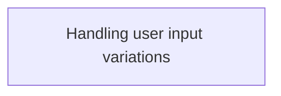

# Program Overview

This document describes the user input demonstration flow (ACCEPT-EXAMPLE). The flow showcases several COBOL input handling techniques, including basic input capture, timed input, <SwmToken path="accept/accept.cbl" pos="46:3:5" line-data="      *&gt; auto-skip automatically enteres the user&#39;s input once it reaches">`auto-skip`</SwmToken> for fixed-length fields, hidden input for sensitive data, and automatic uppercase conversion.



# Program Workflow

# Handling user input variations

```mermaid
%%{init: {"flowchart": {"defaultRenderer": "elk"}} }%%
flowchart TD
    node1["Prompt for user input (basic accept)"]
    click node1 openCode "accept/accept.cbl:20:22"
    node1 --> node2["Prompt for key press (no input stored)"]
    click node2 openCode "accept/accept.cbl:25:26"
    node2 --> node3["Prompt for input with timeout (wait 3 seconds)"]
    click node3 openCode "accept/accept.cbl:42:44"
    node3 --> node4["Prompt for input with auto-skip (max 16 chars)"]
    click node4 openCode "accept/accept.cbl:51:53"
    node4 --> node5["Prompt for hidden input (no-echo, useful for passwords)"]
    click node5 openCode "accept/accept.cbl:59:61"
    node5 --> node6["Prompt for input with uppercase conversion (useful for comparisons)"]
    click node6 openCode "accept/accept.cbl:69:71"
    node6 --> node7["End of input demonstrations"]
    click node7 openCode "accept/accept.cbl:74:74"

classDef HeadingStyle fill:#777777,stroke:#333,stroke-width:2px;

%% Swimm:
%% %%{init: {"flowchart": {"defaultRenderer": "elk"}} }%%
%% flowchart TD
%%     node1["Prompt for user input (basic accept)"]
%%     click node1 openCode "<SwmPath>[accept/accept.cbl](accept/accept.cbl)</SwmPath>:20:22"
%%     node1 --> node2["Prompt for key press (no input stored)"]
%%     click node2 openCode "<SwmPath>[accept/accept.cbl](accept/accept.cbl)</SwmPath>:25:26"
%%     node2 --> node3["Prompt for input with timeout (wait 3 seconds)"]
%%     click node3 openCode "<SwmPath>[accept/accept.cbl](accept/accept.cbl)</SwmPath>:42:44"
%%     node3 --> node4["Prompt for input with <SwmToken path="accept/accept.cbl" pos="46:3:5" line-data="      *&gt; auto-skip automatically enteres the user&#39;s input once it reaches">`auto-skip`</SwmToken> (max 16 chars)"]
%%     click node4 openCode "<SwmPath>[accept/accept.cbl](accept/accept.cbl)</SwmPath>:51:53"
%%     node4 --> node5["Prompt for hidden input (<SwmToken path="accept/accept.cbl" pos="58:5:7" line-data="      *&gt; where no-echo will not show anything.">`no-echo`</SwmToken>, useful for passwords)"]
%%     click node5 openCode "<SwmPath>[accept/accept.cbl](accept/accept.cbl)</SwmPath>:59:61"
%%     node5 --> node6["Prompt for input with uppercase conversion (useful for comparisons)"]
%%     click node6 openCode "<SwmPath>[accept/accept.cbl](accept/accept.cbl)</SwmPath>:69:71"
%%     node6 --> node7["End of input demonstrations"]
%%     click node7 openCode "<SwmPath>[accept/accept.cbl](accept/accept.cbl)</SwmPath>:74:74"
%% 
%% classDef HeadingStyle fill:#777777,stroke:#333,stroke-width:2px;
```



This section's main product role is to showcase and document the different user input handling capabilities available in COBOL, providing examples for each method so that developers can understand and choose the appropriate input technique for their use case.

| Category       | Rule Name                       | Description                                                                                                                                                                                                                                                                                        |
| -------------- | ------------------------------- | -------------------------------------------------------------------------------------------------------------------------------------------------------------------------------------------------------------------------------------------------------------------------------------------------- |
| Business logic | Basic user input capture        | The system must prompt the user for input and capture the entered value for further processing or display.                                                                                                                                                                                         |
| Business logic | Key press continuation          | The system must allow for a key press to continue without capturing or storing any input value.                                                                                                                                                                                                    |
| Business logic | Input timeout enforcement       | If the user does not provide input within 3 seconds, the system must proceed without waiting further. The timeout duration can be adjusted via an environment variable, with a default scale of 1000 (1 second) and a range from 0 to 1000.                                                        |
| Business logic | Auto-skip on max length         | When the user input reaches the maximum allowed length (16 characters), the system must automatically proceed without requiring the user to press enter.                                                                                                                                           |
| Business logic | Hidden input for sensitive data | The system must provide an option to hide user input (<SwmToken path="accept/accept.cbl" pos="58:5:7" line-data="      *&gt; where no-echo will not show anything.">`no-echo`</SwmToken>) so that entered characters are not displayed on the screen, useful for sensitive data such as passwords. |
| Business logic | Uppercase input normalization   | All user input must be converted to uppercase before further processing or display, ensuring consistency for comparisons and data handling.                                                                                                                                                        |

<SwmSnippet path="/accept/accept.cbl" line="16">

---

Main-procedure kicks off the flow by showing different ways to handle user input using the COBOL ACCEPT statement. It starts with basic input, then moves to waiting for any key press, and then demonstrates screen mode input with line/column positioning. It covers timeout for input (with environment variable scaling), <SwmToken path="accept/accept.cbl" pos="46:3:5" line-data="      *&gt; auto-skip automatically enteres the user&#39;s input once it reaches">`auto-skip`</SwmToken> for fixed-length fields, hiding input with <SwmToken path="accept/accept.cbl" pos="58:5:7" line-data="      *&gt; where no-echo will not show anything.">`no-echo`</SwmToken>, and converting input to uppercase for easy comparisons. Each example shows a different way to interact with users and control how/where input is captured.

```cobol
       main-procedure.

      *> Basic accept syntax. Entered value is stored in the variable
      *> provided.
           display "Simple accept. Enter a value: " with no advancing
           accept ws-input
           display "You entered: " ws-input

      *> Accept omitted waits for user input but does not store it
           display "Press any key to enter screen mode."
           accept omitted

      *> From here out, the accept command examples use parameters.
      *> Once this happens, the program enteres screen mode which requires
      *> the inclusion of the line and column numbers to be specified
      *> to each input/output statement when not using the
      *> screen section. Here I am using "at yyxx" to do this.

      *> Timeout specifies how long to wait for the user to enter a
      *> value before continuing. The scale of this can be controlled
      *> using the environment setting:
      *>
      *> set environment "COB_TIMEOUT_SCALE" to '1000'.
      *>
      *> default value is 1000 (1 second). Can be any value between
      *> zero and 1000.
           display "Enter value or wait 3 seconds: " at 0101
           accept ws-input timeout 3 at 0132
           display "You entered: " at 0201 ws-input at 0214

      *> auto-skip automatically enteres the user's input once it reaches
      *> the end width of the variable size. In this case, it's 16
      *> characters as we declared ws-input as PIC X(16). The user
      *> can still enter less characters and submit using the enter
      *> key.
           display "Enter 16 chars to auto skip: " at 0301
           accept ws-input auto-skip at 0330
           display "You entered: " at 0401 ws-input at 0414

      *> No-echo is similar to secure (see accept-secure.cbl) where the
      *> text entered by the user is not displayed on the screen during
      *> entry. The difference is that secure will show '*' for characters
      *> where no-echo will not show anything.
           display "Enter a value (no echo): " at 0501
           accept ws-input no-echo at 0526
           display "You entered: " at 0601 ws-input at 0614


      *> 'upper' converts any input from the user to uppercase. This is
      *> helpful when comparing user input to some string constant.
      *> Example: "Enter y/n: " the user can enter in either case and
      *> when you check the value, you only need to check if the uppercase
      *> values match.
           display "Enter a value: " at 0701
           accept ws-input upper at 0716
           display "You entered: " at 0801 ws-input at 0814


           goback.
```

---

</SwmSnippet>

&nbsp;

*This is an auto-generated document by Swimm 🌊 and has not yet been verified by a human*

<SwmMeta version="3.0.0" repo-id="Z2l0aHViJTNBJTNBQ09CT0wtRXhhbXBsZXMlM0ElM0FTd2ltbS1EZW1v" repo-name="COBOL-Examples"><sup>Powered by [Swimm](https://app.swimm.io/)</sup></SwmMeta>
