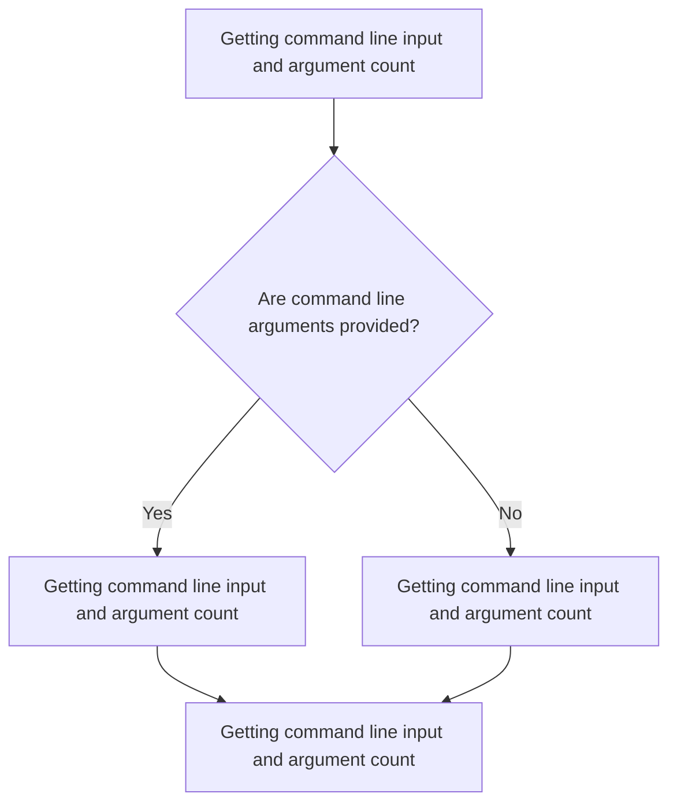

# Program Overview

This document describes the flow of accepting and displaying input from various sources in the <SwmToken path="accept/accept_from.cbl" pos="26:6:10" line-data="       program-id. accept-from-example.">`accept-from-example`</SwmToken> program (ACCEPT_FROM). The program demonstrates how COBOL applications can interact with command line arguments, environment variables, date/time, user name, and screen properties.



## Dependencies

### Program

- <SwmToken path="accept/accept_from.cbl" pos="160:11:11" line-data="      *&gt; Example of using the CBL_GET_SCR_SIZE&quot; system call to do the">`CBL_GET_SCR_SIZE`</SwmToken>

# Program Workflow

# Getting command line input and argument count

```mermaid
%%{init: {"flowchart": {"defaultRenderer": "elk"}} }%%
flowchart TD
    node1["Program introduction"] --> node2["Demonstrate accepting from command-line"]
    click node1 openCode "accept/accept_from.cbl:45:49"
    click node2 openCode "accept/accept_from.cbl:52:53"
    node2 --> node3["Demonstrate accepting argument count"]
    click node3 openCode "accept/accept_from.cbl:57:58"
    node3 --> node4{"Are there command-line arguments?"}
    click node4 openCode "accept/accept_from.cbl:62:62"
    node4 -->|"Yes (ws-input > 0)"| loop1
    node4 -->|"No (ws-input = 0)"| node5["Demonstrate accepting from environment (before set)"]
    subgraph loop1["For each command-line argument (1 to ws-max-args)"]
        node6["Display and accept argument value"]
        click node6 openCode "accept/accept_from.cbl:65:74"
    end
    loop1 --> node5
    node5 --> node7["Demonstrate exception status"]
    click node5 openCode "accept/accept_from.cbl:81:82"
    click node7 openCode "accept/accept_from.cbl:88:89"
    node7 --> node8["Set environment variable"]
    click node8 openCode "accept/accept_from.cbl:93:93"
    node8 --> node9["Demonstrate accepting from environment (after set)"]
    click node9 openCode "accept/accept_from.cbl:99:100"
    node9 --> node10["Demonstrate accepting date"]
    click node10 openCode "accept/accept_from.cbl:106:107"
    node10 --> node11["Demonstrate accepting date yyyymmdd"]
    click node11 openCode "accept/accept_from.cbl:111:112"
    node11 --> node12["Demonstrate accepting day"]
    click node12 openCode "accept/accept_from.cbl:118:119"
    node12 --> node13["Demonstrate accepting day yyyyddd"]
    click node13 openCode "accept/accept_from.cbl:123:124"
    node13 --> node14["Demonstrate accepting time"]
    click node14 openCode "accept/accept_from.cbl:127:128"
    node14 --> node15["Demonstrate accepting day-of-week"]
    click node15 openCode "accept/accept_from.cbl:132:133"
    node15 --> node16["Demonstrate accepting user name"]
    click node16 openCode "accept/accept_from.cbl:137:138"
    node16 --> node17["Demonstrate accepting from console"]
    click node17 openCode "accept/accept_from.cbl:143:144"
    node17 --> node18["Prompt for screen mode"]
    click node18 openCode "accept/accept_from.cbl:148:149"
    node18 --> node19["Demonstrate accepting screen lines"]
    click node19 openCode "accept/accept_from.cbl:153:154"
    node19 --> node20["Demonstrate accepting screen columns"]
    click node20 openCode "accept/accept_from.cbl:157:158"
    node20 --> node21["Call system for screen size"]
    click node21 openCode "accept/accept_from.cbl:165:165"
    node21 --> node22["Display screen size"]
    click node22 openCode "accept/accept_from.cbl:167:169"
    node22 --> node23["End of demonstration"]
    click node23 openCode "accept/accept_from.cbl:171:171"

classDef HeadingStyle fill:#777777,stroke:#333,stroke-width:2px;

%% Swimm:
%% %%{init: {"flowchart": {"defaultRenderer": "elk"}} }%%
%% flowchart TD
%%     node1["Program introduction"] --> node2["Demonstrate accepting from <SwmToken path="accept/accept_from.cbl" pos="52:9:11" line-data="           accept ws-input from command-line">`command-line`</SwmToken>"]
%%     click node1 openCode "<SwmPath>[accept/accept_from.cbl](accept/accept_from.cbl)</SwmPath>:45:49"
%%     click node2 openCode "<SwmPath>[accept/accept_from.cbl](accept/accept_from.cbl)</SwmPath>:52:53"
%%     node2 --> node3["Demonstrate accepting argument count"]
%%     click node3 openCode "<SwmPath>[accept/accept_from.cbl](accept/accept_from.cbl)</SwmPath>:57:58"
%%     node3 --> node4{"Are there <SwmToken path="accept/accept_from.cbl" pos="52:9:11" line-data="           accept ws-input from command-line">`command-line`</SwmToken> arguments?"}
%%     click node4 openCode "<SwmPath>[accept/accept_from.cbl](accept/accept_from.cbl)</SwmPath>:62:62"
%%     node4 -->|"Yes (<SwmToken path="accept/accept_from.cbl" pos="52:3:5" line-data="           accept ws-input from command-line">`ws-input`</SwmToken> > 0)"| loop1
%%     node4 -->|"No (<SwmToken path="accept/accept_from.cbl" pos="52:3:5" line-data="           accept ws-input from command-line">`ws-input`</SwmToken> = 0)"| node5["Demonstrate accepting from environment (before set)"]
%%     subgraph loop1["For each <SwmToken path="accept/accept_from.cbl" pos="52:9:11" line-data="           accept ws-input from command-line">`command-line`</SwmToken> argument (1 to <SwmToken path="accept/accept_from.cbl" pos="63:9:13" line-data="               move ws-input to ws-max-args">`ws-max-args`</SwmToken>)"]
%%         node6["Display and accept argument value"]
%%         click node6 openCode "<SwmPath>[accept/accept_from.cbl](accept/accept_from.cbl)</SwmPath>:65:74"
%%     end
%%     loop1 --> node5
%%     node5 --> node7["Demonstrate exception status"]
%%     click node5 openCode "<SwmPath>[accept/accept_from.cbl](accept/accept_from.cbl)</SwmPath>:81:82"
%%     click node7 openCode "<SwmPath>[accept/accept_from.cbl](accept/accept_from.cbl)</SwmPath>:88:89"
%%     node7 --> node8["Set environment variable"]
%%     click node8 openCode "<SwmPath>[accept/accept_from.cbl](accept/accept_from.cbl)</SwmPath>:93:93"
%%     node8 --> node9["Demonstrate accepting from environment (after set)"]
%%     click node9 openCode "<SwmPath>[accept/accept_from.cbl](accept/accept_from.cbl)</SwmPath>:99:100"
%%     node9 --> node10["Demonstrate accepting date"]
%%     click node10 openCode "<SwmPath>[accept/accept_from.cbl](accept/accept_from.cbl)</SwmPath>:106:107"
%%     node10 --> node11["Demonstrate accepting date yyyymmdd"]
%%     click node11 openCode "<SwmPath>[accept/accept_from.cbl](accept/accept_from.cbl)</SwmPath>:111:112"
%%     node11 --> node12["Demonstrate accepting day"]
%%     click node12 openCode "<SwmPath>[accept/accept_from.cbl](accept/accept_from.cbl)</SwmPath>:118:119"
%%     node12 --> node13["Demonstrate accepting day yyyyddd"]
%%     click node13 openCode "<SwmPath>[accept/accept_from.cbl](accept/accept_from.cbl)</SwmPath>:123:124"
%%     node13 --> node14["Demonstrate accepting time"]
%%     click node14 openCode "<SwmPath>[accept/accept_from.cbl](accept/accept_from.cbl)</SwmPath>:127:128"
%%     node14 --> node15["Demonstrate accepting <SwmToken path="accept/accept_from.cbl" pos="132:9:13" line-data="           accept ws-input from day-of-week">`day-of-week`</SwmToken>"]
%%     click node15 openCode "<SwmPath>[accept/accept_from.cbl](accept/accept_from.cbl)</SwmPath>:132:133"
%%     node15 --> node16["Demonstrate accepting user name"]
%%     click node16 openCode "<SwmPath>[accept/accept_from.cbl](accept/accept_from.cbl)</SwmPath>:137:138"
%%     node16 --> node17["Demonstrate accepting from console"]
%%     click node17 openCode "<SwmPath>[accept/accept_from.cbl](accept/accept_from.cbl)</SwmPath>:143:144"
%%     node17 --> node18["Prompt for screen mode"]
%%     click node18 openCode "<SwmPath>[accept/accept_from.cbl](accept/accept_from.cbl)</SwmPath>:148:149"
%%     node18 --> node19["Demonstrate accepting screen lines"]
%%     click node19 openCode "<SwmPath>[accept/accept_from.cbl](accept/accept_from.cbl)</SwmPath>:153:154"
%%     node19 --> node20["Demonstrate accepting screen columns"]
%%     click node20 openCode "<SwmPath>[accept/accept_from.cbl](accept/accept_from.cbl)</SwmPath>:157:158"
%%     node20 --> node21["Call system for screen size"]
%%     click node21 openCode "<SwmPath>[accept/accept_from.cbl](accept/accept_from.cbl)</SwmPath>:165:165"
%%     node21 --> node22["Display screen size"]
%%     click node22 openCode "<SwmPath>[accept/accept_from.cbl](accept/accept_from.cbl)</SwmPath>:167:169"
%%     node22 --> node23["End of demonstration"]
%%     click node23 openCode "<SwmPath>[accept/accept_from.cbl](accept/accept_from.cbl)</SwmPath>:171:171"
%% 
%% classDef HeadingStyle fill:#777777,stroke:#333,stroke-width:2px;
```



This section demonstrates how a COBOL program can accept and display various types of input, including command line arguments, environment variables, date/time, user name, and screen properties. It is designed to show the breadth of input sources available to a COBOL application and how these can be surfaced to the user.

| Category       | Rule Name                        | Description                                                                                                                                                                                                                                                                                                    |
| -------------- | -------------------------------- | -------------------------------------------------------------------------------------------------------------------------------------------------------------------------------------------------------------------------------------------------------------------------------------------------------------- |
| Business logic | Display Command Line Arguments   | If command line arguments are provided, each argument must be individually displayed to the user in the order they were passed.                                                                                                                                                                                |
| Business logic | Fallback to Environment Variable | If no command line arguments are provided, the program must attempt to read a specific environment variable (<SwmToken path="accept/accept_from.cbl" pos="81:12:12" line-data="           accept ws-input from environment &quot;COB_TEST_ENV_KEY&quot;">`COB_TEST_ENV_KEY`</SwmToken>) and display its value. |
| Business logic | Show Argument Count              | The program must display the number of command line arguments received at the start of execution.                                                                                                                                                                                                              |
| Business logic | Confirm Environment Variable Set | Once an environment variable is set, the program must confirm by reading and displaying its new value.                                                                                                                                                                                                         |
| Business logic | Display Date Formats             | The program must display the current date in both YYMMDD and YYYYMMDD formats to highlight the difference in year representation.                                                                                                                                                                              |
| Business logic | Display Day of Year Formats      | The program must display the current day of the year in both YYDDD and YYYYDDD formats.                                                                                                                                                                                                                        |
| Business logic | Display Current Time             | The program must display the current time in hhmmssnn format.                                                                                                                                                                                                                                                  |
| Business logic | Display Day of Week              | The program must display the current day of the week as a number from 1 (Monday) to 7 (Sunday).                                                                                                                                                                                                                |
| Business logic | Display User Name                | The program must display the current user name running the application, if available.                                                                                                                                                                                                                          |
| Business logic | Prompt and Display Console Input | The program must prompt the user for input via the console and display the entered value.                                                                                                                                                                                                                      |
| Business logic | Display Screen Size              | The program must display the current number of lines and columns of the screen, both using ACCEPT and a system call, and show these values to the user.                                                                                                                                                        |

<SwmSnippet path="/accept/accept_from.cbl" line="43">

---

In <SwmToken path="accept/accept_from.cbl" pos="43:1:3" line-data="       main-procedure.">`main-procedure`</SwmToken> we kick things off by displaying some info and then use ACCEPT to grab the full command line string and the number of arguments passed. This sets up the context for handling input parameters, letting us know what was provided and how many pieces to expect.

```cobol
       main-procedure.

           display space
           display "ACCEPT... FROM... Example Program"
           display "---------------------------------"
           display "Pass command line parameters to demo that feature"
           display space

      *> FROM COMMAND-LINE returns the command line argument string in full.
           accept ws-input from command-line
           display "accept from command-line: " ws-input

      *> FROM ARGUMENT-NUMBER returns the number of command line arguments
      *> passed to the program.
           accept ws-input from argument-number
           display "accept from argument-number: " ws-input
```

---

</SwmSnippet>

<SwmSnippet path="/accept/accept_from.cbl" line="62">

---

Next we check if any arguments were passed, then loop through each one by setting the current index and using ACCEPT to get each argument value. This is how we break down the command line into usable pieces.

```cobol
           if ws-input > 0 then
               move ws-input to ws-max-args

               perform varying ws-idx
               from 1 by 1 until ws-idx > ws-max-args

      *> DISPLAY {VALUE} UPON ARGUMENT-NUMBER sets the current index of
      *> the command line argument to return when calling
      *> ACCEPT ... FROM ARGUMENT-VALUE
                   display ws-idx upon argument-number
                   accept ws-input from argument-value
                   display "accept from argument-value: " ws-input
               end-perform
           end-if
```

---

</SwmSnippet>

<SwmSnippet path="/accept/accept_from.cbl" line="80">

---

Here we demo environment variable access by reading, setting, and re-reading a value. Then we show how to get date/time in different formats, grab the current user name, and prompt for console input. Finally, we switch to screen mode, use ACCEPT to get screen size, and call <SwmToken path="accept/accept_from.cbl" pos="160:11:11" line-data="      *&gt; Example of using the CBL_GET_SCR_SIZE&quot; system call to do the">`CBL_GET_SCR_SIZE`</SwmToken> for a numeric screen size readout.

```cobol
           display "Before environment setting set:"
           accept ws-input from environment "COB_TEST_ENV_KEY"
           display "accept from environment: " ws-input


      *> FROM EXCEPTION STATUS returns the latest exception status value.
      *> Due to calling the above on an environment variable that is not
      *> yet set, this will be set to 1537 or 0x0601 (EC-IMP-ACCEPT)
           accept ws-input from exception status
           display "accept from exception status: " ws-input

      *> SET ENVIRONMENT sets the environment variable to the value
      *> supplied.
           set environment "COB_TEST_ENV_KEY" to "NOW SET!"


      *> Now that the environment value is set, this will return
      *> "NOW SET!" when called.
           display "After environment setting set:"
           accept ws-input from environment "COB_TEST_ENV_KEY"
           display "accept from environment: " ws-input


      *> FROM DATE returns current date in YYMMDD format. Note that this
      *> can cause calculation issues on year if you're not careful
      *> as there no century included in the year value.
           accept ws-input from date
           display "accept from date: " ws-input

      *> FROM DATE YYYYMMDD fixes the above issue and returns a four digit
      *> value for the year.
           accept ws-input from date yyyymmdd
           display "accept from date yyyymmdd: " ws-input

      *> FROM DAY returns the date in the format YYDDD where DDD is a
      *> three digit representation of the day of the year. The year is
      *> only returned in two digits so it has similar issues as
      *> "FROM DATE".
           accept ws-input from day
           display "accept from day: " ws-input

      *> FROM DAY YYYYDDD is the same as above but includes a four digit
      *> year in the returned value.
           accept ws-input from day yyyyddd
           display "accept from day yyyyddd: " ws-input

      *> FROM TIME returns the current time in the format: hhmmssnn
           accept ws-input from time
           display "accept from time: " ws-input

      *> FROM DAY-OF-WEEK returns the day of the week 1-7 starting on
      *> Monday (1) and ending on Sunday (7).
           accept ws-input from day-of-week
           display "accept from day-of-week: " ws-input

      *> FROM USER NAME returns the current user name logged in running
      *> the application (if available)
           accept ws-input from user name
           display "accept from user name: " ws-input

      *> FROM CONSOLE is the default if not specified. Reads user input
      *> from the console.
           display "Enter value: " with no advancing
           accept ws-input from console
           display "accept from console: " ws-input

      *> After this point, the final ACCEPTs require screen mode so
      *> the screen will blank and text positions must be provied.
           display "Press enter to enter screen mode."
           accept omitted


      *> Returns the current number of lines of the current screen
           accept ws-input from lines
           display "accept from lines: " at 0201 ws-input at 0220

      *> Returns the current number of columns of the current screen.
           accept ws-input from columns
           display "accept from columns: " at 0301 ws-input at 0322

      *> Example of using the CBL_GET_SCR_SIZE" system call to do the
      *> same as above. Note: return values must be converted to numeric
      *> in order to be displayed. Alphanumeric seems to truncate the
      *> value to two digits regardless of variable length.
           display "Using CBL_GET_SCR_SIZE instead: " at 0401
           call "CBL_GET_SCR_SIZE" using ws-num-lines ws-num-cols
           move ws-num-lines to ws-num-lines-disp
           display "Num lines: " at 0501 ws-num-lines-disp at 0514
           move ws-num-cols to ws-num-cols-disp
           display "Num cols: " at 0601 ws-num-cols-disp at 0614

           goback.
```

---

</SwmSnippet>

&nbsp;

*This is an auto-generated document by Swimm 🌊 and has not yet been verified by a human*

<SwmMeta version="3.0.0" repo-id="Z2l0aHViJTNBJTNBQ09CT0wtRXhhbXBsZXMlM0ElM0FTd2ltbS1EZW1v" repo-name="COBOL-Examples"><sup>Powered by [Swimm](https://app.swimm.io/)</sup></SwmMeta>
