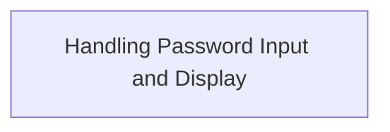

# Program Overview

This document explains the flow for secure password entry (ACCEPT-SECURE). The program prompts the user to enter a password, hides the input during entry to maintain confidentiality, and then displays the entered password for confirmation.



# Program Workflow

# Handling Password Input and Display

This section manages the secure input and display of a password, ensuring user privacy during entry and confirming the input afterward.

| Category        | Rule Name                | Description                                                                       |
| --------------- | ------------------------ | --------------------------------------------------------------------------------- |
| Data validation | Password confidentiality | Password input must be hidden from view during entry to maintain confidentiality. |

<SwmSnippet path="/accept/accept-secure.cbl" line="16">

---

Main-procedure kicks off the flow by displaying a password prompt at a fixed screen position, then securely accepts the password input (so it's not shown on the screen), and finally displays what was entered at another set of coordinates. The use of 'secure' in the accept statement is what hides the password during entry. The flow ends with goback.

```cobol
       main-procedure.
           display "Enter password: " at 0101
           accept ws-password secure  at 0117
           display "You entered: " at 0204 ws-password at 0217
           goback.
```

---

</SwmSnippet>

&nbsp;

*This is an auto-generated document by Swimm 🌊 and has not yet been verified by a human*

<SwmMeta version="3.0.0" repo-id="Z2l0aHViJTNBJTNBQ09CT0wtRXhhbXBsZXMlM0ElM0FTd2ltbS1EZW1v" repo-name="COBOL-Examples"><sup>Powered by [Swimm](https://app.swimm.io/)</sup></SwmMeta>
