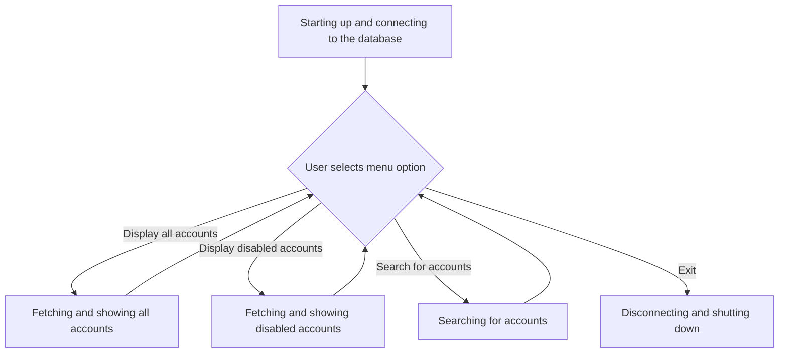
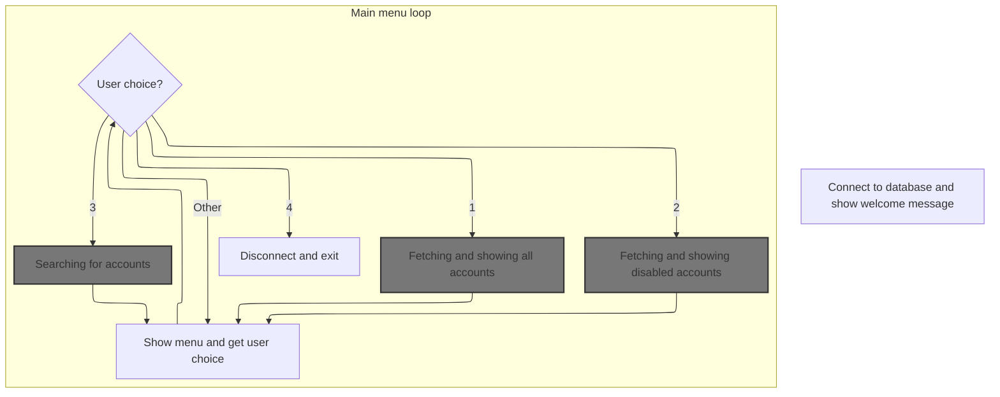
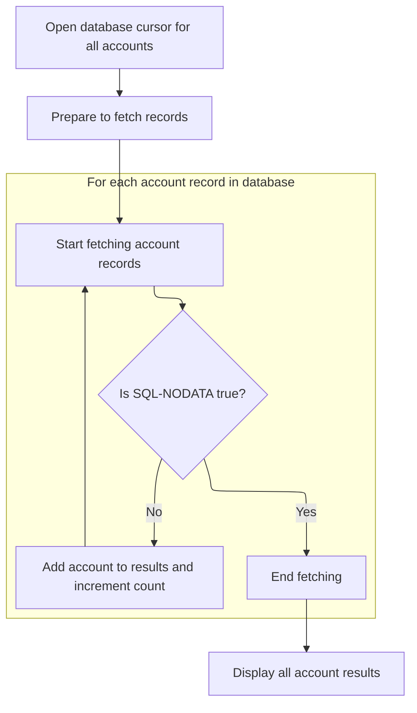
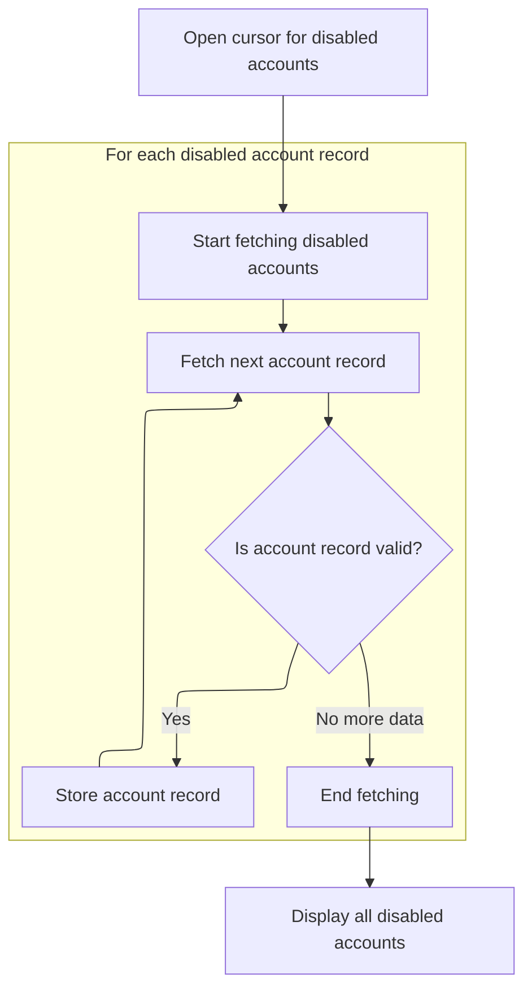
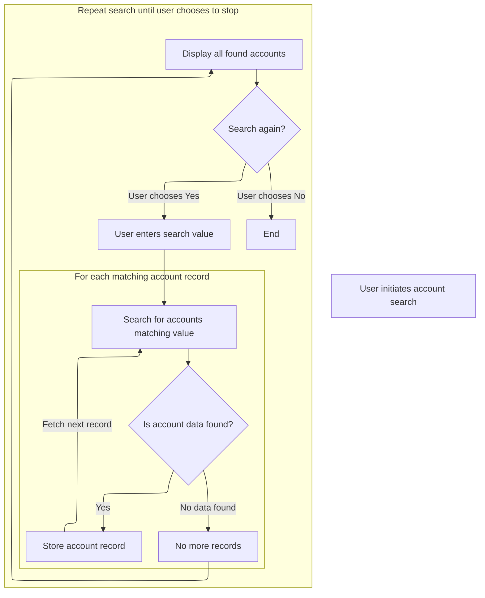

# Program Overview

This document describes the flow of interacting with account data using a menu-driven interface (GENERATED_SQL_EX). Users can view all accounts, filter for disabled accounts, or search for specific accounts by value. Results are displayed in a clear table format.



## Dependencies

### Programs

- OCSQL
- OCSQLDIS
- OCSQLPRE
- OCSQLOCU
- OCSQLFTC
- OCSQLCCU

# Program Workflow

# Starting up and connecting to the database



This section is responsible for initializing the application, establishing a database connection, and providing a menu-driven interface for users to interact with account data.

| Category        | Rule Name                    | Description                                                                                                                                             |
| --------------- | ---------------------------- | ------------------------------------------------------------------------------------------------------------------------------------------------------- |
| Data validation | Database connection required | A database connection must be established using the provided connection string before any account-related operations are allowed.                       |
| Data validation | Menu option validation       | The menu must present four options: display all accounts, display disabled accounts, query accounts, and exit. Only these options are valid selections. |
| Business logic  | Welcome message display      | The program must display a welcome message to the user upon startup before any database operations are performed.                                       |
| Business logic  | Session termination on exit  | When the user selects 'Exit', the program must disconnect from the database and terminate the session.                                                  |

<SwmSnippet path="/sql/generated_sql_ex.cbl" line="167">

---

In <SwmToken path="sql/generated_sql_ex.cbl" pos="167:1:3" line-data="       main-procedure.">`main-procedure`</SwmToken> we kick things off by displaying some intro text and then call 'OCSQL' to connect to the database using the connection string. This sets up the session for all subsequent database operations.

```cobol
       main-procedure.
           display space
           display "COBOL SQL DB Example Program"
           display "----------------------------"
           display space

      *> Connect to database and check response status.
      *    EXEC SQL
      *        CONNECT TO :ws-db-connection-string
      *    END-EXEC.
           MOVE 1024 TO SQL-LEN(1)
           CALL 'OCSQL'    USING WS-DB-CONNECTION-STRING
                               SQL-LEN(1)
                               SQLCA
           END-CALL
```

---

</SwmSnippet>

<SwmSnippet path="/sql/generated_sql_ex.cbl" line="182">

---

Right after connecting, we call <SwmToken path="sql/generated_sql_ex.cbl" pos="182:3:7" line-data="           perform check-sql-state">`check-sql-state`</SwmToken> to make sure the connection worked. If there's an error, we bail out before doing anything else.

```cobol
           perform check-sql-state
```

---

</SwmSnippet>

<SwmSnippet path="/sql/generated_sql_ex.cbl" line="183">

---

After confirming the connection, we mark the session as active so later logic knows we're connected.

```cobol
           set ws-is-connected to true
```

---

</SwmSnippet>

<SwmSnippet path="/sql/generated_sql_ex.cbl" line="195">

---

After another DB operation, we check for errors again to catch any issues right away.

```cobol
           perform check-sql-state
```

---

</SwmSnippet>

<SwmSnippet path="/sql/generated_sql_ex.cbl" line="207">

---

Another DB step, another error check. Keeps things predictable and safe.

```cobol
           perform check-sql-state
```

---

</SwmSnippet>

<SwmSnippet path="/sql/generated_sql_ex.cbl" line="223">

---

We do another error check before moving on to the menu, just in case.

```cobol
           perform check-sql-state
```

---

</SwmSnippet>

<SwmSnippet path="/sql/generated_sql_ex.cbl" line="227">

---

After showing the menu, if the user picks option 1, we call <SwmToken path="sql/generated_sql_ex.cbl" pos="238:3:7" line-data="                       perform display-all-accounts">`display-all-accounts`</SwmToken> to pull and show every account from the DB. The other options branch to their own handlers for disabled accounts, queries, or exit.

```cobol
               display space
               display "1) Display all accounts"
               display "2) Display disabled accounts"
               display "3) Query accounts"
               display "4) Exit"
               display "Selection: " with no advancing
               accept ws-menu-choice

               evaluate ws-menu-choice

                   when '1'
                       perform display-all-accounts

                   when '2'
                       perform display-disabled-accounts

                   when '3'
                       perform query-accounts

                   when '4'
                       exit perform

                   when other
                       display "Please make a selection between 1-4"

               end-evaluate
```

---

</SwmSnippet>

## Fetching and showing all accounts



This section provides the functionality to fetch and display all account records from the database, ensuring that users can view the current state of all accounts in the system.

| Category        | Rule Name                   | Description                                                                                                                                                               |
| --------------- | --------------------------- | ------------------------------------------------------------------------------------------------------------------------------------------------------------------------- |
| Data validation | Account record completeness | Each account record displayed must include the following fields: account ID, first name, last name, phone, address, enabled status, creation date, and modification date. |
| Data validation | Field count limit           | The maximum number of fields fetched per account record is limited to 8, as defined by the SQLV structure.                                                                |
| Business logic  | Complete account retrieval  | All account records present in the database must be retrieved and included in the results, regardless of their status or content.                                         |

<SwmSnippet path="/sql/generated_sql_ex.cbl" line="270">

---

In <SwmToken path="sql/generated_sql_ex.cbl" pos="270:1:5" line-data="       display-all-accounts.">`display-all-accounts`</SwmToken> we open the cursor for all accounts, prepping it with OCSQLPRE if needed. This sets up the DB fetch loop.

```cobol
       display-all-accounts.

      *> Open cursor
      *    EXEC SQL
      *        OPEN ACCOUNT-ALL-CUR
      *    END-EXEC
           IF SQL-PREP OF SQL-STMT-0 = 'N'
               MOVE 0 TO SQL-COUNT
               CALL 'OCSQLPRE' USING SQLV
                                   SQL-STMT-0
                                   SQLCA
           END-IF
```

---

</SwmSnippet>

<SwmSnippet path="/sql/generated_sql_ex.cbl" line="282">

---

After prepping the cursor, we call OCSQLOCU to activate it, then check for errors before fetching data.

```cobol
           CALL 'OCSQLOCU' USING SQL-STMT-0
                               SQLCA
           END-CALL

           perform check-sql-state
```

---

</SwmSnippet>

<SwmSnippet path="/sql/generated_sql_ex.cbl" line="290">

---

We set up all the variable bindings and start the fetch loop, pulling account data from the DB into memory for each row.

```cobol
           move 0 to ws-num-accounts
           perform with test after until SQLCODE = 100
      *        EXEC SQL
      *            FETCH ACCOUNT-ALL-CUR
      *            INTO
      *                :ws-sql-account-id,
      *                :ws-sql-account-first-name,
      *                :ws-sql-account-last-name,
      *                :ws-sql-account-phone,
      *                :ws-sql-account-address,
      *                :ws-sql-account-is-enabled,
      *                :ws-sql-account-create-dt,
      *                :ws-sql-account-mod-dt;
      *        END-EXEC
           SET SQL-ADDR(1) TO ADDRESS OF
             SQL-VAR-0001
           MOVE '3' TO SQL-TYPE(1)
           MOVE 3 TO SQL-LEN(1)
               MOVE X'00' TO SQL-PREC(1)
           SET SQL-ADDR(2) TO ADDRESS OF
             WS-SQL-ACCOUNT-FIRST-NAME
           MOVE 'X' TO SQL-TYPE(2)
           MOVE 8 TO SQL-LEN(2)
           SET SQL-ADDR(3) TO ADDRESS OF
             WS-SQL-ACCOUNT-LAST-NAME
           MOVE 'X' TO SQL-TYPE(3)
           MOVE 8 TO SQL-LEN(3)
           SET SQL-ADDR(4) TO ADDRESS OF
             WS-SQL-ACCOUNT-PHONE
           MOVE 'X' TO SQL-TYPE(4)
           MOVE 10 TO SQL-LEN(4)
           SET SQL-ADDR(5) TO ADDRESS OF
             WS-SQL-ACCOUNT-ADDRESS
           MOVE 'X' TO SQL-TYPE(5)
           MOVE 22 TO SQL-LEN(5)
           SET SQL-ADDR(6) TO ADDRESS OF
             WS-SQL-ACCOUNT-IS-ENABLED
           MOVE 'X' TO SQL-TYPE(6)
           MOVE 1 TO SQL-LEN(6)
           SET SQL-ADDR(7) TO ADDRESS OF
             WS-SQL-ACCOUNT-CREATE-DT
           MOVE 'X' TO SQL-TYPE(7)
           MOVE 20 TO SQL-LEN(7)
           SET SQL-ADDR(8) TO ADDRESS OF
             WS-SQL-ACCOUNT-MOD-DT
           MOVE 'X' TO SQL-TYPE(8)
           MOVE 20 TO SQL-LEN(8)
           MOVE 8 TO SQL-COUNT
           CALL 'OCSQLFTC' USING SQLV
                               SQL-STMT-0
                               SQLCA
           MOVE SQL-VAR-0001 TO WS-SQL-ACCOUNT-ID
```

---

</SwmSnippet>

<SwmSnippet path="/sql/generated_sql_ex.cbl" line="342">

---

After each fetch, we check for DB errors before storing the row.

```cobol
               perform check-sql-state
```

---

</SwmSnippet>

<SwmSnippet path="/sql/generated_sql_ex.cbl" line="345">

---

If we got data, we bump the account count and stash the row in the account array. Loop ends when there's no more data.

```cobol
               if not SQL-NODATA then
                   add 1 to ws-num-accounts

                   move ws-sql-account-record
                   to ws-account-record(ws-num-accounts)
           end-perform
```

---

</SwmSnippet>

<SwmSnippet path="/sql/generated_sql_ex.cbl" line="357">

---

After fetching all rows, we call OCSQLCCU to close the cursor and check for errors before displaying results.

```cobol
           CALL 'OCSQLCCU' USING SQL-STMT-0
                               SQLCA
           perform check-sql-state
```

---

</SwmSnippet>

<SwmSnippet path="/sql/generated_sql_ex.cbl" line="362">

---

Once all accounts are fetched and stored, we call <SwmToken path="sql/generated_sql_ex.cbl" pos="362:3:7" line-data="           perform display-account-results">`display-account-results`</SwmToken> to print them out in a table format.

```cobol
           perform display-account-results

           exit paragraph.
```

---

</SwmSnippet>

## Formatting and printing account data

This section is responsible for presenting account data in a clear, tabular format for review or reporting purposes. It ensures that all relevant account fields are displayed in a consistent and readable manner.

| Category        | Rule Name                | Description                                                                                                                                                                                                                                       |
| --------------- | ------------------------ | ------------------------------------------------------------------------------------------------------------------------------------------------------------------------------------------------------------------------------------------------- |
| Data validation | Account display limit    | Only accounts up to the value of <SwmToken path="sql/generated_sql_ex.cbl" pos="290:7:11" line-data="           move 0 to ws-num-accounts">`ws-num-accounts`</SwmToken> are displayed; no more than 100 accounts can be shown in a single output. |
| Business logic  | Table header clarity     | The table must include a header row that clearly labels each column: ID, First, Last, Phone, Address, and Enabled.                                                                                                                                |
| Business logic  | Header separator         | A separator row must be displayed immediately below the header to visually distinguish the header from the account data.                                                                                                                          |
| Business logic  | Account row completeness | Each account must be displayed on its own row, with all fields (ID, First, Last, Phone, Address, Enabled) shown in the order specified in the header.                                                                                             |
| Business logic  | Enabled status accuracy  | The 'Enabled' column must display the value as stored ('Y' for enabled, 'N' for disabled), matching the business definition of account status.                                                                                                    |

<SwmSnippet path="/sql/generated_sql_ex.cbl" line="632">

---

In <SwmToken path="sql/generated_sql_ex.cbl" pos="632:1:5" line-data="       display-account-results.">`display-account-results`</SwmToken> we print headers and separators to set up a clear table for the account data.

```cobol
       display-account-results.

           display space
           display "ACCOUNTS:"
           display space
           display " ID   | First    | Last     | Phone      |"
               " Address                | Enabled "
           end-display
           display "------|----------|----------|------------|"
               "------------------------|---------"
           end-display
```

---

</SwmSnippet>

<SwmSnippet path="/sql/generated_sql_ex.cbl" line="644">

---

We loop through the account arrays from 1 to <SwmToken path="sql/generated_sql_ex.cbl" pos="645:11:15" line-data="           until ws-account-idx &gt; ws-num-accounts">`ws-num-accounts`</SwmToken>, printing each account's details in the table. This assumes the arrays are filled and indexed right.

```cobol
           perform varying ws-account-idx from 1 by 1
           until ws-account-idx > ws-num-accounts

               display
                   ws-account-id(ws-account-idx)
                   " | "
                   ws-account-first-name(ws-account-idx)
                   " | "
                   ws-account-last-name(ws-account-idx)
                   " | "
                   ws-account-phone(ws-account-idx)
                   " | "
                   ws-account-address(ws-account-idx)
                   " | "
                   ws-account-is-enabled(ws-account-idx)
               end-display

           end-perform
           exit paragraph.
```

---

</SwmSnippet>

## Fetching and showing disabled accounts



This section is responsible for retrieving all disabled accounts from the database and presenting them in a user-friendly table format. It ensures only valid, disabled accounts are included in the results.

| Category        | Rule Name                 | Description                                                                                                                                                                          |
| --------------- | ------------------------- | ------------------------------------------------------------------------------------------------------------------------------------------------------------------------------------ |
| Data validation | Account record validation | Each account record must be validated for completeness before being added to the results list. Incomplete or invalid records must be excluded.                                       |
| Business logic  | Disabled account filter   | Only accounts with the 'is enabled' status set to false are included in the disabled accounts list.                                                                                  |
| Business logic  | Account display format    | All disabled account records must be displayed in a tabular format, showing account ID, first name, last name, phone, address, enabled status, creation date, and modification date. |

<SwmSnippet path="/sql/generated_sql_ex.cbl" line="376">

---

In <SwmToken path="sql/generated_sql_ex.cbl" pos="376:1:5" line-data="       display-disabled-accounts.">`display-disabled-accounts`</SwmToken> we prep and open the cursor for disabled accounts using external calls, assuming the mappings are set up right.

```cobol
       display-disabled-accounts.

      *    EXEC SQL
      *        OPEN ACCOUNT-DISABLED-CUR
      *    END-EXEC
           IF SQL-PREP OF SQL-STMT-1 = 'N'
               MOVE 0 TO SQL-COUNT
               CALL 'OCSQLPRE' USING SQLV
                                   SQL-STMT-1
                                   SQLCA
           END-IF
```

---

</SwmSnippet>

<SwmSnippet path="/sql/generated_sql_ex.cbl" line="387">

---

After prepping, we activate the cursor for disabled accounts and check for errors before fetching.

```cobol
           CALL 'OCSQLOCU' USING SQL-STMT-1
                               SQLCA
           END-CALL

           perform check-sql-state
```

---

</SwmSnippet>

<SwmSnippet path="/sql/generated_sql_ex.cbl" line="393">

---

We set up the variable bindings and start the fetch loop, pulling disabled account data into memory for each row.

```cobol
           move 0 to ws-num-accounts
           perform with test after until SQLCODE = 100
      *        EXEC SQL
      *            FETCH ACCOUNT-DISABLED-CUR
      *            INTO
      *                :ws-sql-account-id,
      *                :ws-sql-account-first-name,
      *                :ws-sql-account-last-name,
      *                :ws-sql-account-phone,
      *                :ws-sql-account-address,
      *                :ws-sql-account-is-enabled,
      *                :ws-sql-account-create-dt,
      *                :ws-sql-account-mod-dt;
      *        END-EXEC
           SET SQL-ADDR(1) TO ADDRESS OF
             SQL-VAR-0001
           MOVE '3' TO SQL-TYPE(1)
           MOVE 3 TO SQL-LEN(1)
               MOVE X'00' TO SQL-PREC(1)
           SET SQL-ADDR(2) TO ADDRESS OF
             WS-SQL-ACCOUNT-FIRST-NAME
           MOVE 'X' TO SQL-TYPE(2)
           MOVE 8 TO SQL-LEN(2)
           SET SQL-ADDR(3) TO ADDRESS OF
             WS-SQL-ACCOUNT-LAST-NAME
           MOVE 'X' TO SQL-TYPE(3)
           MOVE 8 TO SQL-LEN(3)
           SET SQL-ADDR(4) TO ADDRESS OF
             WS-SQL-ACCOUNT-PHONE
           MOVE 'X' TO SQL-TYPE(4)
           MOVE 10 TO SQL-LEN(4)
           SET SQL-ADDR(5) TO ADDRESS OF
             WS-SQL-ACCOUNT-ADDRESS
           MOVE 'X' TO SQL-TYPE(5)
           MOVE 22 TO SQL-LEN(5)
           SET SQL-ADDR(6) TO ADDRESS OF
             WS-SQL-ACCOUNT-IS-ENABLED
           MOVE 'X' TO SQL-TYPE(6)
           MOVE 1 TO SQL-LEN(6)
           SET SQL-ADDR(7) TO ADDRESS OF
             WS-SQL-ACCOUNT-CREATE-DT
           MOVE 'X' TO SQL-TYPE(7)
           MOVE 20 TO SQL-LEN(7)
           SET SQL-ADDR(8) TO ADDRESS OF
             WS-SQL-ACCOUNT-MOD-DT
           MOVE 'X' TO SQL-TYPE(8)
           MOVE 20 TO SQL-LEN(8)
           MOVE 8 TO SQL-COUNT
           CALL 'OCSQLFTC' USING SQLV
                               SQL-STMT-1
                               SQLCA
           MOVE SQL-VAR-0001 TO WS-SQL-ACCOUNT-ID
```

---

</SwmSnippet>

<SwmSnippet path="/sql/generated_sql_ex.cbl" line="445">

---

After each fetch, we check for DB errors before storing the row.

```cobol
               perform check-sql-state
```

---

</SwmSnippet>

<SwmSnippet path="/sql/generated_sql_ex.cbl" line="446">

---

If we got data, we bump the account count and stash the row in the account array. Loop ends when there's no more data.

```cobol
               if not SQL-NODATA then
                   add 1 to ws-num-accounts

                   move ws-sql-account-record
                   to ws-account-record(ws-num-accounts)
           end-perform
```

---

</SwmSnippet>

<SwmSnippet path="/sql/generated_sql_ex.cbl" line="456">

---

Once all disabled accounts are fetched and stored, we call <SwmToken path="sql/generated_sql_ex.cbl" pos="460:3:7" line-data="           perform display-account-results">`display-account-results`</SwmToken> to print them out in a table format.

```cobol
           CALL 'OCSQLCCU' USING SQL-STMT-1
                               SQLCA
           perform check-sql-state

           perform display-account-results

           exit paragraph.
```

---

</SwmSnippet>

## Searching for accounts



This section enables users to search for account records in the database using a flexible search value. The system supports repeated searches and displays all matching accounts in a user-friendly format.

| Category        | Rule Name                     | Description                                                                                                                                                               |
| --------------- | ----------------------------- | ------------------------------------------------------------------------------------------------------------------------------------------------------------------------- |
| Data validation | Flexible search input         | The system must allow the user to enter a search value, which can be any string up to 50 characters in length.                                                            |
| Data validation | Explicit search continuation  | The system must only process a new search if the user explicitly chooses to search again by entering 'Y' (case-insensitive). Any other input will end the search session. |
| Business logic  | Wildcard search matching      | The search value must be automatically trimmed of leading and trailing spaces and wrapped with wildcard characters to enable partial matches in the database search.      |
| Business logic  | Display all matching accounts | All account records that match the search criteria must be displayed to the user in a clear, tabular format.                                                              |
| Business logic  | Repeat search option          | After displaying search results, the system must prompt the user to search again or exit, allowing repeated searches without restarting the program.                      |

<SwmSnippet path="/sql/generated_sql_ex.cbl" line="485">

---

In <SwmToken path="sql/generated_sql_ex.cbl" pos="485:1:3" line-data="       query-accounts.">`query-accounts`</SwmToken> we prompt the user for a search value, wrap it with wildcards, and prep the search string for the DB query.

```cobol
       query-accounts.

      *> Keep searching until user decides to not search again.
           set ws-search-again to true

           perform until not ws-search-again

      *> Get user input for search
               display space
               display "Enter search value: " with no advancing
               accept ws-search-string

      *> String trimmed user input into our search variable's text
      *> value, adding the '%' wildcard characters at the start and
      *> end of the search string.
               move spaces to ws-search-value-text
               string
                   '%' function trim(ws-search-string) '%'
                   into ws-search-value-text
               end-string

      *> Use the stored-char-length function to determine the length
      *> in characters the search string is and set it in our SQL
      *> search variable
               move function stored-char-length(ws-search-value-text)
               to ws-search-value-len

               display "Search value: " ws-search-value-text
               display "Length: " ws-search-value-len
```

---

</SwmSnippet>

<SwmSnippet path="/sql/generated_sql_ex.cbl" line="520">

---

We set up four variable bindings for the search parameters and prep the SQL statement for querying.

```cobol
           IF SQL-PREP OF SQL-STMT-2 = 'N'
               SET SQL-ADDR(1) TO ADDRESS OF
                 WS-SEARCH-VALUE
               MOVE 'V' TO SQL-TYPE(1)
               MOVE 50 TO SQL-LEN(1)
               SET SQL-ADDR(2) TO ADDRESS OF
                 WS-SEARCH-VALUE
               MOVE 'V' TO SQL-TYPE(2)
               MOVE 50 TO SQL-LEN(2)
               SET SQL-ADDR(3) TO ADDRESS OF
                 WS-SEARCH-VALUE
               MOVE 'V' TO SQL-TYPE(3)
               MOVE 50 TO SQL-LEN(3)
               SET SQL-ADDR(4) TO ADDRESS OF
                 WS-SEARCH-VALUE
               MOVE 'V' TO SQL-TYPE(4)
               MOVE 50 TO SQL-LEN(4)
               MOVE 4 TO SQL-COUNT
               CALL 'OCSQLPRE' USING SQLV
                                   SQL-STMT-2
                                   SQLCA
           END-IF
```

---

</SwmSnippet>

<SwmSnippet path="/sql/generated_sql_ex.cbl" line="542">

---

After prepping, we activate the search cursor and check for errors before fetching results.

```cobol
           CALL 'OCSQLOCU' USING SQL-STMT-2
                               SQLCA
           END-CALL

               perform check-sql-state
```

---

</SwmSnippet>

<SwmSnippet path="/sql/generated_sql_ex.cbl" line="548">

---

We set up the variable bindings and start the fetch loop, pulling matching account data into memory for each row.

```cobol
               move 0 to ws-num-accounts
               perform with test after until SQLCODE = 100
      *            EXEC SQL
      *                FETCH ACCOUNT-QUERY-CUR
      *                INTO
      *                    :ws-sql-account-id,
      *                    :ws-sql-account-first-name,
      *                    :ws-sql-account-last-name,
      *                    :ws-sql-account-phone,
      *                    :ws-sql-account-address,
      *                    :ws-sql-account-is-enabled,
      *                    :ws-sql-account-create-dt,
      *                    :ws-sql-account-mod-dt;
      *            END-EXEC
           SET SQL-ADDR(1) TO ADDRESS OF
             SQL-VAR-0001
           MOVE '3' TO SQL-TYPE(1)
           MOVE 3 TO SQL-LEN(1)
               MOVE X'00' TO SQL-PREC(1)
           SET SQL-ADDR(2) TO ADDRESS OF
             WS-SQL-ACCOUNT-FIRST-NAME
           MOVE 'X' TO SQL-TYPE(2)
           MOVE 8 TO SQL-LEN(2)
           SET SQL-ADDR(3) TO ADDRESS OF
             WS-SQL-ACCOUNT-LAST-NAME
           MOVE 'X' TO SQL-TYPE(3)
           MOVE 8 TO SQL-LEN(3)
           SET SQL-ADDR(4) TO ADDRESS OF
             WS-SQL-ACCOUNT-PHONE
           MOVE 'X' TO SQL-TYPE(4)
           MOVE 10 TO SQL-LEN(4)
           SET SQL-ADDR(5) TO ADDRESS OF
             WS-SQL-ACCOUNT-ADDRESS
           MOVE 'X' TO SQL-TYPE(5)
           MOVE 22 TO SQL-LEN(5)
           SET SQL-ADDR(6) TO ADDRESS OF
             WS-SQL-ACCOUNT-IS-ENABLED
           MOVE 'X' TO SQL-TYPE(6)
           MOVE 1 TO SQL-LEN(6)
           SET SQL-ADDR(7) TO ADDRESS OF
             WS-SQL-ACCOUNT-CREATE-DT
           MOVE 'X' TO SQL-TYPE(7)
           MOVE 20 TO SQL-LEN(7)
           SET SQL-ADDR(8) TO ADDRESS OF
             WS-SQL-ACCOUNT-MOD-DT
           MOVE 'X' TO SQL-TYPE(8)
           MOVE 20 TO SQL-LEN(8)
           MOVE 8 TO SQL-COUNT
           CALL 'OCSQLFTC' USING SQLV
                               SQL-STMT-2
                               SQLCA
           MOVE SQL-VAR-0001 TO WS-SQL-ACCOUNT-ID
```

---

</SwmSnippet>

<SwmSnippet path="/sql/generated_sql_ex.cbl" line="600">

---

After each fetch, we check for DB errors before storing the row.

```cobol
                   perform check-sql-state
```

---

</SwmSnippet>

<SwmSnippet path="/sql/generated_sql_ex.cbl" line="601">

---

If we got data, we bump the account count and stash the row in the account array. Loop ends when there's no more data.

```cobol
                   if not SQL-NODATA then
                       add 1 to ws-num-accounts

                       move ws-sql-account-record
                       to ws-account-record(ws-num-accounts)
               end-perform
```

---

</SwmSnippet>

<SwmSnippet path="/sql/generated_sql_ex.cbl" line="611">

---

Once all matching accounts are fetched and stored, we call <SwmToken path="sql/generated_sql_ex.cbl" pos="615:3:7" line-data="               perform display-account-results">`display-account-results`</SwmToken> to print them out in a table format.

```cobol
           CALL 'OCSQLCCU' USING SQL-STMT-2
                               SQLCA
               perform check-sql-state

               perform display-account-results
```

---

</SwmSnippet>

<SwmSnippet path="/sql/generated_sql_ex.cbl" line="617">

---

Back in <SwmToken path="sql/generated_sql_ex.cbl" pos="244:3:5" line-data="                       perform query-accounts">`query-accounts`</SwmToken>, after printing the results, we prompt the user to search again or exit the loop.

```cobol
               display space
               display "Search again? (Y/[N]) " with no advancing
               accept ws-search-again-sw

               move function upper-case(ws-search-again-sw)
               to ws-search-again-sw

           end-perform

           exit paragraph.
```

---

</SwmSnippet>

## Disconnecting and shutting down

<SwmSnippet path="/sql/generated_sql_ex.cbl" line="253">

---

Back in <SwmToken path="sql/generated_sql_ex.cbl" pos="167:1:3" line-data="       main-procedure.">`main-procedure`</SwmToken>, after all menu actions (including queries), we disconnect from the DB and exit the program.

```cobol
           end-perform

      *> Disconnect and exit
      *    EXEC SQL
      *        CONNECT RESET
      *    END-EXEC
           CALL 'OCSQLDIS' USING SQLCA END-CALL
           display "Disconnected."
           display space

           stop run.
```

---

</SwmSnippet>

&nbsp;

*This is an auto-generated document by Swimm 🌊 and has not yet been verified by a human*

<SwmMeta version="3.0.0" repo-id="Z2l0aHViJTNBJTNBQ09CT0wtRXhhbXBsZXMlM0ElM0FTd2ltbS1EZW1v" repo-name="COBOL-Examples"><sup>Powered by [Swimm](https://app.swimm.io/)</sup></SwmMeta>
