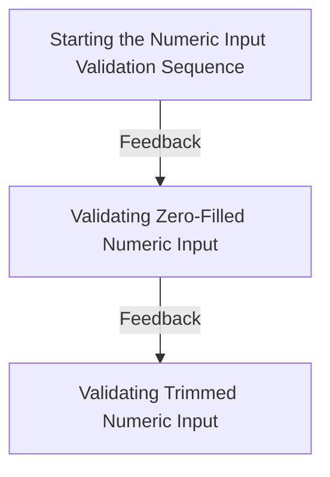
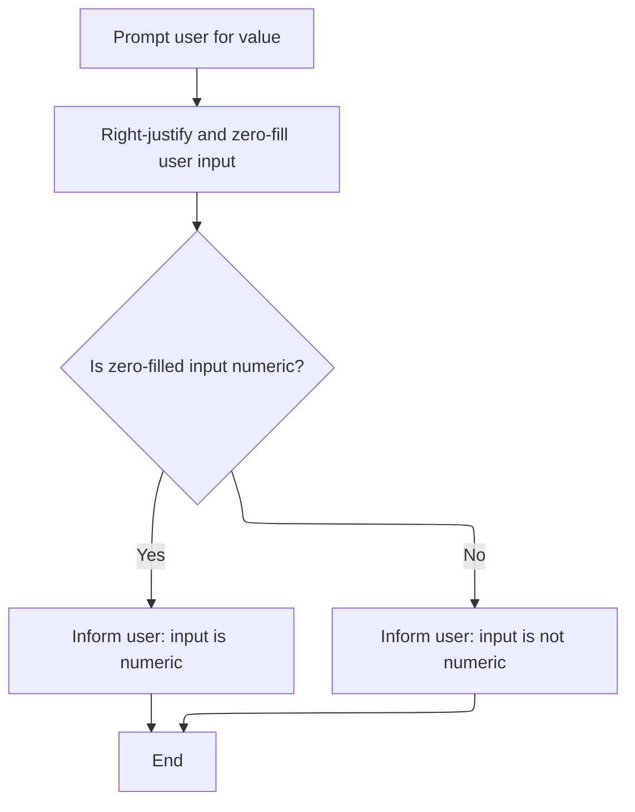
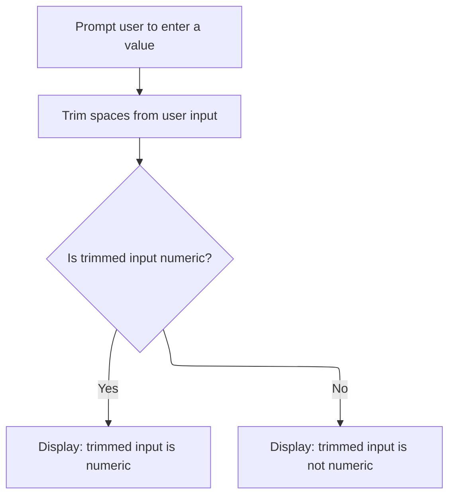

# Program Overview

This document describes the flow for validating numeric input (IS-NUMERIC-TEST). Users are prompted to enter values, and the program demonstrates how different formatting approaches—raw, zero-filled, and trimmed—affect whether the input is recognized as numeric, with instant feedback after each check.



# Program Workflow

# Starting the Numeric Input Validation Sequence

This section demonstrates how COBOL evaluates user input for numeric validity under different formatting scenarios, highlighting the impact of spaces and zero-filling on the numeric test.

| Category        | Rule Name                              | Description                                                                                                                                                 |
| --------------- | -------------------------------------- | ----------------------------------------------------------------------------------------------------------------------------------------------------------- |
| Data validation | All digits are valid numeric input     | If the user input consists solely of digits with no spaces, the input is considered numeric and the user is informed that the value is valid.               |
| Business logic  | Immediate feedback on numeric validity | After the numeric check, the program immediately displays a message to the user indicating whether the input is numeric or not, providing instant feedback. |

<SwmSnippet path="/is_numeric/is_numeric.cbl" line="18">

---

Main-procedure kicks off the flow by calling three sub-procedures in order: <SwmToken path="is_numeric/is_numeric.cbl" pos="19:3:5" line-data="           perform process-plain">`process-plain`</SwmToken>, <SwmToken path="is_numeric/is_numeric.cbl" pos="20:3:7" line-data="           perform process-zero-fill">`process-zero-fill`</SwmToken>, and <SwmToken path="is_numeric/is_numeric.cbl" pos="21:3:5" line-data="           perform process-trim">`process-trim`</SwmToken>. It starts with <SwmToken path="is_numeric/is_numeric.cbl" pos="19:3:5" line-data="           perform process-plain">`process-plain`</SwmToken> to check the raw user input for numeric validity, which sets the baseline for how spaces and formatting affect the numeric test. After all checks, the program terminates.

```cobol
       main-procedure.
           perform process-plain
           perform process-zero-fill
           perform process-trim
           stop run.
```

---

</SwmSnippet>

<SwmSnippet path="/is_numeric/is_numeric.cbl" line="25">

---

Process-plain prompts the user for input, checks if the raw string is all digits (spaces make it fail), and immediately displays whether it's numeric or not. This shows how COBOL treats spaces as invalid for numeric checks.

```cobol
       process-plain.
      *> If alphanumeric value entered has spaces, even if the user entered
      *> just digits, it will not pass the "is numeric" test. (Even if
      *> spaces are only trailing.)
           display "(plain) Enter a value: " with no advancing
           accept ws-user-input

           if ws-user-input is numeric then
               display ws-user-input " is numeric!"
           else
               display ws-user-input " is not numeric."
           end-if

           exit paragraph.
```

---

</SwmSnippet>

## Validating Zero-Filled Numeric Input



This section ensures that user-entered numeric values are properly formatted by right-justifying and zero-filling any leading spaces before validating if the input is numeric. It provides clear feedback to the user about the validity of their input.

| Category       | Rule Name                      | Description                                                                                                                               |
| -------------- | ------------------------------ | ----------------------------------------------------------------------------------------------------------------------------------------- |
| Business logic | Zero-fill normalization        | Any user input intended to be numeric must be right-justified and have all leading spaces replaced with zeros before validation.          |
| Business logic | Numeric input confirmation     | If the zero-filled, right-justified input contains only numeric characters, the user must be informed that their input is numeric.        |
| Business logic | Non-numeric input notification | If the zero-filled, right-justified input contains any non-numeric characters, the user must be informed that their input is not numeric. |

<SwmSnippet path="/is_numeric/is_numeric.cbl" line="42">

---

In <SwmToken path="is_numeric/is_numeric.cbl" pos="42:1:5" line-data="       process-zero-fill.">`process-zero-fill`</SwmToken>, we prompt for input, then use INSPECT to swap leading spaces for zeros. This lets right-justified numbers pass the numeric test, handling cases where users pad their input.

```cobol
       process-zero-fill.
      *> Right justifying and then filling the spaces with zeros followed
      *> by testing for numeric does work.
           display
               "(right justify, zero fill) Enter another value: "
               with no advancing
           end-display
           accept ws-user-input-justified

           inspect ws-user-input-justified
               replacing leading spaces by '0'
```

---

</SwmSnippet>

<SwmSnippet path="/is_numeric/is_numeric.cbl" line="54">

---

After zero-filling, <SwmToken path="is_numeric/is_numeric.cbl" pos="20:3:7" line-data="           perform process-zero-fill">`process-zero-fill`</SwmToken> checks if the modified input is numeric and displays the result using the zero-filled string, so the user sees exactly what was validated.

```cobol
           if ws-user-input-justified is numeric then
               display ws-user-input-justified " is numeric!"
           else
               display ws-user-input-justified " is not numeric."
           end-if

           exit paragraph.
```

---

</SwmSnippet>

## Validating Trimmed Numeric Input



<SwmSnippet path="/is_numeric/is_numeric.cbl" line="64">

---

Process-trim prompts for input, trims off any spaces using the TRIM function, then checks if what's left is all digits. This makes sure stray spaces don't mess up the numeric validation.

```cobol
       process-trim.
      *> Using the intrinsic "TRIM" function to remove any spaces in the
      *> input also will pass the "is numeric" test if trimmed data is all
      *> contiguous digits.
           display "(trim) Enter a third value: " with no advancing
           accept ws-user-input

           if function trim(ws-user-input) is numeric then
               display function trim(ws-user-input) " is numeric!"
           else
               display function trim(ws-user-input) " is not numeric."
           end-if

           exit paragraph.
```

---

</SwmSnippet>

&nbsp;

*This is an auto-generated document by Swimm 🌊 and has not yet been verified by a human*

<SwmMeta version="3.0.0" repo-id="Z2l0aHViJTNBJTNBQ09CT0wtRXhhbXBsZXMlM0ElM0FTd2ltbS1EZW1v" repo-name="COBOL-Examples"><sup>Powered by [Swimm](https://app.swimm.io/)</sup></SwmMeta>
