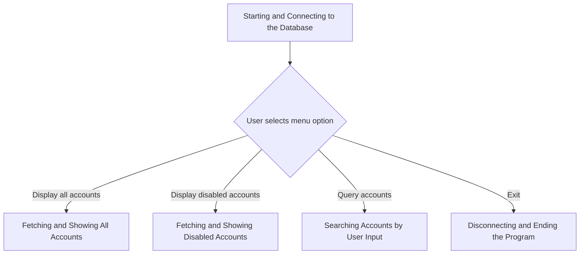
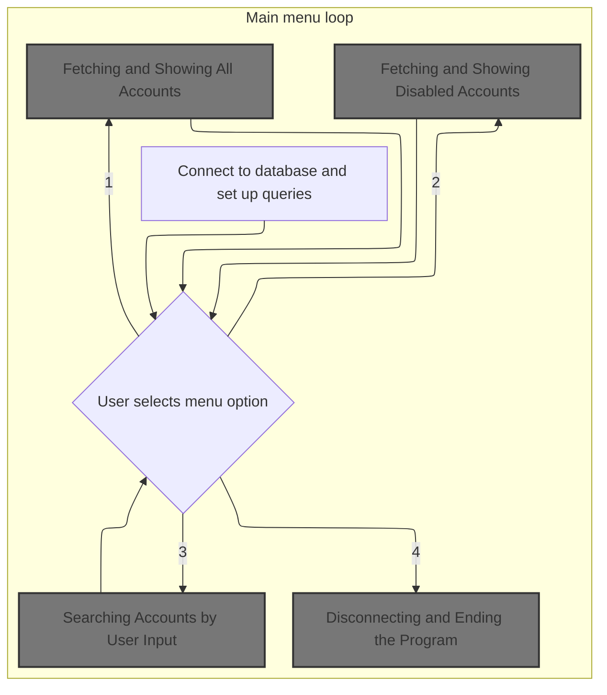
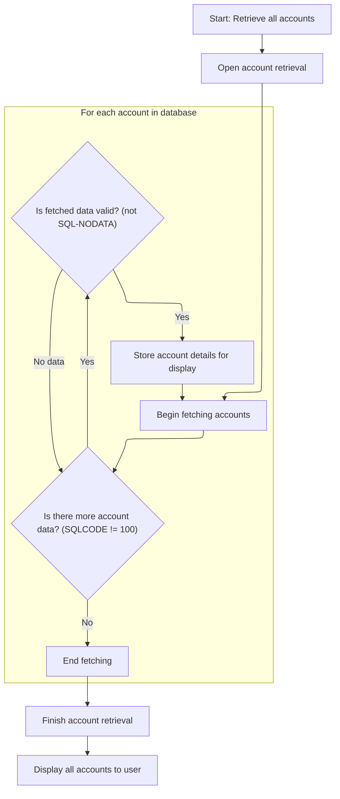
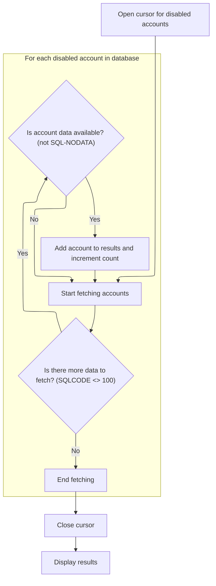
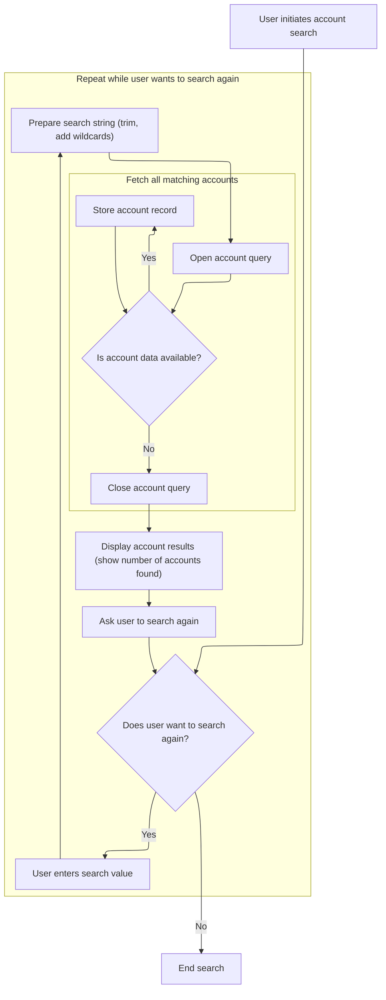

# Program Overview

This document describes the flow for viewing and searching account data (SQL_EXAMPLE). Users interact with a menu-driven interface to display all accounts, view only disabled accounts, or search for accounts by name, phone, or address.



## Input and Output Tables/Files used in the Program

| Table / File Name | Type | Description                                                       | Usage Mode | Key Fields / Layout Highlights                                                                                                                                                                                                                                                                                                                                                                                                                                                                                                                                                                                                                                                                                                                                                                                                                                                                                                                                                                                                                                                                                                                                                   |
| ----------------- | ---- | ----------------------------------------------------------------- | ---------- | -------------------------------------------------------------------------------------------------------------------------------------------------------------------------------------------------------------------------------------------------------------------------------------------------------------------------------------------------------------------------------------------------------------------------------------------------------------------------------------------------------------------------------------------------------------------------------------------------------------------------------------------------------------------------------------------------------------------------------------------------------------------------------------------------------------------------------------------------------------------------------------------------------------------------------------------------------------------------------------------------------------------------------------------------------------------------------------------------------------------------------------------------------------------------------- |
| ACCOUNTS          | DB2  | Customer account details: ID, name, phone, address, status, dates | Input      | <SwmToken path="sql/sql_example.cbl" pos="121:1:1" line-data="                   ID, FIRST_NAME, LAST_NAME, PHONE, ">`ID`</SwmToken>, <SwmToken path="sql/sql_example.cbl" pos="121:4:4" line-data="                   ID, FIRST_NAME, LAST_NAME, PHONE, ">`FIRST_NAME`</SwmToken>, <SwmToken path="sql/sql_example.cbl" pos="121:7:7" line-data="                   ID, FIRST_NAME, LAST_NAME, PHONE, ">`LAST_NAME`</SwmToken>, <SwmToken path="sql/sql_example.cbl" pos="121:10:10" line-data="                   ID, FIRST_NAME, LAST_NAME, PHONE, ">`PHONE`</SwmToken>, <SwmToken path="sql/sql_example.cbl" pos="122:1:1" line-data="                   ADDRESS, IS_ENABLED, CREATE_DT, MOD_DT ">`ADDRESS`</SwmToken>, <SwmToken path="sql/sql_example.cbl" pos="122:4:4" line-data="                   ADDRESS, IS_ENABLED, CREATE_DT, MOD_DT ">`IS_ENABLED`</SwmToken>, <SwmToken path="sql/sql_example.cbl" pos="122:7:7" line-data="                   ADDRESS, IS_ENABLED, CREATE_DT, MOD_DT ">`CREATE_DT`</SwmToken>, <SwmToken path="sql/sql_example.cbl" pos="122:10:10" line-data="                   ADDRESS, IS_ENABLED, CREATE_DT, MOD_DT ">`MOD_DT`</SwmToken> |

&nbsp;

# Program Workflow

# Starting and Connecting to the Database



This section is responsible for establishing a database connection, preparing queries for account data, and guiding the user through a menu to select which account information to view or search.

| Category        | Rule Name                    | Description                                                                                                                                                                                                                                                                                                                                     |
| --------------- | ---------------------------- | ----------------------------------------------------------------------------------------------------------------------------------------------------------------------------------------------------------------------------------------------------------------------------------------------------------------------------------------------- |
| Data validation | Database connection required | The system must establish a database connection using the provided connection string before any account data can be accessed or queried.                                                                                                                                                                                                        |
| Data validation | Menu option validation       | The system must present a menu with four options: display all accounts, display disabled accounts, query accounts, and exit. Only selections <SwmToken path="sql/sql_example.cbl" pos="182:14:16" line-data="                       display &quot;Please make a selection between 1-4&quot;                       ">`1-4`</SwmToken> are valid. |
| Business logic  | Show all accounts            | When the user selects 'Display all accounts', the system must fetch and display all account records ordered by ID.                                                                                                                                                                                                                              |
| Business logic  | Show disabled accounts       | When the user selects 'Display disabled accounts', the system must fetch and display only accounts where <SwmToken path="sql/sql_example.cbl" pos="122:4:4" line-data="                   ADDRESS, IS_ENABLED, CREATE_DT, MOD_DT ">`IS_ENABLED`</SwmToken> is 'N', ordered by ID.                                                               |
| Business logic  | Account search               | When the user selects 'Query accounts', the system must allow searching for accounts by user input, matching against first name, last name, phone, or address fields using partial matches.                                                                                                                                                     |
| Business logic  | Exit and disconnect          | When the user selects 'Exit', the system must disconnect from the database and terminate the program.                                                                                                                                                                                                                                           |

<SwmSnippet path="/sql/sql_example.cbl" line="104">

---

In <SwmToken path="sql/sql_example.cbl" pos="104:1:3" line-data="       main-procedure.">`main-procedure`</SwmToken> we kick off the flow by displaying some intro text, then connect to the database using the connection string, and immediately check the SQL state to catch any connection errors.

```cobol
       main-procedure.
           display space 
           display "COBOL SQL DB Example Program"
           display "----------------------------"
           display space

      *> Connect to database and check response status.
           EXEC SQL
               CONNECT TO :ws-db-connection-string
           END-EXEC.
           perform check-sql-state
```

---

</SwmSnippet>

<SwmSnippet path="/sql/sql_example.cbl" line="115">

---

After connecting, we flag the connection as active, then declare a cursor for fetching all accounts, and check for SQL errors again before moving on.

```cobol
           set ws-is-connected to true 

      *> Set up cursors for querying records
           EXEC SQL 
               DECLARE ACCOUNT-ALL-CUR CURSOR FOR 
               SELECT 
                   ID, FIRST_NAME, LAST_NAME, PHONE, 
                   ADDRESS, IS_ENABLED, CREATE_DT, MOD_DT 
               FROM ACCOUNTS 
               ORDER BY ID;
           END-EXEC 

           perform check-sql-state           
```

---

</SwmSnippet>

<SwmSnippet path="/sql/sql_example.cbl" line="129">

---

Next we declare a cursor specifically for disabled accounts, so we can fetch just those when needed, and check for SQL errors again.

```cobol
           EXEC SQL 
               DECLARE ACCOUNT-DISABLED-CUR CURSOR FOR 
               SELECT 
                   ID, FIRST_NAME, LAST_NAME, PHONE, 
                   ADDRESS, IS_ENABLED, CREATE_DT, MOD_DT 
               FROM ACCOUNTS 
               WHERE IS_ENABLED = 'N'
               ORDER BY ID;
           END-EXEC 

           perform check-sql-state
```

---

</SwmSnippet>

<SwmSnippet path="/sql/sql_example.cbl" line="141">

---

Here we declare a cursor for searching accounts by user input, using LIKE on several fields, and check for SQL errors again.

```cobol
           EXEC SQL 
               DECLARE ACCOUNT-QUERY-CUR CURSOR FOR 
               SELECT 
                   ID, FIRST_NAME, LAST_NAME, PHONE, 
                   ADDRESS, IS_ENABLED, CREATE_DT, MOD_DT 
               FROM ACCOUNTS 
               WHERE 
                   FIRST_NAME LIKE :ws-search-value
                   OR LAST_NAME LIKE :ws-search-value
                   OR PHONE LIKE :ws-search-value
                   OR ADDRESS LIKE :ws-search-value                    
               ORDER BY ID;
           END-EXEC 

           perform check-sql-state
```

---

</SwmSnippet>

<SwmSnippet path="/sql/sql_example.cbl" line="159">

---

Here we show the menu, take the user's choice, and call <SwmToken path="sql/sql_example.cbl" pos="170:3:7" line-data="                       perform display-all-accounts">`display-all-accounts`</SwmToken> if they pick option 1, which fetches and displays all account data.

```cobol
               display space 
               display "1) Display all accounts"
               display "2) Display disabled accounts"
               display "3) Query accounts"
               display "4) Exit"
               display "Selection: " with no advancing 
               accept ws-menu-choice

               evaluate ws-menu-choice
               
                   when '1' 
                       perform display-all-accounts
                       
                   when '2' 
                       perform display-disabled-accounts 

                   when '3' 
                       perform query-accounts 

                   when '4' 
                       exit perform 

                   when other 
                       display "Please make a selection between 1-4"                       

               end-evaluate
```

---

</SwmSnippet>

## Fetching and Showing All Accounts



This section is responsible for fetching all account records from the database and displaying them to the user. It ensures only valid records are included and handles any errors encountered during the retrieval process.

| Category        | Rule Name                  | Description                                                                                                                 |
| --------------- | -------------------------- | --------------------------------------------------------------------------------------------------------------------------- |
| Data validation | Valid account inclusion    | Only account records that are valid and contain data should be included in the displayed results.                           |
| Business logic  | Complete account retrieval | All account records in the database must be retrieved and included in the results, unless an error prevents retrieval.      |
| Business logic  | Accurate account count     | The total number of valid accounts retrieved must be accurately counted and reflected in the results displayed to the user. |

<SwmSnippet path="/sql/sql_example.cbl" line="201">

---

In <SwmToken path="sql/sql_example.cbl" pos="201:1:5" line-data="       display-all-accounts.">`display-all-accounts`</SwmToken> we open the cursor for all accounts and check for SQL errors before fetching any data.

```cobol
       display-all-accounts.

      *> Open cursor
           EXEC SQL 
               OPEN ACCOUNT-ALL-CUR 
           END-EXEC 

           perform check-sql-state
```

---

</SwmSnippet>

<SwmSnippet path="/sql/sql_example.cbl" line="212">

---

We loop and fetch each account from the cursor, checking for SQL errors after each fetch.

```cobol
           move 0 to ws-num-accounts
           perform with test after until SQLCODE = 100
               EXEC SQL 
                   FETCH ACCOUNT-ALL-CUR 
                   INTO 
                       :ws-sql-account-id,
                       :ws-sql-account-first-name,
                       :ws-sql-account-last-name,
                       :ws-sql-account-phone,
                       :ws-sql-account-address,
                       :ws-sql-account-is-enabled,
                       :ws-sql-account-create-dt,
                       :ws-sql-account-mod-dt;
               END-EXEC 
               perform check-sql-state
```

---

</SwmSnippet>

<SwmSnippet path="/sql/sql_example.cbl" line="229">

---

If we get a valid record, we increment the count and copy the fetched data into the account array for later display.

```cobol
               if not SQL-NODATA then 
                   add 1 to ws-num-accounts
                   
                   move ws-sql-account-record 
                   to ws-account-record(ws-num-accounts)
           end-perform 
```

---

</SwmSnippet>

<SwmSnippet path="/sql/sql_example.cbl" line="238">

---

After fetching all records, we close the cursor and check for errors.

```cobol
           EXEC SQL 
               CLOSE ACCOUNT-ALL-CUR 
           END-EXEC 
           perform check-sql-state
```

---

</SwmSnippet>

<SwmSnippet path="/sql/sql_example.cbl" line="244">

---

Once all records are fetched and stored, we call <SwmToken path="sql/sql_example.cbl" pos="244:3:7" line-data="           perform display-account-results">`display-account-results`</SwmToken> to show the data to the user.

```cobol
           perform display-account-results

           exit paragraph. 
```

---

</SwmSnippet>

## Displaying Account Data

This section is responsible for presenting account data in a clear, tabular format so users can easily view and understand the details of each account.

| Category        | Rule Name                     | Description                                                                                                                                                                                                                 |
| --------------- | ----------------------------- | --------------------------------------------------------------------------------------------------------------------------------------------------------------------------------------------------------------------------- |
| Data validation | Valid account range           | Only accounts with valid data (i.e., those indexed from 1 to <SwmToken path="sql/sql_example.cbl" pos="212:7:11" line-data="           move 0 to ws-num-accounts">`ws-num-accounts`</SwmToken>) are displayed in the table. |
| Data validation | Maximum account display limit | No more than 100 accounts can be displayed in the table at one time, as limited by the maximum size of the account record array.                                                                                            |
| Business logic  | Table header display          | The table must display a header row that clearly labels each column: ID, First, Last, Phone, Address, and Enabled.                                                                                                          |
| Business logic  | Enabled status display        | The 'Enabled' column must display 'Y' for enabled accounts and 'N' for disabled accounts, as defined by business status values.                                                                                             |

<SwmSnippet path="/sql/sql_example.cbl" line="400">

---

In <SwmToken path="sql/sql_example.cbl" pos="400:1:5" line-data="       display-account-results. ">`display-account-results`</SwmToken> we print the table headers so users know what each column means.

```cobol
       display-account-results. 

           display space 
           display "ACCOUNTS:"
           display space                  
           display " ID   | First    | Last     | Phone      |"
               " Address                | Enabled "
           end-display 
           display "------|----------|----------|------------|"
               "------------------------|---------"
           end-display 
```

---

</SwmSnippet>

<SwmSnippet path="/sql/sql_example.cbl" line="412">

---

We loop from 1 to <SwmToken path="sql/sql_example.cbl" pos="413:11:15" line-data="           until ws-account-idx &gt; ws-num-accounts">`ws-num-accounts`</SwmToken> and print each account's details from the arrays, assuming they're filled and indexed correctly.

```cobol
           perform varying ws-account-idx from 1 by 1 
           until ws-account-idx > ws-num-accounts

               display 
                   ws-account-id(ws-account-idx) 
                   " | "               
                   ws-account-first-name(ws-account-idx) 
                   " | "
                   ws-account-last-name(ws-account-idx)
                   " | "
                   ws-account-phone(ws-account-idx) 
                   " | "
                   ws-account-address(ws-account-idx)
                   " | "
                   ws-account-is-enabled(ws-account-idx)  
               end-display 

           end-perform 
           exit paragraph.
```

---

</SwmSnippet>

## Fetching and Showing Disabled Accounts



This section is responsible for retrieving all disabled accounts from the database and presenting them for review. It ensures only valid and complete records are shown, and handles any errors encountered during the process.

| Category        | Rule Name                       | Description                                                                                                                                                                                    |
| --------------- | ------------------------------- | ---------------------------------------------------------------------------------------------------------------------------------------------------------------------------------------------- |
| Data validation | Account completeness validation | Each account record must contain all required fields (account ID, first name, last name, phone, address, enabled status, creation date, modification date) to be considered valid for display. |
| Data validation | Account count accuracy          | The total number of disabled accounts displayed must match the number of valid records fetched from the database.                                                                              |
| Business logic  | Disabled account filter         | Only accounts marked as disabled in the database are included in the results.                                                                                                                  |
| Business logic  | Post-fetch display              | The results must be displayed only after all disabled accounts have been fetched and validated.                                                                                                |

<SwmSnippet path="/sql/sql_example.cbl" line="258">

---

In <SwmToken path="sql/sql_example.cbl" pos="258:1:5" line-data="       display-disabled-accounts.">`display-disabled-accounts`</SwmToken> we open the cursor for disabled accounts and check for errors before fetching.

```cobol
       display-disabled-accounts.

           EXEC SQL 
               OPEN ACCOUNT-DISABLED-CUR 
           END-EXEC 

           perform check-sql-state
```

---

</SwmSnippet>

<SwmSnippet path="/sql/sql_example.cbl" line="266">

---

We loop and fetch each disabled account, checking for errors after each fetch.

```cobol
           move 0 to ws-num-accounts
           perform with test after until SQLCODE = 100
               EXEC SQL 
                   FETCH ACCOUNT-DISABLED-CUR 
                   INTO 
                       :ws-sql-account-id,
                       :ws-sql-account-first-name,
                       :ws-sql-account-last-name,
                       :ws-sql-account-phone,
                       :ws-sql-account-address,
                       :ws-sql-account-is-enabled,
                       :ws-sql-account-create-dt,
                       :ws-sql-account-mod-dt;
               END-EXEC 
               perform check-sql-state
```

---

</SwmSnippet>

<SwmSnippet path="/sql/sql_example.cbl" line="281">

---

Valid disabled account records are added to the account array for display.

```cobol
               if not SQL-NODATA then 
                   add 1 to ws-num-accounts
                   
                   move ws-sql-account-record 
                   to ws-account-record(ws-num-accounts)
           end-perform 
```

---

</SwmSnippet>

<SwmSnippet path="/sql/sql_example.cbl" line="288">

---

After closing the cursor and checking for errors, we call <SwmToken path="sql/sql_example.cbl" pos="293:3:7" line-data="           perform display-account-results">`display-account-results`</SwmToken> to show the disabled accounts.

```cobol
           EXEC SQL 
               CLOSE ACCOUNT-DISABLED-CUR 
           END-EXEC 
           perform check-sql-state

           perform display-account-results

           exit paragraph.
```

---

</SwmSnippet>

## Searching Accounts by User Input



This section enables users to search for accounts by entering a search value. The system processes the input, performs a database search using the provided value, and displays the results. Users can repeat the search process multiple times.

| Category        | Rule Name                      | Description                                                                                                                                                                             |
| --------------- | ------------------------------ | --------------------------------------------------------------------------------------------------------------------------------------------------------------------------------------- |
| Data validation | Prompt for Search Value        | The system must prompt the user to enter a search value before performing any account search.                                                                                           |
| Data validation | Accurate Search Value Length   | The system must ensure that the search value length is accurately calculated and provided to the database query to avoid mismatches or incomplete results.                              |
| Business logic  | Wildcard and Trim Search Value | The search value entered by the user must be trimmed of leading and trailing spaces and have wildcard characters ('%') added to both the start and end before being used in the search. |
| Business logic  | Display Result Count           | The system must display the number of accounts found as a result of the search to the user.                                                                                             |
| Business logic  | Repeat Search Option           | After displaying search results, the system must ask the user if they wish to perform another search and repeat the process if the user agrees.                                         |
| Business logic  | End Search on User Request     | The search process must end immediately if the user indicates they do not wish to search again.                                                                                         |

<SwmSnippet path="/sql/sql_example.cbl" line="318">

---

In <SwmToken path="sql/sql_example.cbl" pos="318:1:3" line-data="       query-accounts.">`query-accounts`</SwmToken> we set up for repeated searches, get user input, trim it, add wildcards, and prep the search variable for SQL.

```cobol
       query-accounts.

      *> Keep searching until user decides to not search again.
           set ws-search-again to true 

           perform until not ws-search-again

      *> Get user input for search
               display space 
               display "Enter search value: " with no advancing 
               accept ws-search-string
           
      *> String trimmed user input into our search variable's text 
      *> value, adding the '%' wildcard characters at the start and 
      *> end of the search string.
               move spaces to ws-search-value-text
               string 
                   '%' function trim(ws-search-string) '%'                   
                   into ws-search-value-text
               end-string 

      *> Use the stored-char-length function to determine the length
      *> in characters the search string is and set it in our SQL 
      *> search variable
               move function stored-char-length(ws-search-value-text) 
               to ws-search-value-len

               display "Search value: " ws-search-value-text
               display "Length: " ws-search-value-len
```

---

</SwmSnippet>

<SwmSnippet path="/sql/sql_example.cbl" line="350">

---

After prepping the search value, we open the query cursor and check for errors.

```cobol
               EXEC SQL 
                   OPEN ACCOUNT-QUERY-CUR 
               END-EXEC 

               perform check-sql-state
```

---

</SwmSnippet>

<SwmSnippet path="/sql/sql_example.cbl" line="356">

---

We loop and fetch each matching account, checking for errors after each fetch.

```cobol
               move 0 to ws-num-accounts
               perform with test after until SQLCODE = 100
                   EXEC SQL 
                       FETCH ACCOUNT-QUERY-CUR 
                       INTO 
                           :ws-sql-account-id,
                           :ws-sql-account-first-name,
                           :ws-sql-account-last-name,
                           :ws-sql-account-phone,
                           :ws-sql-account-address,
                           :ws-sql-account-is-enabled,
                           :ws-sql-account-create-dt,
                           :ws-sql-account-mod-dt;
                   END-EXEC 
                   perform check-sql-state
```

---

</SwmSnippet>

<SwmSnippet path="/sql/sql_example.cbl" line="371">

---

Valid query results are added to the account array for display.

```cobol
                   if not SQL-NODATA then 
                       add 1 to ws-num-accounts
                   
                       move ws-sql-account-record 
                       to ws-account-record(ws-num-accounts)
               end-perform 
```

---

</SwmSnippet>

<SwmSnippet path="/sql/sql_example.cbl" line="378">

---

After closing the cursor and checking for errors, we call <SwmToken path="sql/sql_example.cbl" pos="383:3:7" line-data="               perform display-account-results">`display-account-results`</SwmToken> to show the query results.

```cobol
               EXEC SQL 
                   CLOSE ACCOUNT-QUERY-CUR 
               END-EXEC 
               perform check-sql-state

               perform display-account-results
```

---

</SwmSnippet>

<SwmSnippet path="/sql/sql_example.cbl" line="385">

---

Back in <SwmToken path="sql/sql_example.cbl" pos="176:3:5" line-data="                       perform query-accounts ">`query-accounts`</SwmToken>, after showing results, we ask the user if they want to search again and loop if they do.

```cobol
               display space 
               display "Search again? (Y/[N]) " with no advancing 
               accept ws-search-again-sw 
               
               move function upper-case(ws-search-again-sw) 
               to ws-search-again-sw 

           end-perform 

           exit paragraph.
```

---

</SwmSnippet>

## Disconnecting and Ending the Program

<SwmSnippet path="/sql/sql_example.cbl" line="185">

---

Back in <SwmToken path="sql/sql_example.cbl" pos="104:1:3" line-data="       main-procedure.">`main-procedure`</SwmToken>, after returning from <SwmToken path="sql/sql_example.cbl" pos="176:3:5" line-data="                       perform query-accounts ">`query-accounts`</SwmToken>, we disconnect from the database to clean up before exiting.

```cobol
           end-perform 

      *> Disconnect and exit
           EXEC SQL
               CONNECT RESET
           END-EXEC
```

---

</SwmSnippet>

<SwmSnippet path="/sql/sql_example.cbl" line="191">

---

We show a disconnect message and then stop the program.

```cobol
           display "Disconnected."
           display space 

           stop run.
```

---

</SwmSnippet>

&nbsp;

*This is an auto-generated document by Swimm 🌊 and has not yet been verified by a human*

<SwmMeta version="3.0.0" repo-id="Z2l0aHViJTNBJTNBQ09CT0wtRXhhbXBsZXMlM0ElM0FTd2ltbS1EZW1v" repo-name="COBOL-Examples"><sup>Powered by [Swimm](https://app.swimm.io/)</sup></SwmMeta>
