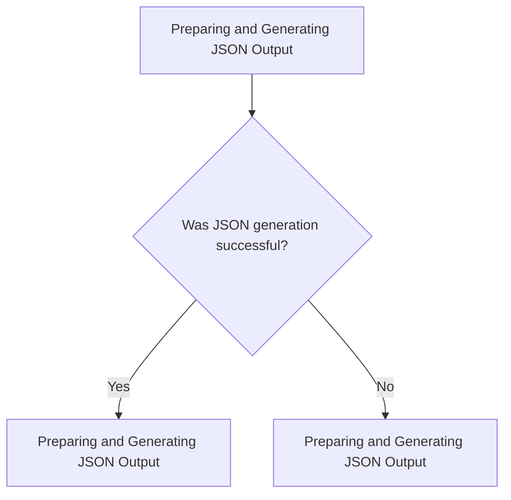
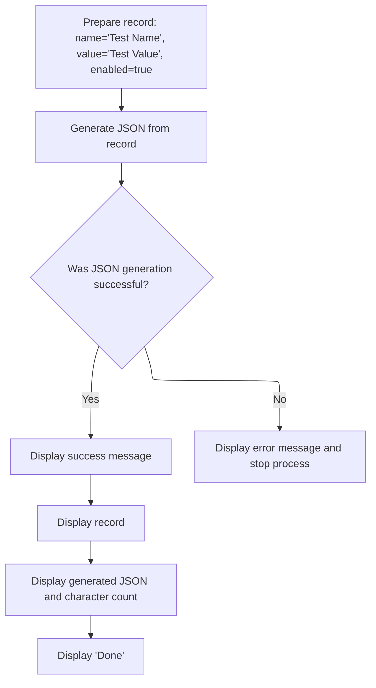

# Program Overview

This document explains the flow for generating a JSON representation from a COBOL data record (JSON-GENERATE-EXAMPLE). The program prepares a record, converts it to JSON using custom key mappings, and displays both the record and the JSON output for verification.



# Program Workflow

# Preparing and Generating JSON Output



This section is responsible for preparing a data record, generating a JSON representation with custom key mappings, and displaying both the record and the JSON output for verification. It also handles error messaging if JSON generation fails.

| Category       | Rule Name                        | Description                                                                                    |
| -------------- | -------------------------------- | ---------------------------------------------------------------------------------------------- |
| Business logic | Display JSON and character count | The generated JSON string and its character count must be displayed for verification purposes. |

<SwmSnippet path="/json_generate/json_generate.cbl" line="36">

---

Main-procedure kicks off the flow by setting up <SwmToken path="json_generate/json_generate.cbl" pos="38:11:13" line-data="           move &quot;Test Name&quot; to ws-record-name">`ws-record`</SwmToken> with fixed values and enabling the flag. Then it generates a JSON string from <SwmToken path="json_generate/json_generate.cbl" pos="38:11:13" line-data="           move &quot;Test Name&quot; to ws-record-name">`ws-record`</SwmToken>, mapping COBOL field names to custom JSON keys using the NAME OF clause. After that, it prints the record, the JSON output, and its character count for verification. If JSON generation fails, it displays an error and stops.

```cobol
       main-procedure.

           move "Test Name" to ws-record-name
           move "Test Value" to ws-record-value
           set ws-record-flag-enabled to true

           json generate ws-json-output
               from ws-record
               count in ws-json-char-count
               name of
                   ws-record-name is "name",
                   ws-record-value is "value",
                   ws-record-flag is "enabled"
               on exception
                   display "Error generating JSON error " JSON-CODE
                   stop run
               not on exception
                   display "JSON document successfully generated."
           end-json

           display "Generated JSON for record: " ws-record
           display "----------------------------"
           display function trim(ws-json-output)
           display "----------------------------"
           display "JSON output character count: " ws-json-char-count
           display "Done."
           stop run.


       end program json-generate-example.
```

---

</SwmSnippet>

&nbsp;

*This is an auto-generated document by Swimm 🌊 and has not yet been verified by a human*

<SwmMeta version="3.0.0" repo-id="Z2l0aHViJTNBJTNBQ09CT0wtRXhhbXBsZXMlM0ElM0FTd2ltbS1EZW1v" repo-name="COBOL-Examples"><sup>Powered by [Swimm](https://app.swimm.io/)</sup></SwmMeta>
