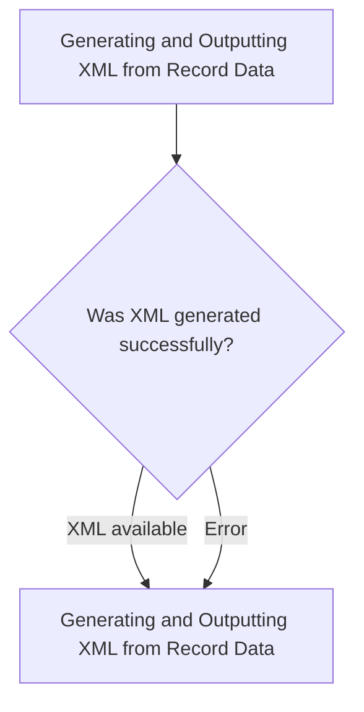
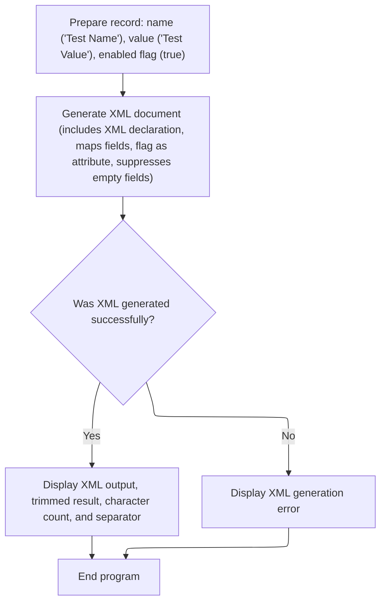

# Program Overview

This document explains the flow of generating XML from record data (XML-GENERATE-EXAMPLE). The program transforms structured record data into a well-formed XML document using custom mapping rules and displays the result to the user.



# Program Workflow

# Generating and Outputting XML from Record Data



This section is responsible for transforming record data into a well-formed XML document, applying custom naming conventions, handling empty fields, and reporting the result or any errors to the user.

| Category       | Rule Name                 | Description                                                                                                                                            |
| -------------- | ------------------------- | ------------------------------------------------------------------------------------------------------------------------------------------------------ |
| Business logic | XML Declaration Inclusion | The XML output must include an XML declaration at the beginning of the document.                                                                       |
| Business logic | Custom Field Mapping      | The record's 'name', 'value', and 'enabled' flag must be mapped to XML elements and attributes using custom names: 'name', 'value', and 'enabled'.     |
| Business logic | Flag as Attribute         | The 'enabled' flag must be represented as an XML attribute, not an element.                                                                            |
| Business logic | Suppress Empty Fields     | Any record field that is empty or contains only spaces must be suppressed and not appear in the XML output.                                            |
| Business logic | Result Display            | Upon successful XML generation, the system must display the trimmed XML output, a separator, the character count of the XML, and a completion message. |

<SwmSnippet path="/xml_generate/xml_generate.cbl" line="35">

---

Main-procedure kicks off the flow by populating <SwmToken path="xml_generate/xml_generate.cbl" pos="37:11:13" line-data="           move &quot;Test Name&quot; to ws-record-name">`ws-record`</SwmToken> fields, sets <SwmToken path="xml_generate/xml_generate.cbl" pos="39:3:7" line-data="           set ws-record-flag-enabled to true">`ws-record-flag`</SwmToken> to 'true' using the <SwmToken path="xml_generate/xml_generate.cbl" pos="39:3:9" line-data="           set ws-record-flag-enabled to true">`ws-record-flag-enabled`</SwmToken> condition name, then generates XML from <SwmToken path="xml_generate/xml_generate.cbl" pos="37:11:13" line-data="           move &quot;Test Name&quot; to ws-record-name">`ws-record`</SwmToken> with custom element and attribute names. It handles exceptions, displays the generated XML and its character count, and stops the run. The XML GENERATE statement uses options to control naming and suppress empty fields, and the flag is set using COBOL's idiomatic 88-level condition name for clarity.

```cobol
       main-procedure.

           move "Test Name" to ws-record-name
           move "Test Value" to ws-record-value
           set ws-record-flag-enabled to true

           xml generate ws-xml-output
               from ws-record
               count in ws-xml-char-count
               with xml-declaration
               name of
                   ws-record-name is "name",
                   ws-record-value is "value",
                   ws-record-flag is "enabled"
               type of ws-record-flag is attribute
               suppress when spaces
               on exception
                   display "Error generating xml error " XML-CODE
                   stop run
               not on exception
                   display "XML document successfully generated."
           end-xml

           display "Generated xml for record: " ws-record
           display "----------------------------"
           display function trim(ws-xml-output)
           display "----------------------------"
           display "XML output character count: " ws-xml-char-count
           display "Done."
           stop run.


       end program xml-generate-example.
```

---

</SwmSnippet>

&nbsp;

*This is an auto-generated document by Swimm 🌊 and has not yet been verified by a human*

<SwmMeta version="3.0.0" repo-id="Z2l0aHViJTNBJTNBQ09CT0wtRXhhbXBsZXMlM0ElM0FTd2ltbS1EZW1v" repo-name="COBOL-Examples"><sup>Powered by [Swimm](https://app.swimm.io/)</sup></SwmMeta>
