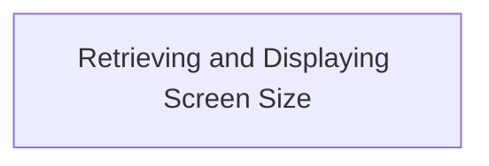

# Program Overview

This document describes the flow for interactively retrieving and displaying the terminal screen size (SCREEN-SIZE-TEST). Users can resize their terminal and observe the updated screen dimensions using two different COBOL methods: the ACCEPT statement and the <SwmToken path="screen_size/get_screen_size.cbl" pos="60:7:7" line-data="           display &quot;Using &#39;CBL_GET_SCR_SIZE&#39; to get screen size:&quot;">`CBL_GET_SCR_SIZE`</SwmToken> routine.



## Dependencies

### Program

- <SwmToken path="screen_size/get_screen_size.cbl" pos="60:7:7" line-data="           display &quot;Using &#39;CBL_GET_SCR_SIZE&#39; to get screen size:&quot;">`CBL_GET_SCR_SIZE`</SwmToken>

# Program Workflow

# Retrieving and Displaying Screen Size

```mermaid
%%{init: {"flowchart": {"defaultRenderer": "elk"}} }%%
flowchart TD
    node1["Clear screen and start demonstration"]
    click node1 openCode "screen_size/get_screen_size.cbl:38:39"
    node1 --> node2["Show: Using ACCEPT ... FROM LINES/COLS"]
    click node2 openCode "screen_size/get_screen_size.cbl:42:43"
    subgraph loop1["Repeat 3 times: User can resize, then get and display screen size"]
      node2 --> node3["Get screen lines and columns using ACCEPT"]
      click node3 openCode "screen_size/get_screen_size.cbl:47:48"
      node3 --> node4["Display current screen size (lines and columns)"]
      click node4 openCode "screen_size/get_screen_size.cbl:50:52"
      node4 --> node5["Prompt: Resize and press enter to continue"]
      click node5 openCode "screen_size/get_screen_size.cbl:84:85"
    end
    node5 --> node6["Clear screen"]
    click node6 openCode "screen_size/get_screen_size.cbl:59:59"
    node6 --> node7["Show: Using CBL_GET_SCR_SIZE"]
    click node7 openCode "screen_size/get_screen_size.cbl:60:60"
    subgraph loop2["Repeat 3 times: User can resize, then get and display screen size"]
      node7 --> node8["Get screen lines and columns using CBL_GET_SCR_SIZE"]
      click node8 openCode "screen_size/get_screen_size.cbl:64:67"
      node8 --> node9["Display current screen size (lines and columns)"]
      click node9 openCode "screen_size/get_screen_size.cbl:69:71"
      node9 --> node10["Prompt: Resize and press enter to continue"]
      click node10 openCode "screen_size/get_screen_size.cbl:84:85"
    end
    node10 --> node11["Show 'Done.' and end program"]
    click node11 openCode "screen_size/get_screen_size.cbl:73:75"

classDef HeadingStyle fill:#777777,stroke:#333,stroke-width:2px;

%% Swimm:
%% %%{init: {"flowchart": {"defaultRenderer": "elk"}} }%%
%% flowchart TD
%%     node1["Clear screen and start demonstration"]
%%     click node1 openCode "<SwmPath>[screen_size/get_screen_size.cbl](screen_size/get_screen_size.cbl)</SwmPath>:38:39"
%%     node1 --> node2["Show: Using ACCEPT ... FROM LINES/COLS"]
%%     click node2 openCode "<SwmPath>[screen_size/get_screen_size.cbl](screen_size/get_screen_size.cbl)</SwmPath>:42:43"
%%     subgraph loop1["Repeat 3 times: User can resize, then get and display screen size"]
%%       node2 --> node3["Get screen lines and columns using ACCEPT"]
%%       click node3 openCode "<SwmPath>[screen_size/get_screen_size.cbl](screen_size/get_screen_size.cbl)</SwmPath>:47:48"
%%       node3 --> node4["Display current screen size (lines and columns)"]
%%       click node4 openCode "<SwmPath>[screen_size/get_screen_size.cbl](screen_size/get_screen_size.cbl)</SwmPath>:50:52"
%%       node4 --> node5["Prompt: Resize and press enter to continue"]
%%       click node5 openCode "<SwmPath>[screen_size/get_screen_size.cbl](screen_size/get_screen_size.cbl)</SwmPath>:84:85"
%%     end
%%     node5 --> node6["Clear screen"]
%%     click node6 openCode "<SwmPath>[screen_size/get_screen_size.cbl](screen_size/get_screen_size.cbl)</SwmPath>:59:59"
%%     node6 --> node7["Show: Using <SwmToken path="screen_size/get_screen_size.cbl" pos="60:7:7" line-data="           display &quot;Using &#39;CBL_GET_SCR_SIZE&#39; to get screen size:&quot;">`CBL_GET_SCR_SIZE`</SwmToken>"]
%%     click node7 openCode "<SwmPath>[screen_size/get_screen_size.cbl](screen_size/get_screen_size.cbl)</SwmPath>:60:60"
%%     subgraph loop2["Repeat 3 times: User can resize, then get and display screen size"]
%%       node7 --> node8["Get screen lines and columns using <SwmToken path="screen_size/get_screen_size.cbl" pos="60:7:7" line-data="           display &quot;Using &#39;CBL_GET_SCR_SIZE&#39; to get screen size:&quot;">`CBL_GET_SCR_SIZE`</SwmToken>"]
%%       click node8 openCode "<SwmPath>[screen_size/get_screen_size.cbl](screen_size/get_screen_size.cbl)</SwmPath>:64:67"
%%       node8 --> node9["Display current screen size (lines and columns)"]
%%       click node9 openCode "<SwmPath>[screen_size/get_screen_size.cbl](screen_size/get_screen_size.cbl)</SwmPath>:69:71"
%%       node9 --> node10["Prompt: Resize and press enter to continue"]
%%       click node10 openCode "<SwmPath>[screen_size/get_screen_size.cbl](screen_size/get_screen_size.cbl)</SwmPath>:84:85"
%%     end
%%     node10 --> node11["Show 'Done.' and end program"]
%%     click node11 openCode "<SwmPath>[screen_size/get_screen_size.cbl](screen_size/get_screen_size.cbl)</SwmPath>:73:75"
%% 
%% classDef HeadingStyle fill:#777777,stroke:#333,stroke-width:2px;
```



This section provides an interactive demonstration of how to retrieve and display the terminal screen size in COBOL, using both the ACCEPT statement and the <SwmToken path="screen_size/get_screen_size.cbl" pos="60:7:7" line-data="           display &quot;Using &#39;CBL_GET_SCR_SIZE&#39; to get screen size:&quot;">`CBL_GET_SCR_SIZE`</SwmToken> routine. The user can resize the terminal and see the updated values displayed after each retrieval.

| Category       | Rule Name                          | Description                                                                                                                                                                                                                                                                                                                                      |
| -------------- | ---------------------------------- | ------------------------------------------------------------------------------------------------------------------------------------------------------------------------------------------------------------------------------------------------------------------------------------------------------------------------------------------------ |
| Business logic | Display updated screen size        | The program must display the current screen size (lines and columns) to the user after each retrieval, ensuring the user can observe changes resulting from resizing the terminal.                                                                                                                                                               |
| Business logic | Prompt for terminal resize         | The user must be prompted to resize the terminal and press enter to continue after each screen size display, allowing them to interactively test the feature.                                                                                                                                                                                    |
| Business logic | Repeat demonstration cycles        | The demonstration must repeat the screen size retrieval and display process three times for each method, providing multiple opportunities for the user to observe changes.                                                                                                                                                                       |
| Business logic | Demonstrate both retrieval methods | Both methods for retrieving screen size (ACCEPT statement and <SwmToken path="screen_size/get_screen_size.cbl" pos="60:7:7" line-data="           display &quot;Using &#39;CBL_GET_SCR_SIZE&#39; to get screen size:&quot;">`CBL_GET_SCR_SIZE`</SwmToken> routine) must be demonstrated in sequence, allowing the user to compare their outputs. |
| Business logic | Completion message                 | The program must display a 'Done.' message at the end of the demonstration to clearly indicate completion to the user.                                                                                                                                                                                                                           |

<SwmSnippet path="/screen_size/get_screen_size.cbl" line="32">

---

In <SwmToken path="screen_size/get_screen_size.cbl" pos="32:1:3" line-data="       main-procedure.">`main-procedure`</SwmToken> we kick off the flow by prepping the screen and setting up to show two ways to get the terminal size. First, we use ACCEPT statements to grab lines and columns separately, then later we'll use a single call to <SwmToken path="screen_size/get_screen_size.cbl" pos="60:7:7" line-data="           display &quot;Using &#39;CBL_GET_SCR_SIZE&#39; to get screen size:&quot;">`CBL_GET_SCR_SIZE`</SwmToken>. This sets up the demo for both approaches.

```cobol
       main-procedure.

      *> Both methods of getting the screen size enter the program in to
      *> "COB SCREEN MODE" which requires either the use of a screen
      *> section or the location of the display statements specified.

           display space blank screen

      *> Example of using ACCEPT .. FROM.. to get the lines and column
      *> size of the current display.
           display "Using 'ACCEPT ... FROM LINES' and 'ACCEPT ... FROM "
               & "COLUMNS' to get screen size:" at 0101
```

---

</SwmSnippet>

<SwmSnippet path="/screen_size/get_screen_size.cbl" line="45">

---

After grabbing the screen size with ACCEPT, we loop three times so the user can resize the terminal and see the new values. Each time, we call <SwmToken path="screen_size/get_screen_size.cbl" pos="50:3:7" line-data="               perform display-screens-size">`display-screens-size`</SwmToken> to show the current size and prompt the user to continue.

```cobol
           perform 3 times

               accept ws-scr-lines-disp from lines
               accept ws-scr-cols-disp from cols

               perform display-screens-size

           end-perform
```

---

</SwmSnippet>

<SwmSnippet path="/screen_size/get_screen_size.cbl" line="78">

---

<SwmToken path="screen_size/get_screen_size.cbl" pos="78:1:5" line-data="       display-screens-size.">`display-screens-size`</SwmToken> shows the current columns and lines at fixed positions, then prompts the user to resize the terminal and hit enter. This makes it easy to see changes in screen size as you interact.

```cobol
       display-screens-size.
           display "-------------------------------------------------"
               & "------------" at 0201
           display "Current screen size: " at 0301
           display concat("Columns: " ws-scr-cols-disp) at 0401
           display concat("  Lines: " ws-scr-lines-disp) at 0501
           display "Resize and press enter to continue" at 0701
           accept omitted
           exit paragraph.
```

---

</SwmSnippet>

<SwmSnippet path="/screen_size/get_screen_size.cbl" line="59">

---

Back in <SwmToken path="screen_size/get_screen_size.cbl" pos="32:1:3" line-data="       main-procedure.">`main-procedure`</SwmToken> after returning from <SwmToken path="screen_size/get_screen_size.cbl" pos="69:3:7" line-data="               perform display-screens-size">`display-screens-size`</SwmToken>, we switch to using <SwmToken path="screen_size/get_screen_size.cbl" pos="60:7:7" line-data="           display &quot;Using &#39;CBL_GET_SCR_SIZE&#39; to get screen size:&quot;">`CBL_GET_SCR_SIZE`</SwmToken> to get both screen size values in one call. We move the results to display variables before showing them, then repeat the interactive display three times, just like before.

```cobol
           display space blank screen
           display "Using 'CBL_GET_SCR_SIZE' to get screen size:"

           perform 3 times

               call "CBL_GET_SCR_SIZE" using ws-scr-lines ws-scr-cols

               move ws-scr-lines to ws-scr-lines-disp
               move ws-scr-cols to ws-scr-cols-disp

               perform display-screens-size

           end-perform

           display "Done." at 0901

           stop run.
```

---

</SwmSnippet>

&nbsp;

*This is an auto-generated document by Swimm 🌊 and has not yet been verified by a human*

<SwmMeta version="3.0.0" repo-id="Z2l0aHViJTNBJTNBQ09CT0wtRXhhbXBsZXMlM0ElM0FTd2ltbS1EZW1v" repo-name="COBOL-Examples"><sup>Powered by [Swimm](https://app.swimm.io/)</sup></SwmMeta>
