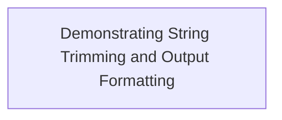

# Program Overview

This document describes the flow of demonstrating string trimming and output formatting (TRIM-FUNCTION-TEST). The program displays how COBOL's TRIM function affects both variables and string literals, showing the results for fully trimmed, leading trimmed, and trailing trimmed cases.



# Program Workflow

# Demonstrating String Trimming and Output Formatting

```mermaid
%%{init: {"flowchart": {"defaultRenderer": "elk"}} }%%
flowchart TD
    node1["Show original test string"]
    click node1 openCode "trim/trim.cbl:22:22"
    node1 --> node2["Show fully trimmed test string"]
    click node2 openCode "trim/trim.cbl:23:23"
    node2 --> node3["Show leading trimmed test string"]
    click node3 openCode "trim/trim.cbl:24:24"
    node3 --> node4["Show trailing trimmed test string"]
    click node4 openCode "trim/trim.cbl:25:25"
    node4 --> node5["Move and display fully trimmed result"]
    click node5 openCode "trim/trim.cbl:34:35"
    node5 --> node6["Move and display leading trimmed result"]
    click node6 openCode "trim/trim.cbl:39:41"
    node6 --> node7["Move and display trailing trimmed result"]
    click node7 openCode "trim/trim.cbl:45:47"
    node7 --> node8["Show effect of trim on string literal"]
    click node8 openCode "trim/trim.cbl:51:51"
    node8 --> node9["Show effect of leading trim on string literal"]
    click node9 openCode "trim/trim.cbl:53:54"
    node9 --> node10["Show effect of trailing trim on string literal"]
    click node10 openCode "trim/trim.cbl:56:57"
    node10 --> node11["End"]
    click node11 openCode "trim/trim.cbl:60:60"

classDef HeadingStyle fill:#777777,stroke:#333,stroke-width:2px;

%% Swimm:
%% %%{init: {"flowchart": {"defaultRenderer": "elk"}} }%%
%% flowchart TD
%%     node1["Show original test string"]
%%     click node1 openCode "<SwmPath>[trim/trim.cbl](trim/trim.cbl)</SwmPath>:22:22"
%%     node1 --> node2["Show fully trimmed test string"]
%%     click node2 openCode "<SwmPath>[trim/trim.cbl](trim/trim.cbl)</SwmPath>:23:23"
%%     node2 --> node3["Show leading trimmed test string"]
%%     click node3 openCode "<SwmPath>[trim/trim.cbl](trim/trim.cbl)</SwmPath>:24:24"
%%     node3 --> node4["Show trailing trimmed test string"]
%%     click node4 openCode "<SwmPath>[trim/trim.cbl](trim/trim.cbl)</SwmPath>:25:25"
%%     node4 --> node5["Move and display fully trimmed result"]
%%     click node5 openCode "<SwmPath>[trim/trim.cbl](trim/trim.cbl)</SwmPath>:34:35"
%%     node5 --> node6["Move and display leading trimmed result"]
%%     click node6 openCode "<SwmPath>[trim/trim.cbl](trim/trim.cbl)</SwmPath>:39:41"
%%     node6 --> node7["Move and display trailing trimmed result"]
%%     click node7 openCode "<SwmPath>[trim/trim.cbl](trim/trim.cbl)</SwmPath>:45:47"
%%     node7 --> node8["Show effect of trim on string literal"]
%%     click node8 openCode "<SwmPath>[trim/trim.cbl](trim/trim.cbl)</SwmPath>:51:51"
%%     node8 --> node9["Show effect of leading trim on string literal"]
%%     click node9 openCode "<SwmPath>[trim/trim.cbl](trim/trim.cbl)</SwmPath>:53:54"
%%     node9 --> node10["Show effect of trailing trim on string literal"]
%%     click node10 openCode "<SwmPath>[trim/trim.cbl](trim/trim.cbl)</SwmPath>:56:57"
%%     node10 --> node11["End"]
%%     click node11 openCode "<SwmPath>[trim/trim.cbl](trim/trim.cbl)</SwmPath>:60:60"
%% 
%% classDef HeadingStyle fill:#777777,stroke:#333,stroke-width:2px;
```



This section demonstrates how string trimming and output formatting work in COBOL, showing the effect of the TRIM function on both variables and literals, and how results are displayed for clarity.

| Category       | Rule Name                          | Description                                                                                                                                     |
| -------------- | ---------------------------------- | ----------------------------------------------------------------------------------------------------------------------------------------------- |
| Business logic | Original string visibility         | The original test string must be displayed with visible markers to show any leading or trailing spaces.                                         |
| Business logic | Full trim demonstration            | The fully trimmed version of the string must remove all leading and trailing spaces before display.                                             |
| Business logic | Leading trim demonstration         | The leading trimmed version must remove only spaces from the start of the string, leaving trailing spaces intact.                               |
| Business logic | Trailing trim demonstration        | The trailing trimmed version must remove only spaces from the end of the string, leaving leading spaces intact.                                 |
| Business logic | Output stage separation            | A separator line of asterisks must be displayed before each result to clearly distinguish output stages.                                        |
| Business logic | Before and after comparison        | Both the original and trimmed strings must be moved into a secondary variable and displayed, allowing users to compare before and after states. |
| Business logic | Literal and variable demonstration | The trimming functions must be demonstrated on both variable strings and string literals to show consistent behavior.                           |

<SwmSnippet path="/trim/trim.cbl" line="21">

---

Main-procedure kicks off the flow by displaying the original string with spaces, then shows how the COBOL TRIM function removes spaces from both ends, just the leading, or just the trailing side. It uses a line of asterisks as a separator to make each stage clear. The procedure also moves the original and trimmed strings into another variable for display, so you can see the before and after side by side. Finally, it demonstrates the same TRIM options on string literals, not just variables, to show the function's behavior in both cases.

```cobol
       main-procedure.
           display "--" ws-test-string-1 "--"
           display "--" function trim(ws-test-string-1) "--"
           display "--" function trim(ws-test-string-1 leading) "--"
           display "--" function trim(ws-test-string-1 trailing) "--"

           move "******************************" to ws-test-string-2
           display ws-test-string-2
           move ws-test-string-1 to ws-test-string-2
           display ws-test-string-2

           move "******************************" to ws-test-string-2
           display ws-test-string-2
           move function trim(ws-test-string-1) to ws-test-string-2
           display ws-test-string-2

           move "******************************" to ws-test-string-2
           display ws-test-string-2
           move function trim(ws-test-string-1 leading)
               to ws-test-string-2
           display ws-test-string-2

           move "******************************" to ws-test-string-2
           display ws-test-string-2
           move function trim(ws-test-string-1 trailing)
               to ws-test-string-2
           display ws-test-string-2


           display "--" "    String literal    " "--"
           display "--" function trim("   String literal    ") "--"
           display
               "--" function trim("     String literal   " leading) "--"
           end-display
           display
               "--" function trim("   String literal    " trailing) "--"
           end-display


           stop run.
```

---

</SwmSnippet>

&nbsp;

*This is an auto-generated document by Swimm 🌊 and has not yet been verified by a human*

<SwmMeta version="3.0.0" repo-id="Z2l0aHViJTNBJTNBQ09CT0wtRXhhbXBsZXMlM0ElM0FTd2ltbS1EZW1v" repo-name="COBOL-Examples"><sup>Powered by [Swimm](https://app.swimm.io/)</sup></SwmMeta>
