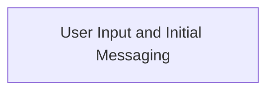
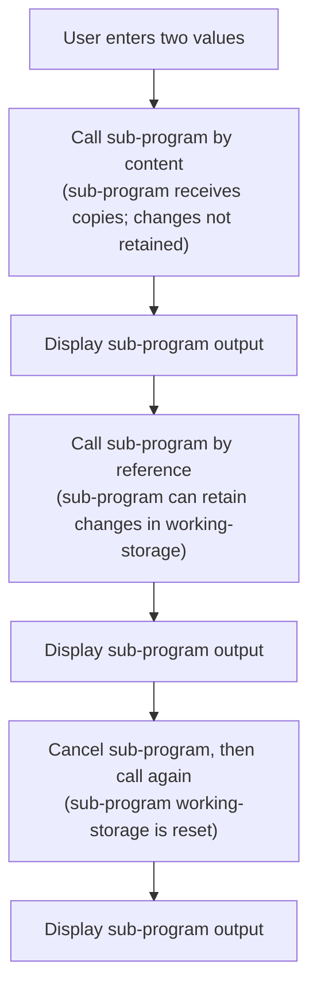

# Program Overview

This document describes the flow for demonstrating COBOL subprogram invocation techniques (MAIN_APP). Users enter two values, which are passed to a subprogram using both 'by content' and 'by reference' methods. The program provides clear messaging to illustrate how variable states and persistence differ depending on the call type.



## Dependencies

### Program

- <SwmToken path="sub_program/main_app.cbl" pos="35:4:6" line-data="           call &quot;sub-app&quot; using">`sub-app`</SwmToken> (<SwmPath>[sub_program/sub.cbl](sub_program/sub.cbl)</SwmPath>)

# Program Workflow

# User Input and Initial Messaging



This section is designed to guide the user through interactive input and messaging, illustrating how COBOL subprogram calls affect variable states and persistence. It provides clear feedback at each step to help users understand the impact of their actions.

| Category        | Rule Name                     | Description                                                                                                                                                                                                                                                                                                        |
| --------------- | ----------------------------- | ------------------------------------------------------------------------------------------------------------------------------------------------------------------------------------------------------------------------------------------------------------------------------------------------------------------ |
| Data validation | User input capture            | Prompt the user to enter two values at the start of the program. These values must be stored in <SwmToken path="sub_program/sub.cbl" pos="35:4:6" line-data="           display &quot;working-storage values at start:&quot;">`working-storage`</SwmToken> variables and used for all subsequent subprogram calls. |
| Business logic  | Input confirmation messaging  | Display a formatted message after user input to confirm the values entered and prepare the user for the next steps in the workflow.                                                                                                                                                                                |
| Business logic  | Call by content isolation     | When calling the subprogram by content, any changes made to the input variables within the subprogram must not affect the original variables in the main program.                                                                                                                                                  |
| Business logic  | Call by reference persistence | After calling the subprogram by reference, any changes made to the input variables within the subprogram must be reflected in the main program's variables.                                                                                                                                                        |
| Business logic  | Subprogram state reset        | Cancelling the subprogram must reset its <SwmToken path="sub_program/sub.cbl" pos="35:4:6" line-data="           display &quot;working-storage values at start:&quot;">`working-storage`</SwmToken> variables to their initial state, ensuring that subsequent calls do not retain previous values.                |
| Business logic  | State transparency messaging  | All user-facing messages must clearly indicate the current state of relevant variables, including before and after subprogram calls, to ensure transparency and user understanding.                                                                                                                                |

<SwmSnippet path="/sub_program/main_app.cbl" line="22">

---

In <SwmToken path="sub_program/main_app.cbl" pos="22:1:3" line-data="       main-procedure.">`main-procedure`</SwmToken> we start by prompting the user for two input values and storing them in <SwmToken path="sub_program/sub.cbl" pos="35:4:6" line-data="           display &quot;working-storage values at start:&quot;">`working-storage`</SwmToken>. Right after, we call <SwmToken path="sub_program/main_app.cbl" pos="30:3:5" line-data="           perform display-message">`display-message`</SwmToken> to show a formatted message, confirming the input and prepping the user for the next steps. This makes the flow clear and interactive for anyone running the program.

```cobol
       main-procedure.
           display space
           display "Enter value for #1: " with no advancing
           accept ws-item-1

           display "Enter value for #2: " with no advancing
           accept ws-item-2.

           perform display-message
```

---

</SwmSnippet>

<SwmSnippet path="/sub_program/main_app.cbl" line="65">

---

<SwmToken path="sub_program/main_app.cbl" pos="65:1:3" line-data="       display-message.">`display-message`</SwmToken> just prints a separator and the current value of <SwmToken path="sub_program/main_app.cbl" pos="68:11:15" line-data="           display &quot;Main app: &quot; ws-group-1">`ws-group-1`</SwmToken>. It's a straightforward way to show the user what's happening, with no extra logic or surprises.

```cobol
       display-message.
           display space
           display "-----------------------------------------------"
           display "Main app: " ws-group-1
           exit paragraph.
```

---

</SwmSnippet>

<SwmSnippet path="/sub_program/main_app.cbl" line="34">

---

Back in <SwmToken path="sub_program/main_app.cbl" pos="22:1:3" line-data="       main-procedure.">`main-procedure`</SwmToken>, after showing the initial message, we call the subprogram by content to demonstrate that any changes made inside the subprogram won't touch the original variables. We then display another message to show the state after the call.

```cobol
           display "Calling sub program by content:"
           call "sub-app" using
               by content ws-item-1
               by content ws-item-2
           end-call
           perform display-message
```

---

</SwmSnippet>

<SwmSnippet path="/sub_program/sub.cbl" line="32">

---

<SwmToken path="sub_program/sub.cbl" pos="32:1:3" line-data="       main-procedure.">`main-procedure`</SwmToken> in the subprogram displays the initial state of all its variables, copies the incoming values to <SwmToken path="sub_program/sub.cbl" pos="35:4:6" line-data="           display &quot;working-storage values at start:&quot;">`working-storage`</SwmToken> and <SwmToken path="sub_program/sub.cbl" pos="39:4:6" line-data="           display &quot;local-storage values at start:&quot;">`local-storage`</SwmToken>, then changes the linkage section variables to new values. It shows before and after states to make it clear what gets updated and what persists.

```cobol
       main-procedure.
           display "In sub program: " l-test-item-1 " " l-test-item-2
           display space
           display "working-storage values at start:"
           display "ws-test-item-1: " ws-test-item-1
           display "ws-test-item-2: " ws-test-item-2
           display space
           display "local-storage values at start:"
           display "ls-test-item-1: " ls-test-item-1
           display "ls-test-item-2: " ls-test-item-2
           display space
           display "Moving linkage section values to ws and ls vars.."

           move l-test-item-1 to ws-test-item-1
           move l-test-item-2 to ws-test-item-2
           move l-test-item-1 to ls-test-item-1
           move l-test-item-2 to ls-test-item-2


           display "setting input variables to new value..."
           move "replace1" to l-test-item-1
           move "replace2" to l-test-item-2

           display space
           display "working-storage values at end:"
           display "ws-test-item-1: " ws-test-item-1
           display "ws-test-item-2: " ws-test-item-2
           display space
           display "local-storage values at end:"
           display "ls-test-item-1: " ls-test-item-1
           display "ls-test-item-2: " ls-test-item-2
           display space
           display "Exit sub program: " l-test-item-1 " " l-test-item-2
           goback.
```

---

</SwmSnippet>

<SwmSnippet path="/sub_program/main_app.cbl" line="45">

---

After returning from the subprogram, <SwmToken path="sub_program/main_app.cbl" pos="22:1:3" line-data="       main-procedure.">`main-procedure`</SwmToken> calls it again, this time by reference. This lets us show that changes in the subprogram now affect the main program's variables, and that <SwmToken path="sub_program/sub.cbl" pos="35:4:6" line-data="           display &quot;working-storage values at start:&quot;">`working-storage`</SwmToken> variables inside the subprogram persist between calls. We display another message to show the updated state.

```cobol
           display "Second call of sub program should retain WS values."
           display "Calling sub program by reference:"
           call "sub-app" using
               ws-item-1 ws-item-2
           end-call
           perform display-message
```

---

</SwmSnippet>

<SwmSnippet path="/sub_program/main_app.cbl" line="54">

---

Finally, <SwmToken path="sub_program/main_app.cbl" pos="22:1:3" line-data="       main-procedure.">`main-procedure`</SwmToken> cancels the subprogram to reset its <SwmToken path="sub_program/sub.cbl" pos="35:4:6" line-data="           display &quot;working-storage values at start:&quot;">`working-storage`</SwmToken> variables, then calls it again to show that the state has been cleared. We display a message to confirm the reset before stopping the run.

```cobol
           display "Cancelling sub program"
           cancel "sub-app"
           display "Calling sub program. WS values should be reset:"
           call "sub-app" using
               ws-item-1 ws-item-2
           end-call
           perform display-message


           stop run.
```

---

</SwmSnippet>

&nbsp;

*This is an auto-generated document by Swimm 🌊 and has not yet been verified by a human*

<SwmMeta version="3.0.0" repo-id="Z2l0aHViJTNBJTNBQ09CT0wtRXhhbXBsZXMlM0ElM0FTd2ltbS1EZW1v" repo-name="COBOL-Examples"><sup>Powered by [Swimm](https://app.swimm.io/)</sup></SwmMeta>
