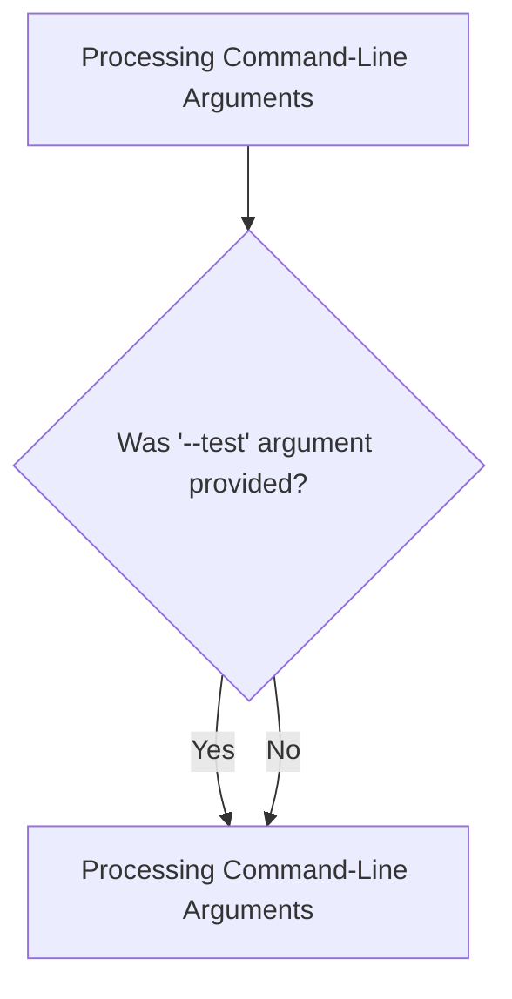
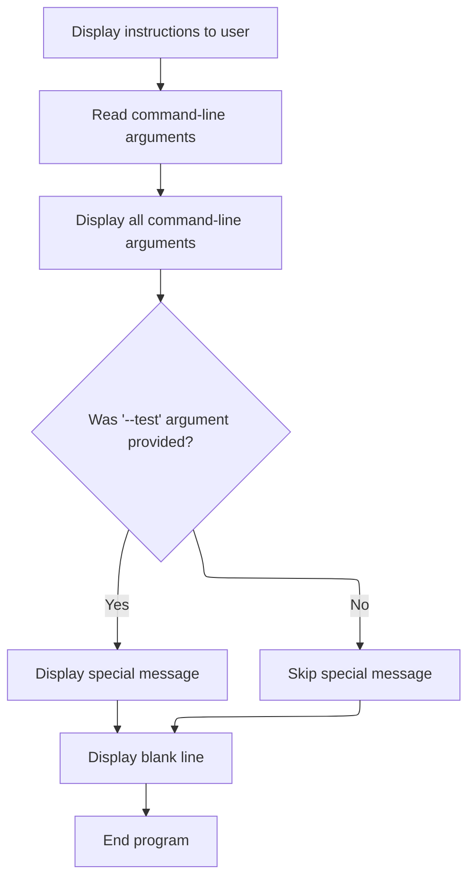

# Program Overview

This document describes the flow for processing <SwmToken path="read_command_args/read_cmd_line_args.cbl" pos="22:11:13" line-data="           accept ws-cmd-args from command-line">`command-line`</SwmToken> arguments (READ_CMD_LINE_ARGS). The program displays instructions, shows all received arguments, and provides a special message if the '--test' flag is present.



# Program Workflow

# Processing Command-Line Arguments



This section governs how <SwmToken path="read_command_args/read_cmd_line_args.cbl" pos="22:11:13" line-data="           accept ws-cmd-args from command-line">`command-line`</SwmToken> arguments are processed, displayed, and how special flags like '--test' trigger additional messaging for the user.

| Category       | Rule Name                    | Description                                                                                                                                                                                                                                                                |
| -------------- | ---------------------------- | -------------------------------------------------------------------------------------------------------------------------------------------------------------------------------------------------------------------------------------------------------------------------- |
| Business logic | User instruction prompt      | Always display instructions to the user indicating that passing '--test' will result in a special message.                                                                                                                                                                 |
| Business logic | Show raw arguments           | Display all <SwmToken path="read_command_args/read_cmd_line_args.cbl" pos="22:11:13" line-data="           accept ws-cmd-args from command-line">`command-line`</SwmToken> arguments exactly as received from the user.                                                    |
| Business logic | Special message for '--test' | If the '--test' argument is present in the <SwmToken path="read_command_args/read_cmd_line_args.cbl" pos="22:11:13" line-data="           accept ws-cmd-args from command-line">`command-line`</SwmToken> input (case-insensitive), display a special message to the user. |
| Business logic | End with blank line          | After processing <SwmToken path="read_command_args/read_cmd_line_args.cbl" pos="22:11:13" line-data="           accept ws-cmd-args from command-line">`command-line`</SwmToken> arguments and any special messages, always display a blank line before ending the program. |

<SwmSnippet path="/read_command_args/read_cmd_line_args.cbl" line="18">

---

In <SwmToken path="read_command_args/read_cmd_line_args.cbl" pos="18:1:3" line-data="       main-procedure.">`main-procedure`</SwmToken>, we kick off by displaying a prompt about the '--test' argument, then grab the full <SwmToken path="read_command_args/read_cmd_line_args.cbl" pos="22:11:13" line-data="           accept ws-cmd-args from command-line">`command-line`</SwmToken> input into <SwmToken path="read_command_args/read_cmd_line_args.cbl" pos="22:3:7" line-data="           accept ws-cmd-args from command-line">`ws-cmd-args`</SwmToken>. We show the raw arguments, convert them to lowercase, and use INSPECT with TALLYING to count how many times '--test' appears. This sets up the logic for handling special <SwmToken path="read_command_args/read_cmd_line_args.cbl" pos="22:11:13" line-data="           accept ws-cmd-args from command-line">`command-line`</SwmToken> flags.

```cobol
       main-procedure.
           display space
           display "Pass arg '--test' for special message".

           accept ws-cmd-args from command-line
           display "Full command line args: " ws-cmd-args

           inspect function lower-case(ws-cmd-args)
               tallying ws-test-arg-count
               for all "--test"
```

---

</SwmSnippet>

<SwmSnippet path="/read_command_args/read_cmd_line_args.cbl" line="29">

---

If '--test' is found, we show a special message, then end the program.

```cobol
           if ws-test-arg-count > 0 then
               display "You entered the '--test' cmd arg!"
           end-if

           display space

           stop run.
```

---

</SwmSnippet>

&nbsp;

*This is an auto-generated document by Swimm 🌊 and has not yet been verified by a human*

<SwmMeta version="3.0.0" repo-id="Z2l0aHViJTNBJTNBQ09CT0wtRXhhbXBsZXMlM0ElM0FTd2ltbS1EZW1v" repo-name="COBOL-Examples"><sup>Powered by [Swimm](https://app.swimm.io/)</sup></SwmMeta>
