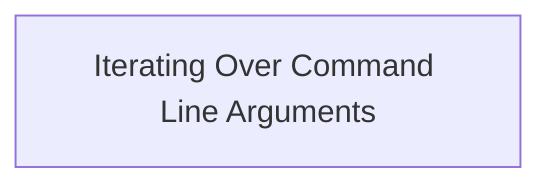

# Program Overview

This document explains the flow for displaying command line arguments (CMD-ARGS-EXAMPLE). When the program is launched with command line inputs, it shows the total number of arguments and lists each argument with its index and value.



# Program Workflow

# Iterating Over Command Line Arguments

This section enables the program to process and display all command line arguments, providing visibility into what inputs were supplied and their sequence.

| Category       | Rule Name                     | Description                                                                                                                              |
| -------------- | ----------------------------- | ---------------------------------------------------------------------------------------------------------------------------------------- |
| Business logic | Display argument count        | The program must display the total number of command line arguments received, ensuring users are aware of how many inputs were provided. |
| Business logic | Show argument index and value | Each command line argument must be displayed alongside its index, so users can clearly see the order and value of each input.            |

<SwmSnippet path="/read_command_args/read_specific_cmd_line_args.cbl" line="16">

---

Procedure division kicks off the flow by grabbing the total number of command line arguments, then loops through each one. For every argument, it shows the index and the actual value, making it easy to see what was passed in and in what order.

```cobol
       procedure division.
      *> Get total number of cmd args.
           accept ws-num-args from argument-number

      *> loop through all of them.
           perform varying ws-counter
           from 1 by 1 until ws-counter > ws-num-args
               *> set current command ptr to argument number of ws-counter.
               display ws-counter upon argument-number
               *> get value of that command line arguement and move to ws-cmd-args variable.
               accept ws-cmd-args from argument-value

               display ws-cmd-args
           end-perform.
```

---

</SwmSnippet>

&nbsp;

*This is an auto-generated document by Swimm 🌊 and has not yet been verified by a human*

<SwmMeta version="3.0.0" repo-id="Z2l0aHViJTNBJTNBQ09CT0wtRXhhbXBsZXMlM0ElM0FTd2ltbS1EZW1v" repo-name="COBOL-Examples"><sup>Powered by [Swimm](https://app.swimm.io/)</sup></SwmMeta>
