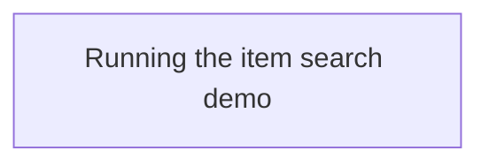

# Program Overview

This document describes the flow for searching items (SEARCH-EXAMPLE). Users are guided through entering item IDs to search for records in both keyed and non-keyed tables, with results displayed according to matches found.



# Program Workflow

# Running the item search demo

```mermaid
%%{init: {"flowchart": {"defaultRenderer": "elk"}} }%%
flowchart TD
    node1["Display intro and setup test data"]
    click node1 openCode "search/search.cbl:47:48"
    node1 --> node2["Prompt for ID 1"]
    click node2 openCode "search/search.cbl:53:54"
    node2 --> node3["Binary search keyed table by ID 1"]
    click node3 openCode "search/search.cbl:61:66"
    node3 --> node4{"Match found in keyed table?"}
    click node4 openCode "search/search.cbl:62:64"
    node4 -->|"Yes"| node5["Display found item"]
    click node5 openCode "search/search.cbl:65:65"
    node4 -->|"No"| node6["Display 'Item not found'"]
    click node6 openCode "search/search.cbl:63:63"
    node5 --> node7["Prompt for all IDs (ID 1, ID 2, ID 3)"]
    node6 --> node7
    click node7 openCode "search/search.cbl:72:79"
    node7 --> node8["Binary search keyed table by all IDs"]
    click node8 openCode "search/search.cbl:82:89"
    node8 --> node9{"Match found for all IDs?"}
    click node9 openCode "search/search.cbl:83:87"
    node9 -->|"Yes"| node10["Display found item"]
    click node10 openCode "search/search.cbl:88:88"
    node9 -->|"No"| node11["Display 'Item not found'"]
    click node11 openCode "search/search.cbl:84:84"
    node10 --> node12["Prompt for ID 1 (no-key table)"]
    node11 --> node12
    click node12 openCode "search/search.cbl:96:97"
    node12 --> node13["Sequential search non-keyed table"]
    click node13 openCode "search/search.cbl:100:109"
    node13 --> node14{"Match found in non-keyed table?"}
    click node14 openCode "search/search.cbl:101:103"
    node14 -->|"Yes"| node15["Display found record (ID and value)"]
    click node15 openCode "search/search.cbl:104:108"
    node14 -->|"No"| node16["Display 'Item not found'"]
    click node16 openCode "search/search.cbl:102:102"
classDef HeadingStyle fill:#777777,stroke:#333,stroke-width:2px;

%% Swimm:
%% %%{init: {"flowchart": {"defaultRenderer": "elk"}} }%%
%% flowchart TD
%%     node1["Display intro and setup test data"]
%%     click node1 openCode "<SwmPath>[search/search.cbl](search/search.cbl)</SwmPath>:47:48"
%%     node1 --> node2["Prompt for ID 1"]
%%     click node2 openCode "<SwmPath>[search/search.cbl](search/search.cbl)</SwmPath>:53:54"
%%     node2 --> node3["Binary search keyed table by ID 1"]
%%     click node3 openCode "<SwmPath>[search/search.cbl](search/search.cbl)</SwmPath>:61:66"
%%     node3 --> node4{"Match found in keyed table?"}
%%     click node4 openCode "<SwmPath>[search/search.cbl](search/search.cbl)</SwmPath>:62:64"
%%     node4 -->|"Yes"| node5["Display found item"]
%%     click node5 openCode "<SwmPath>[search/search.cbl](search/search.cbl)</SwmPath>:65:65"
%%     node4 -->|"No"| node6["Display 'Item not found'"]
%%     click node6 openCode "<SwmPath>[search/search.cbl](search/search.cbl)</SwmPath>:63:63"
%%     node5 --> node7["Prompt for all IDs (ID 1, ID 2, ID 3)"]
%%     node6 --> node7
%%     click node7 openCode "<SwmPath>[search/search.cbl](search/search.cbl)</SwmPath>:72:79"
%%     node7 --> node8["Binary search keyed table by all IDs"]
%%     click node8 openCode "<SwmPath>[search/search.cbl](search/search.cbl)</SwmPath>:82:89"
%%     node8 --> node9{"Match found for all IDs?"}
%%     click node9 openCode "<SwmPath>[search/search.cbl](search/search.cbl)</SwmPath>:83:87"
%%     node9 -->|"Yes"| node10["Display found item"]
%%     click node10 openCode "<SwmPath>[search/search.cbl](search/search.cbl)</SwmPath>:88:88"
%%     node9 -->|"No"| node11["Display 'Item not found'"]
%%     click node11 openCode "<SwmPath>[search/search.cbl](search/search.cbl)</SwmPath>:84:84"
%%     node10 --> node12["Prompt for ID 1 (<SwmToken path="search/search.cbl" pos="100:5:7" line-data="           search ws-no-key-item-table">`no-key`</SwmToken> table)"]
%%     node11 --> node12
%%     click node12 openCode "<SwmPath>[search/search.cbl](search/search.cbl)</SwmPath>:96:97"
%%     node12 --> node13["Sequential search non-keyed table"]
%%     click node13 openCode "<SwmPath>[search/search.cbl](search/search.cbl)</SwmPath>:100:109"
%%     node13 --> node14{"Match found in non-keyed table?"}
%%     click node14 openCode "<SwmPath>[search/search.cbl](search/search.cbl)</SwmPath>:101:103"
%%     node14 -->|"Yes"| node15["Display found record (ID and value)"]
%%     click node15 openCode "<SwmPath>[search/search.cbl](search/search.cbl)</SwmPath>:104:108"
%%     node14 -->|"No"| node16["Display 'Item not found'"]
%%     click node16 openCode "<SwmPath>[search/search.cbl](search/search.cbl)</SwmPath>:102:102"
%% classDef HeadingStyle fill:#777777,stroke:#333,stroke-width:2px;
```



This section provides a demo for searching items in both keyed and non-keyed tables, using binary and sequential search methods. It guides the user through entering search criteria and displays results based on matches found in the tables.

| Category       | Rule Name                         | Description                                                                                                                                                                                                                                                                                                                                                                                                                                                                                                                                            |
| -------------- | --------------------------------- | ------------------------------------------------------------------------------------------------------------------------------------------------------------------------------------------------------------------------------------------------------------------------------------------------------------------------------------------------------------------------------------------------------------------------------------------------------------------------------------------------------------------------------------------------------ |
| Business logic | Single-key match requirement      | When searching the keyed table by a single ID, only items with an exact match on <SwmToken path="search/search.cbl" pos="64:3:9" line-data="               when ws-item-id-1(idx) = ws-accept-id-1">`ws-item-id-1`</SwmToken> are considered found.                                                                                                                                                                                                                                                                                                    |
| Business logic | Multi-key match requirement       | When searching the keyed table by all three IDs, only items with exact matches on <SwmToken path="search/search.cbl" pos="64:3:9" line-data="               when ws-item-id-1(idx) = ws-accept-id-1">`ws-item-id-1`</SwmToken>, <SwmToken path="search/search.cbl" pos="86:1:7" line-data="                   ws-item-id-2(idx) = ws-accept-id-2 and">`ws-item-id-2`</SwmToken>, and <SwmToken path="search/search.cbl" pos="87:1:7" line-data="                   ws-item-id-3(idx) = ws-accept-id-3">`ws-item-id-3`</SwmToken> are considered found. |
| Business logic | Keyed table result display        | When a match is found in the keyed table, the output must display the item's IDs, name, and date.                                                                                                                                                                                                                                                                                                                                                                                                                                                      |
| Business logic | Non-keyed table match requirement | When searching the non-keyed table, only items with an exact match on <SwmToken path="search/search.cbl" pos="103:3:9" line-data="               when ws-no-key-id(idx-2) = ws-accept-id-1">`ws-no-key-id`</SwmToken> are considered found.                                                                                                                                                                                                                                                                                                            |
| Business logic | Non-keyed table result display    | If a match is found in the non-keyed table, the output must display the item's ID and value.                                                                                                                                                                                                                                                                                                                                                                                                                                                           |

<SwmSnippet path="/search/search.cbl" line="47">

---

In <SwmToken path="search/search.cbl" pos="47:1:3" line-data="       main-procedure.">`main-procedure`</SwmToken> we kick things off by calling <SwmToken path="search/search.cbl" pos="48:3:7" line-data="           perform setup-test-data">`setup-test-data`</SwmToken>, which fills both item tables with sample records. This is required before any search logic runs, since the searches assume the tables are already populated and, for binary search, sorted and indexed. No input validation is done here; it just sets up the data.

```cobol
       main-procedure.
           perform setup-test-data
```

---

</SwmSnippet>

<SwmSnippet path="/search/search.cbl" line="50">

---

We ask for an id and do a fast binary search on the keyed table. If found, we display the item; if not, we say so.

```cobol
           display space
           display "=================================================="
           display "Searching keyed table using binary search."
           display "Enter id-1 to search for: " with no advancing
           accept ws-accept-id-1

      *>   Binary search - table must be indexed by an asc or desc id
      *>   and sorted for search to work. MUCH faster than sequential
      *>   search which does not require any sorting or indexing.
      *>   Binary search is indicated by the "SEARCH ALL" syntax.
           set idx to 1
           search all ws-item-table
               at end
                   display "Item not found."
               when ws-item-id-1(idx) = ws-accept-id-1
```

---

</SwmSnippet>

<SwmSnippet path="/search/search.cbl" line="65">

---

When an item is found by the binary search, we call <SwmToken path="search/search.cbl" pos="65:3:7" line-data="                   perform display-found-item">`display-found-item`</SwmToken> to show its details. This is the only place in the flow where item info is output after a successful search.

```cobol
                   perform display-found-item
```

---

</SwmSnippet>

<SwmSnippet path="/search/search.cbl" line="66">

---

After the single-key search, we prompt for three ids and run another binary search on <SwmToken path="search/search.cbl" pos="82:5:9" line-data="           search all ws-item-table">`ws-item-table`</SwmToken>, this time matching all three key fields. Only items with all ids matching are considered found. If matched, we display the item; otherwise, we show 'not found'.

```cobol
           end-search

           display space
           display "=================================================="
           display "Searching again with all required ids matching."

           display "Enter id-1 to search for: " with no advancing
           accept ws-accept-id-1

           display "Enter id-2 to search for: " with no advancing
           accept ws-accept-id-2

           display "Enter id-3 to search for: " with no advancing
           accept ws-accept-id-3

           set idx to 1
           search all ws-item-table
               at end
                   display "Item not found."
               when ws-item-id-1(idx) = ws-accept-id-1 and
                   ws-item-id-2(idx) = ws-accept-id-2 and
                   ws-item-id-3(idx) = ws-accept-id-3
```

---

</SwmSnippet>

<SwmSnippet path="/search/search.cbl" line="88">

---

If the multi-key binary search finds a match, we call <SwmToken path="search/search.cbl" pos="88:3:7" line-data="                   perform display-found-item">`display-found-item`</SwmToken> again to show the item details, just like in the single-key search.

```cobol
                   perform display-found-item
```

---

</SwmSnippet>

<SwmSnippet path="/search/search.cbl" line="89">

---

Finally we prompt for an id and run a sequential search on <SwmToken path="search/search.cbl" pos="100:3:11" line-data="           search ws-no-key-item-table">`ws-no-key-item-table`</SwmToken>. This doesn't need the table to be sorted or keyed, but it's slower. If a match is found, we display the record; otherwise, we show 'not found'. The flow ends after this.

```cobol
           end-search

      *> Sequential searches are slower but also don't require the data
      *> to be sorted or require a key.
           display space
           display "=================================================="
           display "Searching not keyed table using sequential search."
           display "Enter id: " with no advancing
           accept ws-accept-id-1

           set idx-2 to 1
           search ws-no-key-item-table
               at end
                   display "Item not found."
               when ws-no-key-id(idx-2) = ws-accept-id-1
                   display " Record found:"
                   display "---------------"
                   display "   ws-no-key-id: " ws-no-key-id(idx-2)
                   display "ws-no-key-value: " ws-no-key-value(idx-2)
                   display space
           end-search

           display space

           stop run.
```

---

</SwmSnippet>

&nbsp;

*This is an auto-generated document by Swimm 🌊 and has not yet been verified by a human*

<SwmMeta version="3.0.0" repo-id="Z2l0aHViJTNBJTNBQ09CT0wtRXhhbXBsZXMlM0ElM0FTd2ltbS1EZW1v" repo-name="COBOL-Examples"><sup>Powered by [Swimm](https://app.swimm.io/)</sup></SwmMeta>
