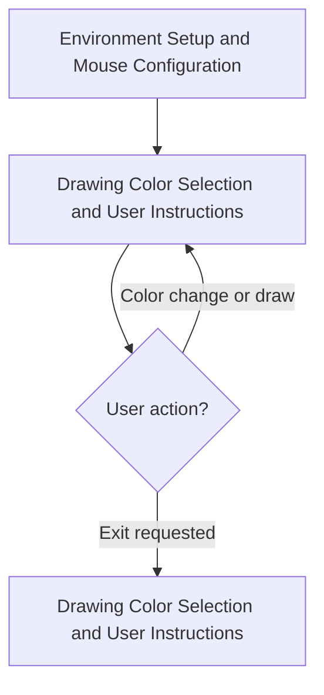
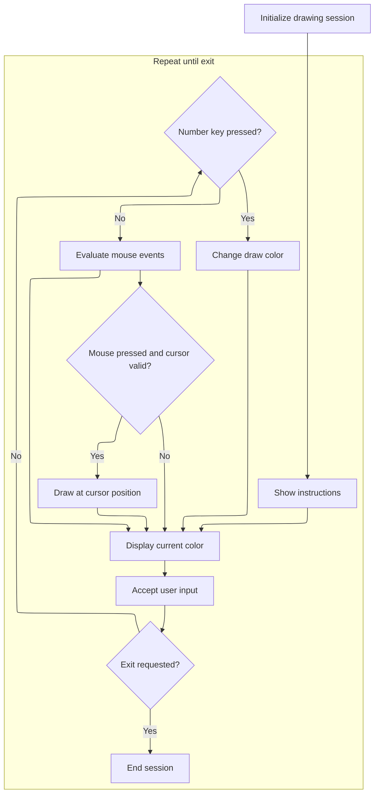

# Program Overview

This document describes the flow of a simple paint program (MOUSE_EXAMPLE) that enables users to interactively select colors and draw on the screen using mouse and keyboard input. The program demonstrates user-driven graphical input and immediate feedback.



## Dependencies

### Copybook

- screenio

# Program Workflow

# Environment Setup and Mouse Configuration

```mermaid
%%{init: {"flowchart": {"defaultRenderer": "elk"}} }%%
flowchart TD
    node1["Enable screen exception handling (COB_SCREEN_EXCEPTIONS = 'Y')"]
    click node1 openCode "mouse/mouse_example.cbl:48:48"
    node1 --> node2["Enable ESC key handling (COB_SCREEN_ESC = 'Y')"]
    click node2 openCode "mouse/mouse_example.cbl:49:49"
    node2 --> node3["Disable wait on exit (COB_EXIT_WAIT = 'N')"]
    click node3 openCode "mouse/mouse_example.cbl:50:50"
    node3 --> node4["Set timeout scale (COB_TIMEOUT_SCALE = '3')"]
    click node4 openCode "mouse/mouse_example.cbl:51:51"
    node4 --> node5["Configure mouse event handling (Left Down, Left Up, Move)"]
    click node5 openCode "mouse/mouse_example.cbl:53:56"
    node5 --> node6["Set mouse flags in environment (COB_MOUSE_FLAGS = ws-mouse-flags)"]
    click node6 openCode "mouse/mouse_example.cbl:59:59"

classDef HeadingStyle fill:#777777,stroke:#333,stroke-width:2px;

%% Swimm:
%% %%{init: {"flowchart": {"defaultRenderer": "elk"}} }%%
%% flowchart TD
%%     node1["Enable screen exception handling (<SwmToken path="mouse/mouse_example.cbl" pos="48:6:6" line-data="           set environment &quot;COB_SCREEN_EXCEPTIONS&quot; to &#39;Y&#39;.">`COB_SCREEN_EXCEPTIONS`</SwmToken> = 'Y')"]
%%     click node1 openCode "<SwmPath>[mouse/mouse_example.cbl](mouse/mouse_example.cbl)</SwmPath>:48:48"
%%     node1 --> node2["Enable ESC key handling (<SwmToken path="mouse/mouse_example.cbl" pos="49:6:6" line-data="           set environment &quot;COB_SCREEN_ESC&quot; to &#39;Y&#39;.">`COB_SCREEN_ESC`</SwmToken> = 'Y')"]
%%     click node2 openCode "<SwmPath>[mouse/mouse_example.cbl](mouse/mouse_example.cbl)</SwmPath>:49:49"
%%     node2 --> node3["Disable wait on exit (<SwmToken path="mouse/mouse_example.cbl" pos="50:6:6" line-data="           set environment &quot;COB_EXIT_WAIT&quot; to &#39;N&#39;.">`COB_EXIT_WAIT`</SwmToken> = 'N')"]
%%     click node3 openCode "<SwmPath>[mouse/mouse_example.cbl](mouse/mouse_example.cbl)</SwmPath>:50:50"
%%     node3 --> node4["Set timeout scale (<SwmToken path="mouse/mouse_example.cbl" pos="51:6:6" line-data="           set environment &quot;COB_TIMEOUT_SCALE&quot; to &#39;3&#39;.">`COB_TIMEOUT_SCALE`</SwmToken> = '3')"]
%%     click node4 openCode "<SwmPath>[mouse/mouse_example.cbl](mouse/mouse_example.cbl)</SwmPath>:51:51"
%%     node4 --> node5["Configure mouse event handling (Left Down, Left Up, Move)"]
%%     click node5 openCode "<SwmPath>[mouse/mouse_example.cbl](mouse/mouse_example.cbl)</SwmPath>:53:56"
%%     node5 --> node6["Set mouse flags in environment (<SwmToken path="mouse/mouse_example.cbl" pos="59:6:6" line-data="           set environment &quot;COB_MOUSE_FLAGS&quot; to ws-mouse-flags.">`COB_MOUSE_FLAGS`</SwmToken> = <SwmToken path="mouse/mouse_example.cbl" pos="53:3:7" line-data="           compute ws-mouse-flags = COB-AUTO-MOUSE-HANDLING">`ws-mouse-flags`</SwmToken>)"]
%%     click node6 openCode "<SwmPath>[mouse/mouse_example.cbl](mouse/mouse_example.cbl)</SwmPath>:59:59"
%% 
%% classDef HeadingStyle fill:#777777,stroke:#333,stroke-width:2px;
```



This section ensures the application is prepared to handle user input and screen events, including mouse interactions, by setting up all necessary environment parameters before the main drawing logic begins.

| Category       | Rule Name                 | Description                                                                                                                                |
| -------------- | ------------------------- | ------------------------------------------------------------------------------------------------------------------------------------------ |
| Business logic | Screen exception handling | Screen exception handling must be enabled for all user sessions to ensure that any screen-related errors are captured and managed.         |
| Business logic | ESC key support           | ESC key handling must be enabled so users can exit or interrupt operations using the ESC key at any time.                                  |
| Business logic | Immediate exit behavior   | Exit wait must be disabled so that the application terminates immediately when requested, without waiting for additional user input.       |
| Business logic | Timeout scaling           | Timeout scaling must be set to '3' to ensure consistent timing for input and screen events across all sessions.                            |
| Business logic | Mouse event configuration | Mouse event handling must be configured to support left button down, left button up, and mouse movement events for all drawing operations. |

<SwmSnippet path="/mouse/mouse_example.cbl" line="47">

---

Procedure division kicks off the flow by configuring the runtime environment for screen and input handling. It sets up exception handling, escape key support, disables exit wait, and adjusts timeout scaling. Mouse event flags are combined and set to enable drawing with the mouse. Calling <SwmToken path="mouse/mouse_example.cbl" pos="61:1:3" line-data="       main-procedure.">`main-procedure`</SwmToken> next hands off control to the actual drawing logic, which relies on these settings to work as intended.

```cobol
       procedure division.
           set environment "COB_SCREEN_EXCEPTIONS" to 'Y'.
           set environment "COB_SCREEN_ESC" to 'Y'.
           set environment "COB_EXIT_WAIT" to 'N'.
           set environment "COB_TIMEOUT_SCALE" to '3'.

           compute ws-mouse-flags = COB-AUTO-MOUSE-HANDLING
               + COB-ALLOW-LEFT-DOWN
               + COB-ALLOW-LEFT-UP
               + COB-ALLOW-MOUSE-MOVE
           end-compute.

           set environment "COB_MOUSE_FLAGS" to ws-mouse-flags.

       main-procedure.
```

---

</SwmSnippet>

# Drawing Color Selection and User Instructions



This section manages the user interface for a simple drawing program, allowing users to select a drawing color, receive instructions, draw using the mouse, and exit the session. It ensures only valid colors and screen positions are used, and provides immediate feedback to user actions.

| Category        | Rule Name                       | Description                                                                                                                                                     |
| --------------- | ------------------------------- | --------------------------------------------------------------------------------------------------------------------------------------------------------------- |
| Data validation | Drawing color range enforcement | The drawing color must always be set to a value between 1 and 7. If a user selects a number higher than 7, the color is set to 7.                               |
| Data validation | Drawing bounds enforcement      | The drawing action is only performed if the mouse is clicked and the cursor is within the screen bounds: line less than 19 and column less than or equal to 80. |
| Business logic  | User instruction visibility     | Instructions for changing color, drawing, and exiting must be displayed to the user at the start of the session and remain visible throughout.                  |
| Business logic  | Immediate exit on quit command  | The session must end immediately if the user presses the 'Q' key or the Escape key.                                                                             |
| Business logic  | Current color display           | The current drawing color must be displayed to the user at all times during the session.                                                                        |

<SwmSnippet path="/mouse/mouse_example.cbl" line="61">

---

In <SwmToken path="mouse/mouse_example.cbl" pos="61:1:3" line-data="       main-procedure.">`main-procedure`</SwmToken>, the drawing color is set to a default value and instructions are shown to the user. This sets up the interface so users know how to change colors, draw, and exit.

```cobol
       main-procedure.

           move 1 to ws-draw-color

           display "Current Draw color:" at 1901
           display
               "Esc to exit. Number keys to change cursor draw color" &
               ". Left mouse down to draw current color."
               foreground-color cob-color-white highlight
               background-color cob-color-blue
               at 2001
           end-display
```

---

</SwmSnippet>

<SwmSnippet path="/mouse/mouse_example.cbl" line="75">

---

The main event loop starts here. It keeps updating the display with the current color and waits for keyboard input, but only for a short time so mouse actions can still be processed quickly.

```cobol
           perform until ws-exit

               display
                   " "
                   background-color ws-draw-color
                   at 1921
               end-display

               accept ws-kb-input
                   with auto-skip no-echo
                   timeout after 50
                   upper
               end-accept
```

---

</SwmSnippet>

<SwmSnippet path="/mouse/mouse_example.cbl" line="89">

---

After getting keyboard input, if the user hits 'Q', the program exits right away. This gives a fast way to quit.

```cobol
               if ws-kb-input not = space then

                   if ws-kb-input = 'Q' then
                       stop run
                   end-if
```

---

</SwmSnippet>

<SwmSnippet path="/mouse/mouse_example.cbl" line="95">

---

If the input is a number, it's used as the new drawing color, but anything above 7 gets set to 7 so only valid colors are used.

```cobol
                   if ws-kb-input is numeric then
                       move ws-kb-input to ws-draw-color
                       if ws-draw-color > 7 then
                           move 7 to ws-draw-color
                       end-if
                   end-if
```

---

</SwmSnippet>

<SwmSnippet path="/mouse/mouse_example.cbl" line="103">

---

The code checks the status for escape key and mouse button events, setting flags so the loop knows when to exit or when the mouse is clicked for drawing.

```cobol
               evaluate ws-crt-status

                   when COB-SCR-ESC
                       set ws-exit to true

                   when COB-SCR-LEFT-PRESSED
                       set ws-mouse-clicked to true

                   when COB-SCR-LEFT-RELEASED
                       set ws-mouse-not-clicked to true

               end-evaluate
```

---

</SwmSnippet>

<SwmSnippet path="/mouse/mouse_example.cbl" line="116">

---

If the mouse is clicked and the cursor is in bounds, it draws at that spot with the current color. The loop keeps running until the exit flag is set, then the program stops.

```cobol
               if ws-cursor-position not = zeros
               and ws-cursor-line < 19
               and ws-cursor-col <= 80
               and ws-mouse-clicked
               then
                   display
                       " "
                       background-color ws-draw-color
                       at ws-cursor-position
                   end-display
               end-if

           end-perform

           stop run.
```

---

</SwmSnippet>

&nbsp;

*This is an auto-generated document by Swimm 🌊 and has not yet been verified by a human*

<SwmMeta version="3.0.0" repo-id="Z2l0aHViJTNBJTNBQ09CT0wtRXhhbXBsZXMlM0ElM0FTd2ltbS1EZW1v" repo-name="COBOL-Examples"><sup>Powered by [Swimm](https://app.swimm.io/)</sup></SwmMeta>
