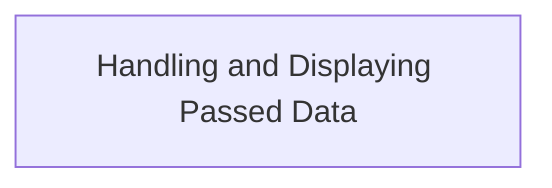
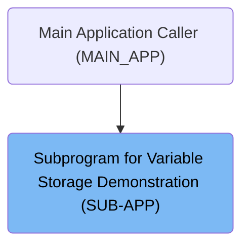
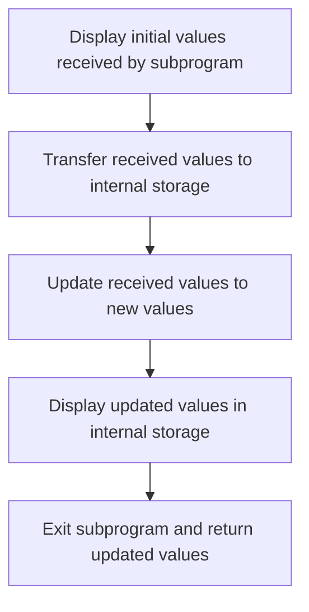

# Program Overview

This document describes the flow of handling and displaying passed data (SUB-APP). The subprogram receives two string values from the main program, demonstrates how these values are inspected, modified, and returned.



# Where is this program used?

This program is used once, as represented in the following diagram:



# Program Workflow

# Handling and Displaying Passed Data



This section demonstrates how a COBOL subprogram can receive, inspect, modify, and return data passed from a calling program. It provides visibility into the state of data at each stage, ensuring that changes to the linkage section are observable by the caller.

| Category       | Rule Name                      | Description                                                                                                                                                                                                                                                                                                                                                                                                                                                           |
| -------------- | ------------------------------ | --------------------------------------------------------------------------------------------------------------------------------------------------------------------------------------------------------------------------------------------------------------------------------------------------------------------------------------------------------------------------------------------------------------------------------------------------------------------- |
| Business logic | Initial value display          | The subprogram must display the initial values received from the caller before any modifications are made.                                                                                                                                                                                                                                                                                                                                                            |
| Business logic | Internal value synchronization | The subprogram must copy the received values into both <SwmToken path="sub_program/sub.cbl" pos="35:4:6" line-data="           display &quot;working-storage values at start:&quot;">`working-storage`</SwmToken> and <SwmToken path="sub_program/sub.cbl" pos="39:4:6" line-data="           display &quot;local-storage values at start:&quot;">`local-storage`</SwmToken> variables for internal tracking and manipulation.                                        |
| Business logic | Linkage value update           | The subprogram must update the linkage section variables to the constant values <SwmToken path="sub_program/sub.cbl" pos="52:4:4" line-data="           move &quot;replace1&quot; to l-test-item-1">`replace1`</SwmToken> and <SwmToken path="sub_program/sub.cbl" pos="53:4:4" line-data="           move &quot;replace2&quot; to l-test-item-2">`replace2`</SwmToken> before returning control to the caller.                                                       |
| Business logic | Updated value display          | The subprogram must display the updated values of all relevant variables (linkage, <SwmToken path="sub_program/sub.cbl" pos="35:4:6" line-data="           display &quot;working-storage values at start:&quot;">`working-storage`</SwmToken>, and <SwmToken path="sub_program/sub.cbl" pos="39:4:6" line-data="           display &quot;local-storage values at start:&quot;">`local-storage`</SwmToken>) before exiting, to provide a clear audit trail of changes. |
| Business logic | Return modified data           | The subprogram must return the updated linkage section values to the caller, ensuring that any changes made are visible to the calling program.                                                                                                                                                                                                                                                                                                                       |

<SwmSnippet path="/sub_program/sub.cbl" line="32">

---

Main-procedure kicks off by showing the values it got from the caller (linkage section), plus what's in <SwmToken path="sub_program/sub.cbl" pos="35:4:6" line-data="           display &quot;working-storage values at start:&quot;">`working-storage`</SwmToken> and <SwmToken path="sub_program/sub.cbl" pos="39:4:6" line-data="           display &quot;local-storage values at start:&quot;">`local-storage`</SwmToken>. It copies the incoming values to both storage areas, then overwrites the linkage section variables with new strings (<SwmToken path="sub_program/sub.cbl" pos="52:4:4" line-data="           move &quot;replace1&quot; to l-test-item-1">`replace1`</SwmToken>, <SwmToken path="sub_program/sub.cbl" pos="53:4:4" line-data="           move &quot;replace2&quot; to l-test-item-2">`replace2`</SwmToken>). Before exiting, it displays the updated values everywhere, so you can see what changed. This is how the subprogram both inspects and returns modified data to the caller.

```cobol
       main-procedure.
           display "In sub program: " l-test-item-1 " " l-test-item-2
           display space
           display "working-storage values at start:"
           display "ws-test-item-1: " ws-test-item-1
           display "ws-test-item-2: " ws-test-item-2
           display space
           display "local-storage values at start:"
           display "ls-test-item-1: " ls-test-item-1
           display "ls-test-item-2: " ls-test-item-2
           display space
           display "Moving linkage section values to ws and ls vars.."

           move l-test-item-1 to ws-test-item-1
           move l-test-item-2 to ws-test-item-2
           move l-test-item-1 to ls-test-item-1
           move l-test-item-2 to ls-test-item-2


           display "setting input variables to new value..."
           move "replace1" to l-test-item-1
           move "replace2" to l-test-item-2

           display space
           display "working-storage values at end:"
           display "ws-test-item-1: " ws-test-item-1
           display "ws-test-item-2: " ws-test-item-2
           display space
           display "local-storage values at end:"
           display "ls-test-item-1: " ls-test-item-1
           display "ls-test-item-2: " ls-test-item-2
           display space
           display "Exit sub program: " l-test-item-1 " " l-test-item-2
           goback.
```

---

</SwmSnippet>

&nbsp;

*This is an auto-generated document by Swimm 🌊 and has not yet been verified by a human*

<SwmMeta version="3.0.0" repo-id="Z2l0aHViJTNBJTNBQ09CT0wtRXhhbXBsZXMlM0ElM0FTd2ltbS1EZW1v" repo-name="COBOL-Examples"><sup>Powered by [Swimm](https://app.swimm.io/)</sup></SwmMeta>
