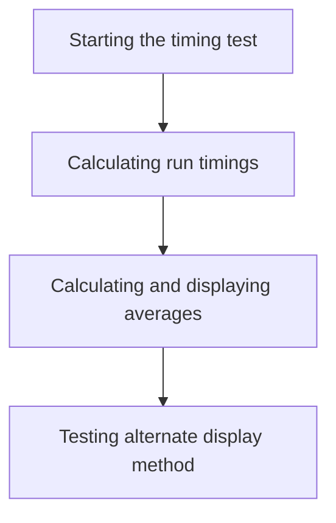
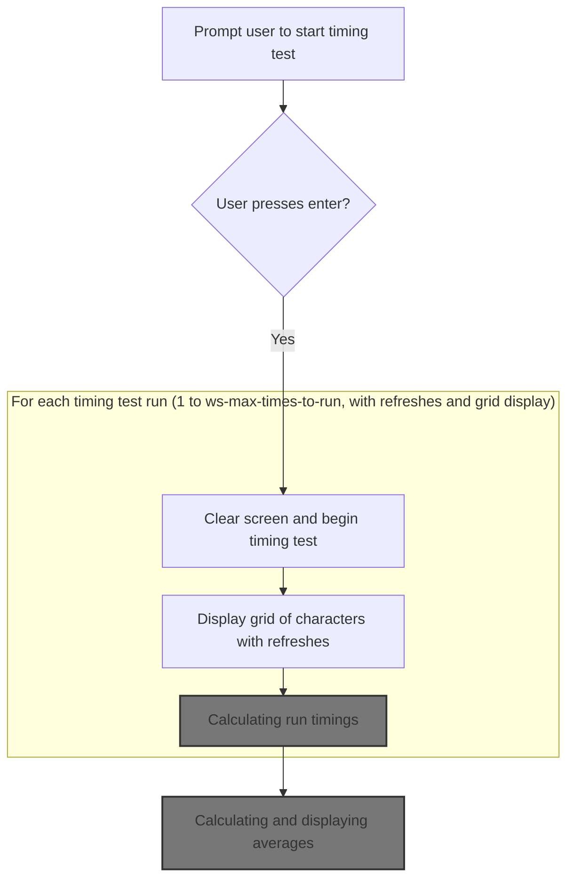
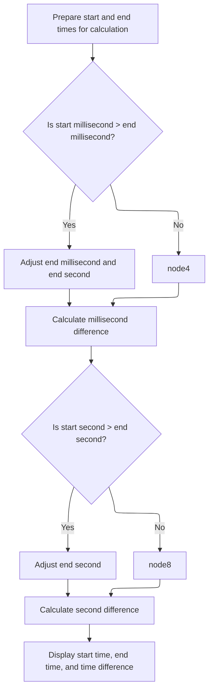
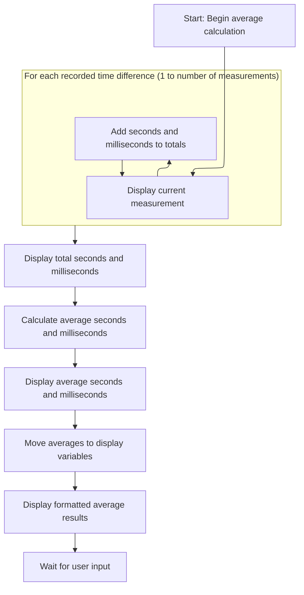
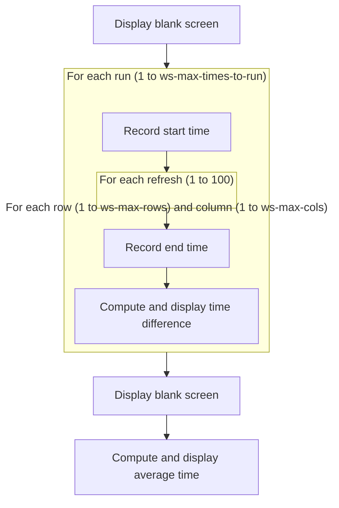

# Program Overview

This document describes the flow for measuring and comparing screen writing speed (DISPLAY_TIMING). The program prompts the user to begin, runs timed display tests for two methods, and presents both per-run and average timing results.



# Program Workflow

# Starting the timing test



This section governs the initiation and execution of the timing test, including user interaction, display refresh cycles, and the calculation and presentation of timing results.

| Category        | Rule Name                      | Description                                                                                                                                                                                                                                                                                                                                                                                                                                                                                  |
| --------------- | ------------------------------ | -------------------------------------------------------------------------------------------------------------------------------------------------------------------------------------------------------------------------------------------------------------------------------------------------------------------------------------------------------------------------------------------------------------------------------------------------------------------------------------------- |
| Data validation | User confirmation required     | The timing test must not begin until the user explicitly confirms by pressing enter.                                                                                                                                                                                                                                                                                                                                                                                                         |
| Business logic  | Fixed refresh cycle count      | Each timing test run must consist of exactly 100 display refresh cycles per run.                                                                                                                                                                                                                                                                                                                                                                                                             |
| Business logic  | Full grid display              | The grid displayed during each refresh must show the '@' character at every position, covering all rows and columns as defined by <SwmToken path="display_timing/display_timing.cbl" pos="101:19:23" line-data="                   from 1 by 1 until ws-row-idx &gt; ws-max-rows">`ws-max-rows`</SwmToken> and <SwmToken path="display_timing/display_timing.cbl" pos="103:19:23" line-data="                       from 1 by 1 until ws-col-idx &gt; ws-max-cols">`ws-max-cols`</SwmToken>. |
| Business logic  | Accurate run timing            | The timing for each run must be measured from the moment the refresh cycles begin until they end, using the system time.                                                                                                                                                                                                                                                                                                                                                                     |
| Business logic  | Display run timing results     | After each run, the time difference between the start and end of the run must be calculated and displayed to the user.                                                                                                                                                                                                                                                                                                                                                                       |
| Business logic  | Display average timing summary | At the end of all runs, the average timing results must be calculated and presented, including a summary of all measurements.                                                                                                                                                                                                                                                                                                                                                                |

<SwmSnippet path="/display_timing/display_timing.cbl" line="84">

---

In <SwmToken path="display_timing/display_timing.cbl" pos="84:1:3" line-data="       main-procedure.">`main-procedure`</SwmToken> we kick off the timing test by waiting for the user to press enter, then clear the screen to prep for the display loop. This sets up the environment before any timing or display logic runs.

```cobol
       main-procedure.

           display "Press enter to start..."
           accept ws-accept
           display spaces with blank screen
```

---

</SwmSnippet>

<SwmSnippet path="/display_timing/display_timing.cbl" line="90">

---

Here we loop through each run, and for each run, we do 100 refresh cycles of the grid, displaying '@' at every position. After each run, we call <SwmToken path="display_timing/display_timing.cbl" pos="113:3:9" line-data="               perform compute-and-display-diff">`compute-and-display-diff`</SwmToken> to measure and show how long that run took. This lets us track timing for each display method.

```cobol
           perform varying ws-times-to-run
           from 1 by 1 until ws-times-to-run > ws-max-times-to-run

               accept ws-start-time from time

               perform varying ws-times-to-refresh
               from 1 by 1 until ws-times-to-refresh > 100


                   perform varying ws-row-idx
                   from 1 by 1 until ws-row-idx > ws-max-rows
                       perform varying ws-col-idx
                       from 1 by 1 until ws-col-idx > ws-max-cols

                           display "@" at ws-screen-position

                       end-perform
                   end-perform
               end-perform

               accept ws-end-time from time

               perform compute-and-display-diff


           end-perform
```

---

</SwmSnippet>

## Calculating run timings



This section is responsible for accurately calculating and displaying the time difference between the start and end of a run, including handling cases where milliseconds or seconds roll over.

| Category       | Rule Name                 | Description                                                                                                                                                                                   |
| -------------- | ------------------------- | --------------------------------------------------------------------------------------------------------------------------------------------------------------------------------------------- |
| Business logic | Consistent timing display | The calculated time difference, along with the start and end times, must be displayed at fixed positions on the screen for each run to provide a clear and consistent view of timing results. |

<SwmSnippet path="/display_timing/display_timing.cbl" line="162">

---

We copy the start/end times and fix up milliseconds if they rolled over, so the timing difference is correct.

```cobol
       compute-and-display-diff.

           move ws-start-sec to ws-start-sec-calc
           move ws-end-sec to ws-end-sec-calc

           move ws-start-milli to ws-start-milli-calc
           move ws-end-milli to ws-end-milli-calc

           if ws-start-milli-calc > ws-end-milli-calc then
               add 100 to ws-end-milli-calc
               subtract 1 from ws-end-sec-calc
           end-if
```

---

</SwmSnippet>

<SwmSnippet path="/display_timing/display_timing.cbl" line="175">

---

We compute and save the millisecond difference for this run, and fix up seconds if needed.

```cobol
           compute ws-diff-milli(ws-times-to-run) =
                   ws-end-milli-calc - ws-start-milli-calc
           end-compute


           if ws-start-sec-calc > ws-end-sec-calc then
               add 60 to ws-end-sec-calc
           end-if
```

---

</SwmSnippet>

<SwmSnippet path="/display_timing/display_timing.cbl" line="185">

---

We finish up by calculating the seconds difference, then display the start time, end time, and the computed difference at fixed spots on the screen. This gives a clear view of each run's timing.

```cobol
           compute ws-diff-sec(ws-times-to-run) =
                   ws-end-sec-calc - ws-start-sec-calc
           end-compute


           display ws-start-time at 2501
           display ws-end-time at 2601
           display ws-time-diff(ws-times-to-run) at 2701

           exit paragraph.
```

---

</SwmSnippet>

## Summarizing run results

<SwmSnippet path="/display_timing/display_timing.cbl" line="119">

---

Back in <SwmToken path="display_timing/display_timing.cbl" pos="84:1:3" line-data="       main-procedure.">`main-procedure`</SwmToken>, after we've measured each run and displayed the timing, we clear the screen and call <SwmToken path="display_timing/display_timing.cbl" pos="121:3:9" line-data="           perform compute-and-display-average">`compute-and-display-average`</SwmToken>. This rolls up all the timings into a summary so the user can see the overall performance.

```cobol
           display spaces with blank screen

           perform compute-and-display-average
```

---

</SwmSnippet>

## Calculating and displaying averages



This section is responsible for calculating the average timing results from multiple measurement runs and displaying both individual and average results to the user in a clear, formatted way.

| Category        | Rule Name                  | Description                                                                                                                                                                                                                                                                                                                  |
| --------------- | -------------------------- | ---------------------------------------------------------------------------------------------------------------------------------------------------------------------------------------------------------------------------------------------------------------------------------------------------------------------------- |
| Data validation | User acknowledgement       | The user must be prompted to acknowledge the displayed results before the process completes.                                                                                                                                                                                                                                 |
| Business logic  | Inclusive averaging        | Each measurement run's timing (seconds and milliseconds) must be included in the total calculation for averages. No run may be skipped.                                                                                                                                                                                      |
| Business logic  | Average calculation method | The average seconds and milliseconds are calculated by dividing the total seconds and milliseconds by the number of measurement runs (<SwmToken path="display_timing/display_timing.cbl" pos="91:21:29" line-data="           from 1 by 1 until ws-times-to-run &gt; ws-max-times-to-run">`ws-max-times-to-run`</SwmToken>). |
| Business logic  | Formatted average display  | The averages must be displayed in a formatted manner, with seconds and milliseconds shown together and separated by a period (e.g., [SS.MM](http://SS.MM)).                                                                                                                                                                  |

<SwmSnippet path="/display_timing/display_timing.cbl" line="197">

---

In <SwmToken path="display_timing/display_timing.cbl" pos="197:1:7" line-data="       compute-and-display-average.">`compute-and-display-average`</SwmToken> we loop through all the recorded timings, display each one, and add up the seconds and milliseconds. This sets up the data for the average calculation and gives the user a look at each run's result.

```cobol
       compute-and-display-average.
           move zeros to ws-time-diff-avg

           perform varying ws-times-to-run
           from 1 by 1 until ws-times-to-run > ws-max-times-to-run
               display ws-time-diff(ws-times-to-run)
                   line ws-times-to-run column 1
               end-display

               add ws-diff-sec(ws-times-to-run) to ws-time-diff-sec-avg

               add ws-diff-milli(ws-times-to-run)
                   to ws-time-diff-milli-avg
               end-add

           end-perform
```

---

</SwmSnippet>

<SwmSnippet path="/display_timing/display_timing.cbl" line="214">

---

After calculating the averages, we display them at set screen positions so the user gets a clear summary. The averages are formatted and shown right after the per-run results.

```cobol
           display ws-time-diff-avg at 1201
           compute ws-time-diff-sec-avg =
               ws-time-diff-sec-avg / ws-max-times-to-run
           end-compute

           compute ws-time-diff-milli-avg =
               ws-time-diff-milli-avg / ws-max-times-to-run
           end-compute

           display ws-time-diff-avg at 1301

           move ws-time-diff-sec-avg to ws-time-diff-sec-avg-disp
           move ws-time-diff-milli-avg to ws-time-diff-milli-avg-disp

           display ws-time-diff-avg-disp at 1401


           accept ws-accept

           exit paragraph.
```

---

</SwmSnippet>

## Testing alternate display method



<SwmSnippet path="/display_timing/display_timing.cbl" line="123">

---

Back in <SwmToken path="display_timing/display_timing.cbl" pos="84:1:3" line-data="       main-procedure.">`main-procedure`</SwmToken>, after showing the averages, we clear the screen and run the timing test again, but this time using explicit line and column positioning for each '@'. The refresh count is still 100, so the comparison is fair.

```cobol
           display spaces with blank screen


           perform varying ws-times-to-run
           from 1 by 1 until ws-times-to-run > ws-max-times-to-run

               accept ws-start-time from time

               perform varying ws-times-to-refresh
               from 1 by 1 until ws-times-to-refresh > 100


                   perform varying ws-row-idx
                   from 1 by 1 until ws-row-idx > ws-max-rows
                       perform varying ws-col-idx
                       from 1 by 1 until ws-col-idx > ws-max-cols

                           display "@"
                               line ws-row-idx column ws-col-idx
                           end-display

                       end-perform
                   end-perform
               end-perform

               accept ws-end-time from time

               perform compute-and-display-diff

           end-perform
```

---

</SwmSnippet>

<SwmSnippet path="/display_timing/display_timing.cbl" line="155">

---

Finally, <SwmToken path="display_timing/display_timing.cbl" pos="84:1:3" line-data="       main-procedure.">`main-procedure`</SwmToken> wraps up by showing the averages for the alternate display method and then exits. The user gets a full set of timing results for both methods before the program returns control.

```cobol
           display spaces with blank screen

           perform compute-and-display-average

           goback.
```

---

</SwmSnippet>

&nbsp;

*This is an auto-generated document by Swimm 🌊 and has not yet been verified by a human*

<SwmMeta version="3.0.0" repo-id="Z2l0aHViJTNBJTNBQ09CT0wtRXhhbXBsZXMlM0ElM0FTd2ltbS1EZW1v" repo-name="COBOL-Examples"><sup>Powered by [Swimm](https://app.swimm.io/)</sup></SwmMeta>
