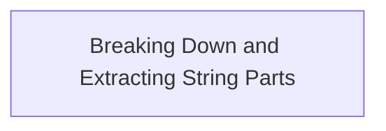

# Program Overview

This document describes how the <SwmToken path="unstring/unstring.cbl" pos="9:6:8" line-data="       program-id. unstring-example.">`unstring-example`</SwmToken> program (UNSTRING) demonstrates extracting and segmenting business data using COBOL's UNSTRING statement. The flow covers splitting strings by single and multiple delimiters, using pointers for sequential extraction, and handling formatted numbers.



# Program Workflow

# Breaking Down and Extracting String Parts

```mermaid
%%{init: {"flowchart": {"defaultRenderer": "elk"}} }%%
flowchart TD
    node1["Start: Demonstrate COBOL UNSTRING (string splitting)"] --> node2["Example 1: Split 'Hello World' by space into PART1 and PART2"]
    click node1 openCode "unstring/unstring.cbl:45:47"
    click node2 openCode "unstring/unstring.cbl:49:61"
    node2 --> node3["Show PART1 and PART2"]
    click node3 openCode "unstring/unstring.cbl:63:64"
    node3 --> node4["Example 2: Split same string twice with pointer (ws-pointer = 1)"]
    click node4 openCode "unstring/unstring.cbl:74:102"
    subgraph loop1["Loop: For each split (2 times), update pointer"]
        node4 --> node5{"Did split overflow?"}
        click node5 openCode "unstring/unstring.cbl:94:97"
        node5 -->|"Yes"| node6["Show overflow error"]
        click node6 openCode "unstring/unstring.cbl:95:95"
        node5 -->|"No"| node7["Show success"]
        click node7 openCode "unstring/unstring.cbl:97:97"
        node6 --> node8["Show part value and pointer"]
        node7 --> node8
        click node8 openCode "unstring/unstring.cbl:100:101"
    end
    node8 --> node9["Example 3: Split string into explicit fields with pointer"]
    click node9 openCode "unstring/unstring.cbl:115:133"
    node9 --> node10{"Did split overflow?"}
    click node10 openCode "unstring/unstring.cbl:125:128"
    node10 -->|"Yes"| node11["Show overflow error"]
    click node11 openCode "unstring/unstring.cbl:126:126"
    node10 -->|"No"| node12["Show success"]
    click node12 openCode "unstring/unstring.cbl:128:128"
    node11 --> node13["Show part values and pointer"]
    node12 --> node13
    click node13 openCode "unstring/unstring.cbl:131:133"
    node13 --> node14["Example 4: Split string by multiple delimiters (<, >, !, |), loop until pointer reaches end"]
    click node14 openCode "unstring/unstring.cbl:146:172"
    subgraph loop2["Loop: For each segment, split by multiple delimiters, update stats"]
        node14 --> node15["Show value, delimiter, char count, pointer, fields filled"]
        click node15 openCode "unstring/unstring.cbl:166:170"
    end
    node15 --> node16["Example 5: Split string by multiple delimiters into multiple destinations"]
    click node16 openCode "unstring/unstring.cbl:183:214"
    subgraph loop3["Loop: For each destination field (1 to 6), display value and stats"]
        node16 --> node17["Show string number, value, delimiter, char count"]
        click node17 openCode "unstring/unstring.cbl:219:223"
    end
    node17 --> node18["Show totals: fields filled"]
    click node18 openCode "unstring/unstring.cbl:226:227"
    node18 --> node19["Example 6: Split formatted number (123456.12) into parts"]
    click node19 openCode "unstring/unstring.cbl:240:248"
    node19 --> node20["Show number parts"]
    click node20 openCode "unstring/unstring.cbl:250:252"
    node20 --> node21["End"]
    click node21 openCode "unstring/unstring.cbl:255:255"
classDef HeadingStyle fill:#777777,stroke:#333,stroke-width:2px;

%% Swimm:
%% %%{init: {"flowchart": {"defaultRenderer": "elk"}} }%%
%% flowchart TD
%%     node1["Start: Demonstrate COBOL UNSTRING (string splitting)"] --> node2["Example 1: Split 'Hello World' by space into <SwmToken path="unstring/unstring.cbl" pos="63:4:4" line-data="           display &quot;PART1: &quot; ws-part-1">`PART1`</SwmToken> and <SwmToken path="unstring/unstring.cbl" pos="64:4:4" line-data="           display &quot;PART2: &quot; ws-part-2">`PART2`</SwmToken>"]
%%     click node1 openCode "<SwmPath>[unstring/unstring.cbl](unstring/unstring.cbl)</SwmPath>:45:47"
%%     click node2 openCode "<SwmPath>[unstring/unstring.cbl](unstring/unstring.cbl)</SwmPath>:49:61"
%%     node2 --> node3["Show <SwmToken path="unstring/unstring.cbl" pos="63:4:4" line-data="           display &quot;PART1: &quot; ws-part-1">`PART1`</SwmToken> and <SwmToken path="unstring/unstring.cbl" pos="64:4:4" line-data="           display &quot;PART2: &quot; ws-part-2">`PART2`</SwmToken>"]
%%     click node3 openCode "<SwmPath>[unstring/unstring.cbl](unstring/unstring.cbl)</SwmPath>:63:64"
%%     node3 --> node4["Example 2: Split same string twice with pointer (<SwmToken path="unstring/unstring.cbl" pos="74:7:9" line-data="           move 1 to ws-pointer">`ws-pointer`</SwmToken> = 1)"]
%%     click node4 openCode "<SwmPath>[unstring/unstring.cbl](unstring/unstring.cbl)</SwmPath>:74:102"
%%     subgraph loop1["Loop: For each split (2 times), update pointer"]
%%         node4 --> node5{"Did split overflow?"}
%%         click node5 openCode "<SwmPath>[unstring/unstring.cbl](unstring/unstring.cbl)</SwmPath>:94:97"
%%         node5 -->|"Yes"| node6["Show overflow error"]
%%         click node6 openCode "<SwmPath>[unstring/unstring.cbl](unstring/unstring.cbl)</SwmPath>:95:95"
%%         node5 -->|"No"| node7["Show success"]
%%         click node7 openCode "<SwmPath>[unstring/unstring.cbl](unstring/unstring.cbl)</SwmPath>:97:97"
%%         node6 --> node8["Show part value and pointer"]
%%         node7 --> node8
%%         click node8 openCode "<SwmPath>[unstring/unstring.cbl](unstring/unstring.cbl)</SwmPath>:100:101"
%%     end
%%     node8 --> node9["Example 3: Split string into explicit fields with pointer"]
%%     click node9 openCode "<SwmPath>[unstring/unstring.cbl](unstring/unstring.cbl)</SwmPath>:115:133"
%%     node9 --> node10{"Did split overflow?"}
%%     click node10 openCode "<SwmPath>[unstring/unstring.cbl](unstring/unstring.cbl)</SwmPath>:125:128"
%%     node10 -->|"Yes"| node11["Show overflow error"]
%%     click node11 openCode "<SwmPath>[unstring/unstring.cbl](unstring/unstring.cbl)</SwmPath>:126:126"
%%     node10 -->|"No"| node12["Show success"]
%%     click node12 openCode "<SwmPath>[unstring/unstring.cbl](unstring/unstring.cbl)</SwmPath>:128:128"
%%     node11 --> node13["Show part values and pointer"]
%%     node12 --> node13
%%     click node13 openCode "<SwmPath>[unstring/unstring.cbl](unstring/unstring.cbl)</SwmPath>:131:133"
%%     node13 --> node14["Example 4: Split string by multiple delimiters (<, >, !, |), loop until pointer reaches end"]
%%     click node14 openCode "<SwmPath>[unstring/unstring.cbl](unstring/unstring.cbl)</SwmPath>:146:172"
%%     subgraph loop2["Loop: For each segment, split by multiple delimiters, update stats"]
%%         node14 --> node15["Show value, delimiter, char count, pointer, fields filled"]
%%         click node15 openCode "<SwmPath>[unstring/unstring.cbl](unstring/unstring.cbl)</SwmPath>:166:170"
%%     end
%%     node15 --> node16["Example 5: Split string by multiple delimiters into multiple destinations"]
%%     click node16 openCode "<SwmPath>[unstring/unstring.cbl](unstring/unstring.cbl)</SwmPath>:183:214"
%%     subgraph loop3["Loop: For each destination field (1 to 6), display value and stats"]
%%         node16 --> node17["Show string number, value, delimiter, char count"]
%%         click node17 openCode "<SwmPath>[unstring/unstring.cbl](unstring/unstring.cbl)</SwmPath>:219:223"
%%     end
%%     node17 --> node18["Show totals: fields filled"]
%%     click node18 openCode "<SwmPath>[unstring/unstring.cbl](unstring/unstring.cbl)</SwmPath>:226:227"
%%     node18 --> node19["Example 6: Split formatted number (<SwmToken path="unstring/unstring.cbl" pos="240:3:5" line-data="           move 123456.12 to ws-source-num">`123456.12`</SwmToken>) into parts"]
%%     click node19 openCode "<SwmPath>[unstring/unstring.cbl](unstring/unstring.cbl)</SwmPath>:240:248"
%%     node19 --> node20["Show number parts"]
%%     click node20 openCode "<SwmPath>[unstring/unstring.cbl](unstring/unstring.cbl)</SwmPath>:250:252"
%%     node20 --> node21["End"]
%%     click node21 openCode "<SwmPath>[unstring/unstring.cbl](unstring/unstring.cbl)</SwmPath>:255:255"
%% classDef HeadingStyle fill:#777777,stroke:#333,stroke-width:2px;
```



This section provides examples of string extraction and segmentation using COBOL's UNSTRING statement, illustrating how business data can be parsed and organized for downstream processing or reporting.

| Category       | Rule Name                   | Description                                                                                                                                                                                                                                                                                                                                         |
| -------------- | --------------------------- | --------------------------------------------------------------------------------------------------------------------------------------------------------------------------------------------------------------------------------------------------------------------------------------------------------------------------------------------------- |
| Business logic | Basic string split          | When splitting a string by a single delimiter (e.g., space), the source string must be divided into exactly two destination fields, with each field containing the segment before and after the delimiter.                                                                                                                                          |
| Business logic | Multi-delimiter extraction  | When splitting a string using multiple delimiters ('<', '>', '!', '                                                                                                                                                                                                                                                                                 |
| Business logic | Field tally reporting       | The total number of fields filled during a multi-destination split must be tallied and displayed at the end of the operation.                                                                                                                                                                                                                       |
| Business logic | Formatted number extraction | When splitting a formatted number (e.g., <SwmToken path="unstring/unstring.cbl" pos="240:3:5" line-data="           move 123456.12 to ws-source-num">`123456.12`</SwmToken>), the operation must start from the second character to exclude any prefix (such as a currency symbol), and segments must be extracted using ',' and '.' as delimiters. |
| Business logic | Segment detail reporting    | Each extracted segment must be displayed along with its corresponding delimiter and character count, ensuring transparency and traceability of the parsing process.                                                                                                                                                                                 |

<SwmSnippet path="/unstring/unstring.cbl" line="45">

---

In <SwmToken path="unstring/unstring.cbl" pos="45:1:3" line-data="       main-procedure.">`main-procedure`</SwmToken> we kick things off by setting up the source string and showing a basic unstring example. The pointer (<SwmToken path="unstring/unstring.cbl" pos="74:7:9" line-data="           move 1 to ws-pointer">`ws-pointer`</SwmToken>) is set to 1 to track our position for later unstring operations, making sure we can split the string in sequence without overlap.

```cobol
       main-procedure.

           move "Hello World" to ws-source-str

      *> EXAMPLE 1:
      *> This is a simple example of unstringing a value into other
      *> variables
           display spaces
           display "================================================="
           display "EX 1 : SIMPLE UNSTRING"
           display space
           display "SOURCE STRING: " ws-source-str

           unstring ws-source-str
               delimited by space
               into ws-part-1 ws-part-2
           end-unstring

           display "PART1: " ws-part-1
           display "PART2: " ws-part-2


      *> EXAMPLE 2:
      *> This is an example of unstringing a variable into another using
      *> space as the delimter. The pointer is a running current string
      *> position variable. At the start, it's set to one (start of string)
      *> and then auto incremented by the unstring command each time it
      *> is called. It's value is the position in the source string where
      *> it "left off".
           move 1 to ws-pointer

           display spaces
           display "================================================="
           display "EX 2 : UNSTRING MULTIPLE TIMES INTO SAME DEST."

      *> Overflow first time because pointer is not past end of source data
      *> indicating that there was more source string to unstring that did
      *> not fit in the destination ("into") variables.
      *>
      *> In example 3, we see that if UNSTRING is able to split the source
      *> string into the destiniation variables, there is no overflow.

           display space
           display "SOURCE STRING: " ws-source-str
```

---

</SwmSnippet>

<SwmSnippet path="/unstring/unstring.cbl" line="90">

---

Next we loop through two unstring operations using the pointer to keep our place in the source string. This shows how the pointer moves forward and what happens if we try to unstring when there's nothing left (overflow).

```cobol
           perform 2 times
               unstring ws-source-str delimited by all spaces
                   into ws-part-1
                   with pointer ws-pointer
                   on overflow
                       display "ERROR: OVERFLOW"
                   not on overflow
                       display "Successfully unstrung."
               end-unstring

               display "PART VALUE: " ws-part-1
               display "POINTER: " ws-pointer
           end-perform
```

---

</SwmSnippet>

<SwmSnippet path="/unstring/unstring.cbl" line="111">

---

Here we reset the pointer and unstring the source into two explicit fields, showing a clean split and confirming no overflow when the pointer is managed correctly.

```cobol
           display spaces
           display "================================================="
           display "EX 3 : UNSTRING INTO EXPLICIT FIELDS"

           move 1 to ws-pointer
      *> No overflow because pointer is past end of source data length
      *> by the end of the command scope.

           display space
           display "SOURCE STRING: " ws-source-str

           unstring ws-source-str delimited by all spaces
               into ws-part-1 ws-part-2
               with pointer ws-pointer
               on overflow
                   display "ERROR: OVERFLOW"
               not on overflow
                   display "Successfully unstrung."
           end-unstring

           display "PART1: " ws-part-1
           display "PART2: " ws-part-2
           display "POINTER: " ws-pointer


      *> EXAMPLE 4:
      *> This example uses a loop to unstring the source string into
      *> a single variable. There are multiple delimiters specified that
      *> split the string up. There are also some statistics/useful
      *> info added by adding delmiter in, count in, and tallying in
      *> keywords.
           display spaces
           display "================================================="
           display "EX 4 : UNSTRING WITH MULTIPLE DELIMITERS "

           move 1 to ws-pointer

           move "A<B<CD>E%FG!HIJ|KL!MN>OP#QR!ST" to ws-source-str

           display space
           display "SOURCE STRING: " ws-source-str
```

---

</SwmSnippet>

<SwmSnippet path="/unstring/unstring.cbl" line="153">

---

Now we loop through the source string, splitting it on multiple delimiters and collecting stats like which delimiter was used, how many chars were pulled, and how many fields we filled. This gives us a detailed breakdown of each part.

```cobol
           perform until ws-pointer > function length(ws-source-str)

               unstring ws-source-str
                   delimited by all "<" or ">" or "!" or ws-delimiter
                   into
                       ws-single-dest-str
                           delimiter in ws-single-delimiter
                           count in ws-single-char-count
                   with pointer ws-pointer
                   tallying in ws-single-fields-filled
               end-unstring

               display space
               display "VALUE: " ws-single-dest-str
               display "DELIMITER: " ws-single-delimiter
               display "CHAR COUNT:" ws-single-char-count
               display "CURRENT POINTER: " ws-pointer
               display "TOTAL FIELDS FILLED: " ws-single-fields-filled
               display "-------------------------------------------"
           end-perform
```

---

</SwmSnippet>

<SwmSnippet path="/unstring/unstring.cbl" line="178">

---

Here we unstring the source into multiple destination fields at once, each with its own delimiter and char count, and tally up how many fields we filled. This sets up for displaying each part in detail next.

```cobol
           display spaces
           display "================================================="
           display "EX 5 : UNSTRING WITH MULTIPLE DELIMITERS " &
               "INTO MULTIPLE DESTINATIONS"

           move "A<B<CD>EFG!HIJ|KLMN>O" to ws-source-str

           display space
           display "SOURCE STRING: " ws-source-str

           unstring ws-source-str
               delimited by
                   all "<"
                   or all ">"
                   or "!"
                   or ws-delimiter
               into
                   ws-multi-dest-str(1)
                       delimiter in ws-multi-delimiter(1)
                       count in ws-multi-char-count(1)
                   ws-multi-dest-str(2)
                       delimiter in ws-multi-delimiter(2)
                       count in ws-multi-char-count(2)
                   ws-multi-dest-str(3)
                       delimiter in ws-multi-delimiter(3)
                       count in ws-multi-char-count(3)
                   ws-multi-dest-str(4)
                       delimiter in ws-multi-delimiter(4)
                       count in ws-multi-char-count(4)
                   ws-multi-dest-str(5)
                       delimiter in ws-multi-delimiter(5)
                       count in ws-multi-char-count(5)
                   ws-multi-dest-str(6)
                       delimiter in ws-multi-delimiter(6)
                       count in ws-multi-char-count(6)
               tallying in ws-multi-fields-filled
           end-unstring
```

---

</SwmSnippet>

<SwmSnippet path="/unstring/unstring.cbl" line="216">

---

Next we loop through each destination field, showing the split value, which delimiter was used, and how many chars were in each part. This makes the unstring results clear.

```cobol
           perform varying ws-multi-idx
           from 1 by 1 until ws-multi-idx > 6
               display space
               display "STRING NUMBER: " ws-multi-idx
               display "VALUE: " ws-multi-dest-str(ws-multi-idx)
               display "DELIMITER: " ws-multi-delimiter(ws-multi-idx)
               display "CHAR COUNT:" ws-multi-char-count(ws-multi-idx)
               display "-------------------------------------------"
           end-perform
```

---

</SwmSnippet>

<SwmSnippet path="/unstring/unstring.cbl" line="226">

---

Finally we show that you can unstring a numeric value by treating it as a string, starting from the second character to skip any prefix, and splitting on ',' and '.' to get the number parts.

```cobol
           display "TOTALS: "
           display "FIELDS FILLED: " ws-multi-fields-filled


      *> EXAMPLE 6:
      *> This examples using UNSTRING to get parts of a formatted
      *> number. It's probably not the best example but gives an
      *> idea.
           display spaces
           display "================================================="
           display "EX 6 : UNSTRING FORMATTED NUMBER"
           display space

           move 123456.12 to ws-source-num
           display "SOURCE VALUE: " ws-source-num

           unstring ws-source-num(2:) *> start at 2 to not include '$'
               delimited by ',' or '.'
               into ws-dest-num(1)
                   ws-dest-num(2)
                   ws-dest-num(3)
           end-unstring

           display "PART 1: " ws-dest-num(1)
           display "PART 2: " ws-dest-num(2)
           display "PART 3: " ws-dest-num(3)
           display space

           goback.
```

---

</SwmSnippet>

&nbsp;

*This is an auto-generated document by Swimm 🌊 and has not yet been verified by a human*

<SwmMeta version="3.0.0" repo-id="Z2l0aHViJTNBJTNBQ09CT0wtRXhhbXBsZXMlM0ElM0FTd2ltbS1EZW1v" repo-name="COBOL-Examples"><sup>Powered by [Swimm](https://app.swimm.io/)</sup></SwmMeta>
