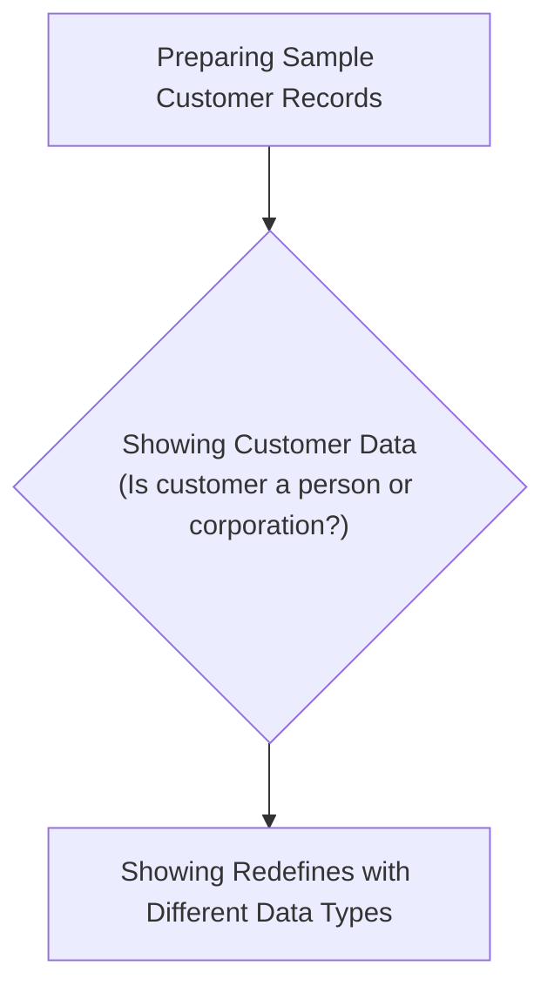
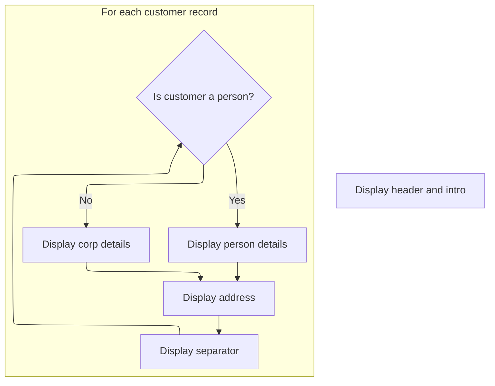

# Program Overview

This document describes the flow of preparing and displaying sample customer records using the REDEFINES-TEST program. The flow demonstrates COBOL's REDEFINES feature by showing how customer data can be flexibly represented and displayed as either person or corporation records, and how the same memory can hold both display and computational values.



# Program Workflow

# Preparing Sample Customer Records

This section is responsible for preparing sample customer data for testing, ensuring coverage of both standard and edge-case scenarios.

| Category        | Rule Name                      | Description                                                                                                        |
| --------------- | ------------------------------ | ------------------------------------------------------------------------------------------------------------------ |
| Data validation | Mandatory address fields       | Each customer record must include a valid address, consisting of street, state, and zip code fields.               |
| Data validation | Customer type name requirement | Person records must contain both a first and last name, while corporation records must contain a corporation name. |

<SwmSnippet path="/redifines/redefines.cbl" line="44">

---

Setup-test-data kicks off the flow by creating three customer records for testing: two persons and one corporation. It uses COBOL's 88-level condition names (<SwmToken path="redifines/redefines.cbl" pos="47:3:9" line-data="           set ws-customer-type-person(1) to true">`ws-customer-type-person`</SwmToken> and <SwmToken path="redifines/redefines.cbl" pos="55:3:9" line-data="           set ws-customer-type-corp(2) to true">`ws-customer-type-corp`</SwmToken>) for clarity when setting customer types, and overlays the name fields using redefines so the same memory can be used for either <SwmToken path="redifines/redefines.cbl" pos="46:13:15" line-data="           display &quot;1. Person record with first/last name entered.&quot;">`first/last`</SwmToken> names or a corp name. The function assumes the arrays have at least three slots and doesn't check for bounds, so if the data structure is smaller, things break. The third test record intentionally puts a corp name in a person record to test edge cases.

```cobol
       setup-test-data.
           display space
           display "1. Person record with first/last name entered."
           set ws-customer-type-person(1) to true
           move "test-first" to ws-customer-first-name(1)
           move "test-last" to ws-customer-last-name(1)
           move "123 fake st" to ws-street-address(1)
           move "NV" to ws-state(1)
           move 12345 to ws-zip-code(1)

           display "2. Corp record with corp name entered."
           set ws-customer-type-corp(2) to true
           move "no-name corp" to ws-corp-name(2)
           move "567 real st" to ws-street-address(2)
           move "NY" to ws-state(2)
           move 11795 to ws-zip-code(2)

           display "3. Person record with corp name entered."
           set ws-customer-type-person(3) to true
           move "SET CORP VALUE" to ws-corp-name(3)
           move "890 what st" to ws-street-address(3)
           move "MA" to ws-state(3)
           move 09345 to ws-zip-code(3).
```

---

</SwmSnippet>

## Showing Customer Data



This section is responsible for presenting customer data in a clear and structured format, distinguishing between individual and corporate customers, and ensuring all relevant details are shown for each record.

| Category        | Rule Name                      | Description                                                                                                                                                                                                                                                |
| --------------- | ------------------------------ | ---------------------------------------------------------------------------------------------------------------------------------------------------------------------------------------------------------------------------------------------------------- |
| Data validation | Maximum Records Displayed      | The number of customer records displayed must not exceed the value of <SwmToken path="redifines/redefines.cbl" pos="76:19:23" line-data="           from 1 by 1 until ws-customer-idx &gt; ws-num-records">`ws-num-records`</SwmToken>, which is set to 3. |
| Business logic  | Display Header and Separator   | The display must always begin with a header and a separator line to introduce the customer data section.                                                                                                                                                   |
| Business logic  | Customer Type Classification   | Each customer record must be classified as either a person or a corporation, based on the customer type value (1 for person, 2 for corporation).                                                                                                           |
| Business logic  | Display Person Name Fields     | For customers classified as persons, the display must include the first name and last name fields.                                                                                                                                                         |
| Business logic  | Display Corporation Name Field | For customers classified as corporations, the display must include the company name field only, not personal name fields.                                                                                                                                  |
| Business logic  | Display Address Information    | Each customer record must display the full address, including street address, state, and zip code, regardless of customer type.                                                                                                                            |
| Business logic  | Record Separator               | A separator line must be displayed after each customer record to clearly distinguish between records in the output.                                                                                                                                        |

<SwmSnippet path="/redifines/redefines.cbl" line="69">

---

In <SwmToken path="redifines/redefines.cbl" pos="69:1:5" line-data="       display-customer-data.">`display-customer-data`</SwmToken>, the function starts by printing a header and a separator line to make the output readable. This sets up the display format before looping through the customer records.

```cobol
       display-customer-data.
           display space
           display "Displaying fake customer data:"
           display "------------------------------"
           display space
```

---

</SwmSnippet>

<SwmSnippet path="/redifines/redefines.cbl" line="75">

---

Next in <SwmToken path="redifines/redefines.cbl" pos="69:1:5" line-data="       display-customer-data.">`display-customer-data`</SwmToken>, the function loops through each customer record using a perform varying loop. It checks if the record is a person or corporation using 88-level condition names, then displays the appropriate name fields. This relies on the arrays being correctly sized and populated.

```cobol
           perform varying ws-customer-idx
           from 1 by 1 until ws-customer-idx > ws-num-records

               if ws-customer-type-person(ws-customer-idx) then
                   display "Customer Type: PERSON"
                   display "First Name: "
                       ws-customer-first-name(ws-customer-idx)
                   end-display

                   display "Last Name: "
                       ws-customer-last-name(ws-customer-idx)
                   end-display
               else
                   display "Customer Type: CORP"
                   display "Company name: "
                       ws-corp-name(ws-customer-idx)
                   end-display
               end-if
```

---

</SwmSnippet>

<SwmSnippet path="/redifines/redefines.cbl" line="94">

---

Finally in <SwmToken path="redifines/redefines.cbl" pos="69:1:5" line-data="       display-customer-data.">`display-customer-data`</SwmToken>, each customer record is printed with its type, name, address, and a separator line. The function assumes the data is valid and the arrays are correctly sized, so the output is clean and readable.

```cobol
               display "Address: "
               display ws-street-address(ws-customer-idx)
               display ws-state(ws-customer-idx) ", "
                   ws-zip-code(ws-customer-idx)
               end-display

               display "------------------------------"
               display space
           end-perform.
```

---

</SwmSnippet>

## Showing Redefines with Different Data Types

<SwmSnippet path="/redifines/redefines.cbl" line="115">

---

Display-second-test-data prints out values from two arrays at fixed indices to show how the same memory can be interpreted as either display (PIC X(10)) or computational (COMP-2) types. This highlights COBOL's redefines feature and assumes the arrays have at least two elements.

```cobol
       display-second-test-data.
           display space
           display "Redefines with different variable types:"
           display "----------------------------------------"
           display "Value entered in ws-data-disp-value: ABC123"
           display "ws-data-disp-value x(10): " ws-data-disp-value(1)
           display "ws-data-comp-value comp-2: " ws-data-comp-value(1)
           display space
           display "----------------------------------------"
           display "Value entered in ws-data-comp-value: 12345.63"
           display "ws-data-disp-value x(10): " ws-data-disp-value(2)
           display "ws-data-comp-value comp-2: " ws-data-comp-value(2)
           display space

           stop run.
```

---

</SwmSnippet>

&nbsp;

*This is an auto-generated document by Swimm 🌊 and has not yet been verified by a human*

<SwmMeta version="3.0.0" repo-id="Z2l0aHViJTNBJTNBQ09CT0wtRXhhbXBsZXMlM0ElM0FTd2ltbS1EZW1v" repo-name="COBOL-Examples"><sup>Powered by [Swimm](https://app.swimm.io/)</sup></SwmMeta>
